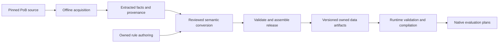

# Data acquisition, rule execution and the current migration

Snapshot: 2026-10-05, including published Arsonist/Frost Mage/Reaver topology
and physical inventories, stable deferred V3 attachment, Sniper count/reservation,
reviewed Direct raw inputs, tree-granted Djinn inputs, Ice Nova intrinsic tables,
native readiness, source-property ownership, Ice source-input fragments and
the ordinary Minion-level Amulet-copy fragments, selected passive/reward
producer closures, the reward ailment/recovery/Charm input channels, Growing
Swarm's complete default Area/cooldown inputs, finite Sniper receiving, Bidding's
conditional minion Action delivery, corrected per-effect Gem supply classification,
exact manual Direct support targets, native Action Area eligibility, Rapid Casting
contributions, Encroaching cost factors, real Offering/Prolonged Duration actions,
actual zero-factor Amulet transport evidence, and the
accepted generality, generated-usage and socket decisions.
This explains the implementation and
the accepted direction. The owner confirmed on 2026-10-02 that SQLite and an ORM
are not needed; generated owned artifacts and loaded Rust indexes remain the plan.
[Domain architecture](domain-architecture.md) controls the target design and
[implementation](implementation.md) records the latest evidence and blockers.

The [scaling-data investigation](owned-scaling-data-investigation.md) now compares
exact tables, genuine formulas and lossless range segments. Current native tables
remain dense bounded integer lookups. A compact storage form could expand once
to those arrays; a table displayed on PoEDB does not itself prove a curve or
authorize interpolation. No format or numerical behavior has changed.

Preset-owned exact generated-skill input bindings are accepted and implemented;
they preserve the supplying provider's level authority. A separate
[generated-source accounting proposal](owned-generated-skill-dispositions-proposal.md)
awaits review of an explicit V2 Import policy. It would prove remaining saved
fields against actual imported outputs and existing Pending usage obligations,
without reinterpreting V1 artifacts or adding native participation behavior.
The [participation proposal](owned-skill-participation-proposal.md) remains a
different pending decision.

## Lua compatibility cleanup and semantic authority

The owner requested a [Lua compatibility cleanup gate](legacy-retirement.md#lua-compatibility-cleanup-gate-requested-2026-10-05)
on 2026-10-05. It audits both source-language types and inherited behaviors in
shared helpers: truthiness/defaults, number formatting, rounding, table ordering,
aliasing and lazy initialization. Owned runtime and UI contracts must be free of
Lua execution concepts. Offline extraction and optional reference execution may
use Lua; saved-format conversions remain isolated at Import.

For every compatibility behavior, decide whether it represents game semantics,
an external format requirement, an upstream bug, an irrelevant language quirk,
or unresolved intent. PoB is evidence rather than automatic authority for every
implementation detail. Preserve useful rounding/order laws when evidence shows
they matter; remove compatibility whose only purpose is reproducing incidental
Lua behavior. Validate changes against contrasting real cases and the five
originals. Numerical behavior changes require review, explicit reference
exceptions and deterministic checks, not silently changed goldens.

Saved presentation now has a narrow source-bound Import policy: empty socket
trade links, calculation-panel collapse state, tree-view settings and empty notes
can be retained as source-only evidence without creating native inputs. Saved
calculation modes, rolled item ranges, generated skill settings and search weights
remain separate semantic responsibilities. A final source/issue correspondence
check prevents an inventory from being retired while its source links still
point to that issue; it does not certify the inventory's numerical coverage.

Item-range correspondence is an intrinsic Import step over the existing live
item attribution and actual emitted modifier identities. Proven final writes
link to their item and modifiers; valid unresolved targets link to the same
item's pending modifier inventory. Fixed-literal targets retain their fraction
as source metadata without treating it as a numerical input. No second range
parser, optional ownership policy, native rule or Lua behavior is introduced.
The version-19 sidecar records this correction when a range is attached; the
owned draft and generated data package are unchanged.

## Three execution paths currently coexist

**Development target:** the owned path. New game support belongs there. Changes
to the legacy path require a named remaining consumer or a correctness fix;
unused compatibility features should be removed. PoB remains an optional oracle.

| Path | What executes | Purpose and current status |
| --- | --- | --- |
| Original PoB through `mlua`/LuaJIT | The pinned original Lua, including its application model for full builds | Optional data acquisition and reference calculations. Kept for parity and updates. |
| Legacy Import/Engine path | Source-shaped import/inspection and a Rust interpreter for a supported subset of extracted Lua-like programs | Remaining acquisition and independent component comparisons. NativeBackend, its CLI and its orphaned profile-template coordinator are removed; legacy Import/Engine retirement is incomplete. |
| Owned native path | Our typed game definitions, expression graphs, relationships and reusable Rust algorithms | Target architecture. Real component execution exists; none of the five original builds completes this path yet. |

`mlua` hosts LuaJIT; it is not our own Lua interpreter. The separate legacy Rust
VM was built to execute selected extracted logic without LuaJIT. The new owned
engine uses neither that compatibility VM nor LuaJIT. It evaluates a different,
project-owned rule representation in Rust.

The [support catalogue/supply correction](legacy-retirement.md#support-catalogue-entries-versus-executable-supply-2026-10-05)
classifies each source effect in Import before declaring potential Skill supplies.
The exact primary association remains source metadata; support modifiers belong
to assignments. The checked data migration removes 568 support associations from
568 Known Gem descriptors across the full 966-Gem census. Additional non-support
capabilities remain, including hidden unresolved helpers. IDs, rules, other
descriptor fields and Partial closures are preserved. The converter has one
current path; old immutable packages remain readable for migration/reference.
No native coverage check is bypassed and no Lua flag enters the evaluator.

Import can also bind a support to an already authenticated manual Direct root
through its existing V2 source proof. It requires one exact root and rejects
ambiguous or unreviewed siblings. This establishes assignment identity and saved
local order, independently of raw values, activation, receiving or numerical
readiness. The [source evidence](owned-djinn-provider-evidence.md#exact-manual-support-targets)
explains the boundary. Attached targets use source sidecar V20; that publication
kept native schema V6 and operations V19. Publication results and current blockers
are recorded in the implementation plan.

Bidding's new numerical programs use the existing native support engine and
data-defined receiving paths. They preserve source/recipient identity across
repeated supports, tier and quality selection, and Rayon workers. The published
owners and reviewed receiving fragment remain Partial, with no complete evaluation
bundle. Its optional source witness retains raw diagnostic ordering separately
from the checked projection of independent channels; native rules acquire no Lua
ordering or cache semantics. The [packet](../data/owned/poe2/3887ae68/bidding-support-delivery/README.md)
records the exact scope and receipts. All five originals remain incomplete.

The [Magnified Area packet](../data/owned/poe2/3887ae68/magnified-area-support-delivery/README.md)
extends the same data-driven support path with Action area and resource-cost
contributions. Source, checked publication and six native component tests pass,
including fourteen action/stat-set contexts and exact scratch/Rayon results. Tier II also
retains a neutral damage factor behind an explicit computed Area input. The source's zero-record diagnostic
filter is not copied into native evaluation. Reviewed receiving covers player
Commands, Djinn child actions and physical Ice Nova through their existing
occurrences. Primary Summon delivery and final radius/cost formulas remain open.
Ordinary cost and reservation are separate: Magnified contributes the former,
while the Sniper Spirit component requires the latter. The two factors are not
interchangeable. [Reservation](owned-summon-reservation.md#native-arithmetic)
records their distinct source producers and consumers.
No public contract or evaluator branch is added. The test world reuses the
existing Bidding fixture with explicit release/request/readiness inputs. Physical
Ice Nova retains its real generated Skill and projected final level; fixture
predicate facts are supplied separately to its exact root and receiver. Those
finite test inputs confer no complete-build authority.

The subsequent [Action Area packet](../data/owned/poe2/3887ae68/action-area-eligibility/README.md)
publishes eleven ordinary programs for the fourteen reviewed action/stat-set
combinations, using operations V20's read-only selection predicates. A full
constructed-catalogue writer census and exact source replays justify this bounded
conversion; later radius-driven Area flags are separate diagnostics. Current
native component checks use the actual published producers with no fixture Area
facts or usage values. Missing-producer controls and exact scratch/Rayon replay
pass. Owners remain Partial and the package still has no evaluation bundle.
The old Magnified fixture remains a historical support-component control, not
an alternative runtime Area system.

The [Rapid Casting packet](../data/owned/poe2/3887ae68/rapid-casting-support-delivery/README.md)
adds one Action cast-speed channel and four ordinary support programs. Tier I/II
contribute 15/20 percentage points through exact admitted support occurrences;
no new interpreter, operation or runtime API is added. Existing prepared-input
programs and Partial owner coverage are preserved. The reviewed receiver is
physical Ice Nova's existing Action with both stat sets. Native checks cover
independent physical roots, removal/disablement, duplicate selection and exact
scratch/Rayon reuse. Admission classification remains a finite test boundary;
the current package has no complete evaluation bundle. Final cast timing and
full incoming contributor coverage remain separate work. Source-store ancestry
only authenticates the optional reference observer. Neither that Lua inheritance
nor a source numeric flag becomes the native receiver model. Missing cost and
reservation coefficients remain absent, rather than fabricated factor-one rules.

The [Encroaching Ground packet](../data/owned/poe2/3887ae68/encroaching-ground-support-delivery/README.md)
reuses the ordinary-cost channel and appends two programs to its existing support
owner. Native checks compose its 1.1 factor with Magnified II's 1.3, keep Rapid's
cost absence explicit, and use actual Area eligibility over independent physical
roots. No new operation, source interpreter or runtime API is added. Source
four-place subtotal truncation is a separate unresolved numerical contract;
the native generic Product remains unrounded. Ground growth, final payable cost,
full receiver/owner closure and whole-build parity remain open. Shared source,
publication and fixture helpers replace duplicated support-family plumbing.

The [Prolonged Duration packet](../data/owned/poe2/3887ae68/prolonged-duration-support-delivery/README.md)
adds the real Offering player action to the existing physical supply and publishes
both tiers' duration/cost contributions. Its minion-related types do not create
a minion actor; the buff applications remain separate recipients. Tests cover
two exact Offering roots and both Ice stat sets, preserving the actual input
projection and explicit finite final-input boundaries. The declared ReceivingSkill
admission uses the generated receiver's types; source-owner metadata does not
silently become a second gate. Inactive contributions retain provenance and
remain distinguishable from a removed support. Final seconds, payable cost,
application lifetime and complete coverage remain separate integration work.

The native CLI entry points `evaluate-owned` and `resolve-owned-effects` use the
owned Core/Data/Engine path. `evaluate` and `metrics` are explicitly PoB reference
commands behind `--features pob`. The old native backend selector, `prepare-build`,
`search-build` and `benchmark-native` are removed. No obsolete search input is
silently sent through the owned evaluator.
The default executable has no PoB/Lua or NativeBackend dependency. Its Import/Data/Engine
dependency closure still compiles some legacy Rust modules for inspection and
conversion. Isolated Data/Engine builds with
`--no-default-features` exclude those modules. These are different guarantees.

See [legacy source runtime](../crates/poe-optimizer-engine/src/source_program.rs),
[CLI entry points](../src/main.rs),
[owned metrics CLI](../src/owned_metrics.rs) and
[retirement inventory](legacy-retirement.md).

## 1. Extracting and packaging game definitions

Three kinds of input must stay separate:

- **Game definitions:** skills, level tables, items, passives and mechanic rules.
- **A user's build:** particular equipment, allocations, skills, supports and
  scenario choices. XML/share-code decoding and normalization handle this input.
- **Reference results:** outputs from executing original PoB, used to check our
  implementation. They are not calculation inputs or substitutes for mechanics.

The owned data pipeline is:

Acquisition is currently mixed, with explicit tools:

| Mechanism | Actual implementation | Limit |
| --- | --- | --- |
| Restricted source/table reading | Existing Python exporters recognize reviewed literal Lua shapes or read pinned JSON/catalogs | They reject unsupported forms; they do not evaluate arbitrary Lua. |
| Executing definitions | Optional Rust `export-owned-*` tools use `mlua`/LuaJIT to run finite authenticated chunks or constructors and project their results | Some use LuaJIT with JIT compilation disabled. They export finite facts, not automatically understood game mechanics. |
| Semantic conversion and assembly | Rust `compile-owned-*`, `extend-owned-*` and `assemble-owned-*` tools validate authored definitions, rules and bindings | Conversion remains family-specific and partly manually authored. Unsupported content stays explicit. |
| Legacy extraction | `extract-game-data` runs an isolated extraction worker | It produces the older PoB-shaped GameDataPackage, not the new general owned package. |

For examples, see the [literal mechanics exporter](../scripts/export-owned-mechanics.py),
[intrinsic acquisition](../crates/poe-optimizer-pob/src/owned_intrinsic_attack.rs),
[actor acquisition](../crates/poe-optimizer-pob/src/owned_actor_baselines.rs),
[augment acquisition](../crates/poe-optimizer-pob/src/owned_augments.rs) and
[release assembly](../crates/poe-optimizer-import/src/owned_release.rs).
Some owned acquisition tools still reuse old extraction helpers internally;
their output boundary is owned, while that tooling cleanup remains unfinished.

Extracting a numeric table is relatively direct. Recovering what a callback means
requires semantic conversion: ownership, applicability, ordering, rounding,
activation and interactions may be encoded in PoB code rather than table cells.
There is no universal automatic Lua-to-owned-mechanics translator. An acquired
definition can be known while its input schema, programs or contributors remain
Partial. Catalog size therefore does not measure supported builds.

Current rule authoring uses verbose structured data and family conversion tools;
there is no compact textual domain DSL frontend yet. Such a frontend could emit
the same typed representation. It would be an authoring improvement, separate
from adding another runtime language or adopting database storage.

**This does not currently run automatically in `cargo build`.** The root
[build script](../build.rs) only configures the Windows executable stack.
The data-build commands are separate offline operations. The latest family
publication also uses an explicit release-test helper to orchestrate checked
library APIs; there is not yet one unattended command rebuilding the complete
game package. The intended distribution pipeline runs acquisition/conversion
before shipping and permits independent data-package updates. It need not run
PoB or regenerate all data on every incremental Rust build.

## Persisted format: owned artifacts and in-memory indexes

There is currently no SQLite, DuckDB or ORM layer. Owned releases use canonical
JSON files with strict typed schemas, versioned identities, hashes and explicit
coverage declarations. The data loader builds indexed Rust structures; the
engine compiles rules and binds them to the supplied build.

Runtime artifacts include the definition schema, rule programs/tables, action
routes and, for an evaluation-bearing release, metric and optional support-stage
artifacts. Development releases also carry source mappings, normalization/item
policies and provenance. The engine needs the owned runtime contracts; full
distribution separation from adapter tooling remains a migration gate.

The latest checked development release is eighteen files, about 60 MB. It is a
Partial data release with no evaluation bundle; it cannot be passed off as a
complete runnable game database. It uses schema V6 and operations V20 for
reviewed occurrence inputs, exact generated preset inputs, source-property preparation and the published
physical/actor/action families, through checked release migrations and successors.
Exact endpoint identities and validation receipts
live in the [implementation plan](implementation.md#checked-baseline-and-original-build-results),
which is the single current resume point. Publication checks preserve all five
original selections and 110 queries and reproduce the eighteen files exactly.
See [owned releases](owned-releases.md) for the package contract.

The accepted storage path is:

1. Extract facts and convert behavior into owned definitions/rules.
2. Persist and version the generated owned artifacts.
3. Validate and load a frozen snapshot, then execute typed plans in memory.

UI search and autocomplete will use a derived index over the loaded model.
SQLite, DuckDB and ORM adoption are outside the implementation plan. The
[storage investigation](definition-storage.md) retains the historical comparison;
its old package-size and schema details describe the legacy checkpoint. No
database service, connection or lazy query belongs in candidate evaluation.

## 2. Conditional logic in the owned engine

The persisted [rule contract](../crates/poe-optimizer-core/src/owned_rules.rs)
contains typed reads, expression nodes and effects. Nodes form a directed acyclic
graph; named intermediate results express dependencies without mutable Lua locals.
Supported operations include arithmetic, finite level-table lookup, explicit-unit
scaling/ratios, rounding, comparisons, Boolean operations and lazy branch selection.
Effects contribute to a stat, derive a final value, activate a grant or project
values into an explicitly supplied skill/actor.

Operations V20 adds `ActionPartIs`, `ActionModeIs` and `ActionStatSetIs`: typed
Boolean reads of the current Action's already validated selection. These reads
cannot select, create or activate an Action. They use owned definition identities,
not source ordinals, MAIN/CALCS state or XML fields. V20 inherits the existing V3
readiness contract; older operation versions keep their original identities and
semantics. This version is separate from Import's source-sidecar V20.

Conditions require typed Boolean inputs. A false effect guard or unused branch
does not demand its numerical inputs. Unknown activation remains unknown.
Required occurrence inputs, provider activation and completeness are separate
gates: laziness cannot make an incompletely described skill ready to execute.
The proposed [participation requirement](owned-skill-participation-proposal.md)
would add an explicit consumer for whole-Skill enabled intent while retaining
mechanical supply for preparation. It awaits an owner decision; current
effect-specific usage rules do not already provide that behavior.
An absent contribution inventory cannot silently become zero or multiplier one.
Current contribution coverage is conservative across the whole selected plan.
The compiler seals one completeness flag after discovering providers, owners,
receivers, encounter/usage programs and routes. Any gap makes scalar Stat reads,
contribution reductions and modifier-transform reads unresolved with
`IncompleteContributors`, even when the gap concerns a different channel.
Unselected catalog definitions do not enter this flag. Completing one property's
producers therefore does not make its total available in an otherwise Partial
real build. Finer occurrence/channel coverage is a separate pending proposal,
not behavior already delivered by the rule compiler; complete-build coverage
remains mandatory.

There are no general author-written loops, mutable tables, arbitrary function
calls, recursion or PoB callbacks in this rule language. Bounded Rust algorithms
perform repeated domain work such as enumerating actual recipients, reducing
contributions and selecting/admitting supports. More complex reusable numerical
operations can call Rust kernels; ordinary action timing is an implemented
example. Coefficients, applicable domains and recipe selection remain injected.
A genuinely new operation requires a versioned engine implementation, not an
automatic Lua fallback.

Compilation has three distinguishable products:

1. **Stored owned package:** portable typed definitions/rules and their content
   identities. Release assembly compiles them as validation, but does not ship
   generated machine code.
2. **Compiled rules:** validated types, units, scopes and acyclic dependencies,
   lowered into private indexed programs.
3. **Occurrence-bound plan:** concrete item/skill/actor/action relationships,
   activation gates, effect dependencies and requested output routes for a build.

Rust evaluates that plan using reusable worker-owned scratch. Immutable programs
and plans can be shared between workers. The prepared evaluation path has no
PoB process, Lua state, SQL access, source parser or serialization. This is an
indexed Rust graph evaluator, not a machine-code JIT for each rule. Repeated
evaluation and Rayon isolation are tested; general search integration and
performance measurements across complete real builds remain unfinished.

Support preparation has explicit stages and dependency checks. Operations V16
adds checked readiness metadata on that same graph: early inputs permit support
preparation, admitted properties can feed final-input assembly, and execution
requires the complete final inputs of the occurrence and its supplying ancestors.
The public native component proof exercises this sequence. Early output roles,
actual dependencies and all potential support templates are checked during cold
compilation; phase labels cannot erase a late read. The reviewed Direct-input
migration introduced operations V17; V18 adds source-property preparation, and
V19 adds generated preset input producers; the current V20 release also adds
typed Action selection predicates. Changing its contract version
does not add missing readiness declarations or mechanics automatically.
Usage preferences follow the separately accepted composition contract below.
Neither contract can be supplied by observed defaults. See
[readiness](owned-preparation-readiness-proposal.md) and
[accepted usage composition](owned-skill-usage-proposal.md).

Intrinsic inputs on manual skills now have a separate, typed home on the exact
`SkillUse` and its draft mirror. Schema V5 declares whether each Skill input
permits authored values, a provider projection, or either at the appropriate
occurrence. Operations V17 binds those values into the same native graph and
retains V16 readiness. The component tests exercise independent Direct uses and
a generated sibling of one definition, including parallel evaluation. Omitted
fields preserve old wire bytes; schema V4 and operations V14 remain defaults.

The source-property component adds receiving V3 relations, stages V3 and operations
V18 without changing that raw-input storage. It discovers exact authored sources
independently of requested Actions, collects admitted support positions across
their declared effects, and invokes complete external/support inventories once
per source and retained position. Producer reads keep their original context;
`PropertyOwner` binds the authorized numeric destination. Native dependency checks
and the same typed programs perform final assembly. The published Partial game
release retains these V18 programs under V20 and includes real Ice pre-support/final-level
fragments, six support-preparation fragments and Exodus's count-one bonus.
It still has no evaluation bundle: complete incoming item properties, copy
inventories, full support mechanics and owner coverage remain open. The finite
native test path removes the placeholder final-level provider and consumes
actual raw Gem inputs. Its already-admitted, item-free boundary is explicitly
separate from full-build support. See the
[source-property contract](owned-source-property-preparation-proposal.md).

The Amulet-copy owned-data packet adds a separate per-occurrence Amulet copy to the
existing Minion-level modifier. It reuses the numerical rule evaluator: divide
the required pre-copy percentage by 100, retain identity/unscalable values, or
floor each scaled record. Four complete placement declarations and six typed
eligibility programs distinguish the two Amulet bases from other item types.
The actual Mystic Attunement rule contributes 25 percentage points, but the real
snapshot aggregation and complete contributor inventory are not yet published.
Finite tests declare their scalar or aggregation boundary explicitly. No new
Lua loading, item parser, raw-input storage or production Rust branch was added.

The reviewed Direct-input adapter now imports raw level and quality from exact
manual Sand/Water Djinn rows into their own Skill occurrences and actual saved
presets. A catalog Gem identifier supplies correspondence, not physical ownership:
no physical Gem is created, and allocation-generated siblings remain distinct.
Injected recipes store level as a Count quantity and quality as a percentage-point
quantity, preserving finite fractional or negative raw inputs. Missing or malformed
values remain Pending. The optional complete-source witness separately records
raw loading, source normalization and prepared values in both JIT modes; none of
its observed final values becomes a definition constant.

The Direct V2 disposition now completes all eleven manual occurrences' intrinsic
input lists using bounded source-action and field proofs. Its shared typed
inspection avoids constructing unused public query reports during normalization;
public resolution retains the same checks and output. The data declares both
Commands, both Actors and all eight actor children without fabricating a Gem or
another Direct root. Direct V1 retains its earlier behavior. Repeated instances,
raw quantities, archived presets and generated siblings stay separate.

Usage inventories, support destinations, raw-to-final producers and numerical
coverage remain incomplete. Source validation passes 81 cases in both JIT modes;
publication preserves all five originals and all 110 queries. It supplies no
complete native build evaluation. See [typed occurrence inputs](owned-skill-occurrence-input-proposal.md),
[Djinn evidence](owned-djinn-provider-evidence.md) and the
[current checkpoint](implementation.md) for exact identities and counts.

### Saved usage preferences and scenario overrides

The Sniper count publication added six preferences across Originals01/05
and an ordinary native reservation consumer. It preserves all five selected
obligation counts and all 110 queries. Final-input and modifier providers remain
unfinished; the authenticated source replay proves this finite component, not a
complete build. Complete native originals remain 0/5.

The earlier Frost publication added five exact preferences across the saved
presets of Originals04/05 using the existing Boolean usage model. It closes
their physical parameter inventories after checking the actual scalar and usage
records. Missing/malformed activation values and counts outside the reviewed
domain remain Pending. At that checkpoint Original05's selected obligations fell
to nineteen; the other four counts were unchanged. Complete native originals
remain 0/5.

The preference is the **requested global-effect setting**, not a computed claim
that the effect exists. Complete-source testing found that cold PoB MAIN can
retain a false-marked Frost effect while CALCS omits it; two normal requested
rebuilds agree after lazy metadata initialization. Both lifecycle results are
retained. The owner classified the affected first-load comparison as a PoB bug
on 2026-10-05: exclude it explicitly and validate the other originals' stability;
do not change the backend to a rebuilt canonical protocol. Native
tests use a synthetic conditional reader to verify the preference seam; Frost
actions, exposure and numerical consumers remain Partial. This adds no source
cache state or Lua dependency to native execution. See the
[Frost evidence](owned-frost-bomb-usage-evidence.md).

In the current implementation, the selected skill preset owns typed usage preferences for its exact supplying
Skill, Action or generated Actor occurrences. Reusing the same physical Gem in
another preset does not reuse its occurrence preferences. The shared
composition boundary combines that selected layer with the explicit scenario.
Legacy preferences use `owned_project::compose_request`; versioned intent uses
`owned_preset_intent::compose_request_checked` and
`DraftSession::finalize_selection_checked` with the data-aware proof. A scenario row
replaces a preference only at the exact `(policy, target)` key, replacing its
whole parameter record. It cannot borrow omitted parameters from the preference.

The owner accepted the [generated-source extension](owned-generated-skill-usage-proposal.md)
on 2026-10-04: exact item/tree providers may belong to another selected axis,
with explicit applicability and dormant intent only for proved nonselection.
The provider remains authoritative, stale/ambiguous targets remain obligations,
and dormant/overridden values still need data-aware validation. The versioned
`SkillPreset.intent` contract now implements this extension with full-project or
full-draft schema proof before selection. Checked composition and finalization
share applicability and merge behavior; the structural-only APIs reject the new
contract without its proof. The legacy `usage_preferences` field retains its
existing strict local ownership and omitted-field bytes. An explicit conversion
moves that field into the new envelope; decoding never silently migrates it.

The accepted [generated raw-input contract](owned-generated-skill-inputs-proposal.md)
shares those proofs but keeps raw parameter assignments distinct from usage.
Selected assignments enter `BuildInput.generated_inputs`, with exact supplying
declarations authorizing slots under schema V6. Operations V19 creates input
producers in the existing preparation graph, preserving provider projections,
activation and complete execution coverage. The CLI exposes data-aware draft
proof/finalization through `check-owned-draft --definitions`. These implementation
contracts pass focused validation. The published V6/V19 successor includes three
quality-only supply permissions and opt-in exact-provider import joins for the
reviewed Djinn/Firebolt families. Original05's three selected raw bindings and
Original01's two resolve without replacing provider levels. Other generated
sources, archived cross-axis correspondence, gameplay usage and final quality
remain incomplete. The importer preserves their explicit obligations; the owned
runtime contains no source names, Item-header parsing or Lua selection logic.

The separate [socket configuration model](owned-socket-configurations.md) is also
accepted. Rolled descriptors, desired socket contents and physical copies remain
distinct; equipped uses project exact child providers and receiving-host effects.
Persistent configuration records, projection, codec/migration and native effects
are pending. Existing per-use socket edges do not already deliver this model.

Complete projects and editable drafts retain the layer. An omitted legacy field
keeps its old serialized representation and means no authored preferences; it
does not prove complete imported usage. Pending preferences on the selected
preset block finalization, while an unselected preset remains independently
editable. Structural validation checks both raw layers before replacement and
charges them before deduplication. Definition binding remains a separate step.

The resulting native request still uses `ScenarioInput.usage`. Usage programs
execute through the ordinary compiled rule graph, exact target resolution and
activation gates. Supported contexts are Skill-to-Skill, Action-to-Action and
Actor-to-Actor, with ordinary derivation, contribution, capability and requirement
effects. Policies do not create provider topology: their grant/projection,
support and transformation effects retain explicit unsupported-relation gaps.
Other context pairs stay unsupported. No usage-specific VM,
Lua callback or subprocess is introduced.

The optional `usage_inputs` import policy projects reviewed Boolean inputs from
an exact physical Gem row to the generated primary Skill in its containing
preset. Its definition, role, catalog and scalar-converter commitments are checked
before import. The first supplied recipe maps Pain Offering's saved primary-effect
switch to an ordinary UsagePolicy program producing its existing activation stat.
An absent policy keeps historical normalization behavior and bytes. Unsupported
source frames and incomplete preset/scenario inventories remain Pending. The V2
physical Gem inventory proof can complete intrinsic assignments only after that
exact preference is actually attached and the containing usage inventory remains
explicitly Pending. Physical completeness does not erase remaining usage or
action-selection obligations.

The additive UsageV2 policy preserves those Boolean rows and adds typed numeric
occurrence inputs with an optional containing-group override. An override wins
by presence, including zero; malformed values remain Pending. Numeric rows do
not acquire the Boolean-specific physical-inventory proof. Sniper's reviewed
count recipe also rejects ambiguous source effect matching when no group
override exists. This source interpretation stays in Import.

The opt-in UsageV3 path extends the same decoder to proved authored Direct and
exact generated occurrences, with multiple policies per occurrence. Raw inputs
and usage share one provider resolver but decode their values independently.
No quality permission or successful quality value is required to identify a
usage target. Historical physical rows retain their exclusive inventory-proof
capability; new rows cannot certify complete gameplay usage. The checked count
packet adds nine selected preferences across Originals01/05, using the unchanged
native count policy. Generated `nil` to one is an explicit source recipe; missing
or malformed inputs remain Pending. See the [current checkpoint](implementation.md).

Requested multiplicity is not actor population or reservation. The
[reporting proposal](owned-full-dps-aggregation-proposal.md) treats inclusion,
exact contributions and reductions separately from selected-action DPS and combat
activation. The [configuration accounting proposal](owned-configuration-dispositions-proposal.md)
also distinguishes saved Inputs from effective constructor defaults. Neither
proposal closes its still-Pending native inventory or numerical gates.

The corresponding owned rules consume exact occurrence counts and the existing
level-dependent reservation coefficient, plus explicit modifier and branch
inputs. They run in the ordinary native graph. Missing final-level and modifier
producers keep real-build execution incomplete; component fixtures supply
observed inputs only for validation. No observed cost or neutral multiplier is
a production default. See [summon count and reservation](owned-summon-reservation.md).

Saved PoB MAIN/CALCS action settings have a separate native Import adapter.
`resolve-owned-action` uses injected correspondence to produce the existing
owned query target, then ordinary normalization proves its physical SkillUse.
Reference contexts and source ordinals stay outside Core and Engine. The initial
Ice Nova packet declares two action alternatives with Partial mechanics; selection
does not close input inventories or execute calculations. See the
[source-action boundary](owned-source-actions.md).

The additive physical V3 disposition uses that adapter to account for reference
settings separately from intrinsic Gem parameters. Five injected recipes validate
saved count/global/group/full-DPS fields while retaining the real containing
preset's Pending usage obligation. Exact physical ownership, unambiguous preset
IDs and exhaustive child-map coverage are required before retiring an intrinsic
list issue. Existing V1/V2 contracts remain intact. This is Import interpretation;
it adds no Lua runtime, numerical rule, usage default or alternative build model.
V3 reserves the physical Pending issue during ordinary materialization, then
attaches its proof after existing Gem/Direct usage consumers have run. Earlier
newly reviewed occurrences therefore retain existing usage issue and SkillUse
IDs. A V3-only preset can instead acquire a new real Pending usage issue in that
later pass; persisted drafts and wire meanings remain unchanged.

The singleton-minion extension maps a reviewed source actor and child choices
onto the existing owned actor/action graph. It accounts for both possible CALCS
actor-name branches and independently checked child maps, without exposing PoB
UI state to native evaluation. The Sniper packet completes six physical input
lists across two originals while preserving usage obligations, all scalar values
and all saved queries. Gas now has three authenticated stat-set alternatives;
Commands, parent inputs and complete Basic/Gas mechanics remain
unresolved.

The [three-family packet](../data/owned/poe2/3887ae68/skeletal-inputs/README.md)
reuses those contracts for Arsonist, Frost Mage and Reaver. Its publication closes
fifteen intrinsic lists across Originals01/05 and checks thirty original
MAIN/CALCS resolutions plus nine mutation controls. All local IDs, existing usage
records and remaining obligations are preserved; all 110 queries are unchanged
and eighteen files rebuild byte-identically. That checkpoint reached selected
counts **115 / 116 / 108 / 121 / 14**. The subsequent manual Djinn packet uses
the same source decoder with explicit Direct authority, closes eleven intrinsic
lists and reaches **113 / 116 / 108 / 121 / 12**. Usage and mechanics remain
incomplete, there is no evaluation bundle, and complete native builds remain
**0/5**. See the [current checkpoint](implementation.md) for the exact baseline
and validation scope.

### Concrete example: Pain Offering

The owned data now supplies the real Offering skill from its physical Gem, reads
an injected forty-level damage table, computes each source/recipient candidate's
effect scaling and rounding, then chooses the maximum per exact recipient,
stacking family and modifier. Equal winners retain their source identities. The engine contains no
Pain Offering-specific opcode or hard-coded sample-build bonus.

This exercises lookup, inputs, activation, ownership and reduction as separate
concepts. The table and delivered modifier agree with fresh original PoB controls.
However, final supported level/quality and resolved scaling
still need production input producers. Finite tests explicitly supply those
boundaries; the real build remains unresolved. See the
[authored family](../data/owned/poe2/3887ae68/pain-offering/README.md).

Incoming enemy damage uses the same separation. Its import policy maps named
source controls to typed external inputs, including an injected finite category
option. The owned data supplies the damage table, defaults, rounding, contribution
channels and DoT branch. The existing native engine evaluates that program. A
separate optional PoB witness observes original preparation and calculation calls
to check the results. Adding this family requires neither a new interpreter nor
PoB UI objects in the production model.

## Where the older interpreter and original Lua still fit

The [legacy source program module](../crates/poe-optimizer-engine/src/source_program.rs)
reuses a shared parser-program compiler, VM and heap. Its extracted language has
assignments, mutable tables, branches, loops, calls and returns with selected
Lua-compatible behavior. The old modifier parser and source-shaped item
preparation still use it. The abandoned PoB class-capture/Common.new and
configuration-control replay experiments have been removed. Generic session
observation remains only where it supports maintained parser reference checks.
The project never completed a general native recreation of PoB's entire UI.

The accepted migration replaces that runtime model with domain semantics. Some
source-lowering code can remain in offline acquisition while it has a named
consumer; it must not become an owned evaluation dependency. Existing Python
exporters/tests are also transitional tooling, not runtime dependencies.

Original PoB remains separate. Its [reference runtime](../crates/poe-optimizer-pob/src/runtime.rs)
uses `mlua` with vendored LuaJIT, executes `HeadlessWrapper.lua` and loads the
build through PoB's application objects with rendering stubbed. Supervised
workers isolate that state and failures. This is still coupled to PoB internals,
appropriately inside the optional reference adapter. Parity compares imported
meaning and calculated results; it does not require the native engine to expose
PoB's UI objects or reproduce irrelevant internal callbacks.

The ordinary authenticated Main lifecycle also loads PoB's stored modifier
parser cache. A HeadlessWrapper comment about CI does not disable that cache in
the pinned revision. Reference evidence must distinguish a stored result from
an actual parser miss; neither cache state belongs in owned evaluation. The
existing generated-skill source witness validates cold cache absence, exact later
entries and parser/cache identity. Source-04 passes both JIT modes with identical
reports. Earlier reports remain separate, including source-03's rejected line
binding before the exact parser location was corrected to line 7404.

The expanded item control follows an actual Bloodbarrier grant from parsed item
records through slot attribution and parent stores to an exact generated receiver.
It distinguishes an effect-specific mapping from a global fallback and preserves
an unmapped payload without assigning it invented game semantics. Its raw emitted
SkillData order can vary because PoB iterates a stat map. A narrowly declared
comparison view keys only the three unique output records; duplicate or unknown
keys fail and all numerical fields remain exact. Raw diagnostics are retained.
The [source evidence](owned-configuration-dispositions-proposal.md#item-granted-skillid-control-2026-10-05)
records validation status and the failed observer/order assertions. This optional
reference work adds no native rule, source-language type or whole-build coverage.

Generated global-switch applicability is still unproved beyond the declared
catalogue and finite controls. Closing it requires complete admitted modifier
suppliers, ancestry and transformations, including nested records and explicit
refusal of unproved Party/callback inputs. Reuse the existing exact occurrence
and provider proofs; do not infer whole-build or search-domain applicability
from a sample with no matching extra stats. The
[source disposition proposal](owned-configuration-dispositions-proposal.md#cache-authority-and-remaining-supplier-proof-2026-10-05)
records the boundary and audit. This does not change accepted generated raw
inputs or resolve the separate participation and reporting decisions.

## Migration status and remaining deliverables

| Gate | Current state |
| --- | --- |
| D0 — own the boundary | Accepted architecture and retirement inventory; legacy expansion is constrained. |
| D1 — owned inputs/import | Project/build/draft/scenario contracts, manual Direct raw inputs and reviewed physical/actor/action families exist. The skeletal and manual Djinn V5/V17 publications close fifteen physical and eleven Direct intrinsic lists, with declared Djinn Commands/Actors/children and all five originals preserved; usage, final inputs, remaining topology and support coverage are incomplete. |
| D2 — owned data/compiler | Typed packages, validation, explicit release assembly and real converted families work. Full semantic coverage and an unattended complete data-build pipeline remain open. |
| D3 — general evaluation | Native effect/metric/support/application components work. Full native originals: **0/5**. |
| D4 — general optimization | Binding joint search to the owned evaluator remains incomplete. The obsolete profile search CLI is removed. |
| D5 — retirement/breadth | NativeBackend crate, its CLI and class/UI experiments are removed. Independent component comparisons and Import's source-shaped dependency closure remain. |
| D6 — performance/applications | Real full-build throughput, general reuse/invalidation and GUI/web integration still need delivery. |
| T1 — Rust tooling/tests | Existing Python migration is deferred; Rust is the direction for new maintained tooling/tests. |

The intended end state is one owned build/evaluation/search model, with a
separate reproducible data-build toolchain and optional original-PoB oracle.
Generated artifacts feed immutable loaded Rust indexes. Lua and PoB application
objects remain outside the native calculation model; no database layer is planned.
