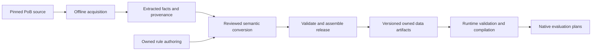

# Data acquisition, rule execution and the current migration

Snapshot: 2026-10-08, including published Arsonist/Frost Mage/Reaver topology
and physical inventories, stable deferred V3 attachment, Sniper count/reservation,
reviewed Direct raw inputs, tree-granted Djinn inputs, Ice Nova intrinsic tables,
native readiness, source-property ownership, Ice source-input fragments and
the ordinary Minion-level Amulet-copy fragments, selected passive/reward
producer closures, the reward ailment/recovery/Charm input channels, Growing
Swarm's complete default Area/cooldown inputs, finite Sniper receiving, Bidding's
conditional minion Action delivery, corrected per-effect Gem supply classification,
exact manual Direct support targets, native Action Area eligibility, Rapid Casting
contributions, Encroaching cost factors, real Offering/Prolonged Duration actions,
actual zero-factor Amulet transport evidence, published Offering final-input
assembly, the bounded stages-V4 local-item extension, the real pre-Amulet
aggregation/receiver, conditional Command damage, the population program
partition, canonical intrinsic minion Life, physical Sniper final inputs,
passive Life Increase delivery, Solar intrinsic declaration closure, local
Armour/ES composition before per-level additions and overrides, canonical Cold
item contribution delivery, selected item parameter inventories, Leggings
placement, component-scalability reconciliation, intrinsic Player Life,
Strength-derived inherent Life, six ordinary attribute consumers over checked
contribution queries, guarded empty-MORE producers, the shared default class-start
closure, once-per-Player Actor rule ownership, generated-field accounting,
native requested-participation gates, strict group-value projection, shared
Player equipment-slot reads, unified typed physical usage, the first Sniper
participation data packet, published selected off-hand facts, and the
accepted generality, generated-usage and socket decisions.
This explains the implementation and
the accepted direction. The owner confirmed on 2026-10-02 that SQLite and an ORM
are not needed; generated owned artifacts and loaded Rust indexes remain the plan.
[Domain architecture](domain-architecture.md) controls the target design and
[implementation](implementation.md) records the latest evidence and blockers.

Delivery now explicitly prioritizes the closest complete unchanged build,
currently Original05 (Skeletal Sniper). Its five selected input obligations
still block request finalization, and complete native builds remain 0/5.
The first complete native/reference result unlocks owned optimizer integration;
we do not wait for all five. Subsequent candidate changes need their own coverage
and fresh/reused/parallel verification. All-five regression and independent
breadth continue through the same caller-driven model.

The latest integration connects imported Offering activation, item-prepared final
level and checked source/recipient scaling to its actual application. The finite
joined graph produces 62% increased damage per Sniper recipient at level22;
duplicate copies do not stack. It uses current Core preset/scenario composition
and the published rules, without changing production behavior or closing the
real Pending inventories. All 76 joined checks pass, including reused and Rayon
execution. The next damage consumer needs checked membership for application
group results; that [public-contract proposal](owned-application-group-contribution-queries-proposal.md)
awaits owner review. Composed support discovery is already approved and remains
independent implementation work. See the current [resume point](implementation.md#latest-integration-checkpoint-offering-activation-and-application).

The joined graph calculates both attribute passes from the actual
imported class/passive sources, resolves the five inherent Boolean flags through
checked membership, and derives inherent Life. It produces Strength 27 and
inherent Life 54 for Original05 without supplied calculated values. The published program
delivers the inherent amount through the existing shared Player Actor, preserving
disabled absence versus enabled zero. Integration uses the actual character
level (92, intrinsic Life 1120), four Life-bearing item records with five equipment
uses, and two quest rewards. All 60 joined checks and five-build publication
preservation pass. Actual catalog, remaining placement and owner gaps remain explicit;
finite test projections do not close them. Final aggregation, complete owner
coverage and request admission remain unfinished. Current artifacts and the
review questions are in the [implementation plan](implementation.md).

The preceding [flat-Life metadata packet](../data/owned/poe2/3887ae68/flat-life-scalability/README.md)
retires one already-proven component-scalability obligation on Modifier `3100`.
Its five programs, source admission and six other owner gaps are unchanged.
Source component classification is distinct from the unscalable input and from
complete numerical/routing coverage. Five-build publication preservation and
all 60 joined checks pass on the new package. This is coverage reconciliation,
not a new final-Life calculation or additional complete build.

The current [placement packet](../data/owned/poe2/3887ae68/selected-equipment-placement/README.md)
closes five selected item destination inventories, including Ring and Staff.
All nine selected equipment uses (eight templates) then have complete
character-slot placement. Public binding controls cover 21 saved uses, including
the two Ring uses and Staff loadout scopes. The older three-item packet and
remaining fixture placement closure are retired; numerical coverage and the
five selected input obligations remain unfinished. Validation and current
package identities are recorded in the implementation plan.

The preceding data checkpoint replaces Gigantic's numeric presence with typed
Boolean Flag/Any and joins its real selected allocation and intrinsic Life in the
existing item-driven Sniper graph. Duplicate grants produce one pair of benefits;
unknown membership does not become false. Actual contributor/Actor coverage stays
Partial. Two obsolete Gigantic helpers are removed; five independent Life tests
now load current artifacts, without an old-format parser. No new public contract
or runtime operation is introduced. See the
[Gigantic packet](../data/owned/poe2/3887ae68/gigantic-flags/README.md).

The preceding data checkpoint adds checked recipient buff-effect producers for
existing Actor channels `322b/322c`. Their empty query domains reject any potential
matching contributor before guards or values; identities are query results, not
literal producer values. Actual Actor and global registry coverage stay Partial.
No public API or runtime model changes. See the
[recipient packet](../data/owned/poe2/3887ae68/buff-effect-recipients/README.md).

The preceding data checkpoint replaces accuracy's integer flag channels `3219/321e`
with checked Boolean Flag/Any queries at the same stat identities. Existing
programs consume the resolved query values directly, with no intermediary Stat or
new runtime model. Actual memberships remain Partial; incomplete coverage and
unknown values are not false. Original source arithmetic and all five imports
are preserved. See the [Boolean packet](../data/owned/poe2/3887ae68/minion-accuracy-flags/README.md).

The preceding data checkpoint splits constant mechanical grant activation from
level-dependent projection in Sniper's population and Basic Attack supply.
The exact dependency-closed fragments preserve every original effect; only the
activation runs during structural preparation. Final inputs and descendant
execution remain subject to their existing requirements. This is owned-data
normalization, without a new Lua behavior or Engine readiness exception. Its
full-input inverse and all-five publication pass without closing any inventory.
See the [activation packet](../data/owned/poe2/3887ae68/sniper-activation-readiness/README.md).

The preceding data checkpoint proves the local early-Amulet copy consumer and
retires one of Modifier `30ca`'s six gaps, preserving all six programs and Partial
owner coverage. The proof includes exact source identity, required eligibility,
snapshot ordering, finite arithmetic, zero retention and unavailable inputs.
It distinguishes the canonical copy-scaling bypass from PoB's item-line marker;
the importer still emits false and synthetic true controls grant no admission
authority. Nonfinite native results remain explicit errors. The all-five
publication and joined item/Sand regressions pass without new runtime operations.
See the [consumer packet](../data/owned/poe2/3887ae68/amulet-copy-consumer/README.md).

The preceding checkpoint closes five empty intrinsic declaration inventories
on the Iron Crown: choices, grants, actors, skill grants and outputs. Its known
three-socket host remains Partial, as do modifier/quality and numerical owner
coverage. The distinction between intrinsic and modifier-supplied grants remains
explicit. Retained source evidence, exact migration inverse and all-five imports
pass without new native operations. See the
[Crown packet](../data/owned/poe2/3887ae68/crown-declarations/README.md).

The preceding native checkpoint publishes shared Sand preparation: manual and
tree-granted occurrences use the same raw-input validation, ordinary-property
and once-per-source assembly rules. The exact Command receives prepared inputs;
the declared Actor slot receives an injected level-table lookup. These are
data-authored programs on existing owners, without skill-name dispatch in Rust.
Their Partial source/support inventories and remaining combat/population modes
still prevent full owner closure. All-five reimports preserve selections and
110 queries; Original05's five obligations and the 0/5 completion count remain.
The current package is `runs/owned-gigantic-flags-publication-01/package`.
See the [packet and coverage limits](../data/owned/poe2/3887ae68/sand-preparation/README.md).

A joined finite test now supplies Sand's ordinary level from the real Crown/Solar
canonical modifier, direct applicability, Amulet snapshot and copy programs.
Selected canonical rolls come from a fresh import; unrelated item mechanics and
real support inventory remain outside that fixture. Exact donor identities,
changed equipment/rolls, Partial and missing-producer refusals, scratch reuse and
Rayon checks pass on the current package. This adds integration evidence without
promoting production contributor coverage or substituting a whole-build request.

A finite joined test now carries actual item contributions through physical
Sniper source preparation, population and intrinsic Basic Attack, with no
precomputed final-level or weapon-value producer. Four retained source controls
and fresh/reused/parallel replay agree. Its selected numerical projection leaves
production owners and contributor inventories Partial: full support coverage,
input finalization and final damage/metric formulas remain separate gates.
This same graph now includes ordinary hit chance through its exact
Actor-to-Action route and actual block configuration imports. Eleven ordinary
source controls agree; one custom-source law uses an explicitly synthetic typed
contributor, and raw40 recovery remains unsupported. Current V3 import preserves
Input0 over Placeholder37 and absence without manufacturing a value. Sixteen
joined tests include unknown flags, exact recipients and parallel replay. The
old Engine accuracy fixture was removed after its useful assertions moved here;
source acquisition and calibration remain independent. Two ordinary Engine tests
execute the current accuracy rule laws in CI. The joined graph still needs its
published package provisioned for explicit CI execution; it is currently an
ignored integration target, not an automatically enforced build-completion gate.

The same graph now joins ten freshly imported passive Minion Damage sources to
the existing Player `1d33` reducer and exact Sniper Actor `1d34` receiver. Complete
current owner bodies preserve paired Life/cooldown effects. Their measured 68%
subtotal reaches both independent populations; twenty joined tests pass. This is
a finite contributor universe, not global completeness or final damage.

The removal control exposes a saved/effective distinction: removing node95 leaves
nine imported family rows, including disconnected8737 with Pending access; PoB
prunes that node from its active set. Import does not silently repair it. An
explicit second removal reproduces eight sources / 48% in the numeric component.
Native post-mutation topology validation is still needed for passive optimization.

The same graph now executes two published recipient scaling producers on both
exact Sniper Actors, with guarded empty input domains. All 25 joined tests passed
at that checkpoint, including missing/Partial coverage, nonempty refusal, staging
and scratch/Rayon checks. The source witness distinguishes the original saved CALCS Arsonist view
from explicit Sniper CALCS controls; these are different selected recipients.

The Gigantic join extends this same graph to its actual selected allocation and
intrinsic Life lookup, preserving paired effects and two independent populations.
All 32 joined tests pass across the regression and focused runs; the five retained
independent Life numerical tests also pass against the current artifact.
Removal and duplicate controls preserve calculated base Life while changing the
separate Gigantic factors. Missing/Partial or unlisted sources remain refusals.
This is finite numerical integration: final Life/Damage aggregation, reservation
delivery and post-mutation tree legality remain separate gates.

The manual Djinn global2 witness now follows original consumer admission in
seven Original05 controls with exact JIT-off/on and independent uninstrumented
agreement. Queried sources have empty ExtraSkillStat lists; disabled manual
sources are explicitly unqueried, while separate tree copies remain present.
The observer retains ancillary calculation environments and validates effective
metadata lookup, so neither final-output equality nor raw-field absence is used
as a substitute for consumer evidence. This remains optional PoB source
accounting; native field dispositions and complete inventories are still open.
The current provenance join confirms these Djinn rows already retain usage-only
responsibility, so this witness cannot retire another configuration fallback.
Syntax guards named `inert_fields` do not establish mechanical non-applicability.
See the [checkpoint](implementation.md#source-checkpoint-manual-djinn-admission-accounting).

Offering's three source-Skill scaling producers now use four checked incoming
queries in the active V24 package. The accepted
[exact Skill query extension](owned-skill-contribution-queries-proposal.md) reuses
the existing graph. V24 now admits Current Skill reads and explicitly permitted
direct/generated Skill self-contributions using validated supply relations;
The writers initially admit only empty domains; nonempty potential sources
reject, and Partial coverage remains unresolved. Joining the existing usage-policy
activation and application to these values is the next numerical connection.
The separate application witness's measured 62% is not yet a joined damage result.
Inherited/support memberships remain pending.
Actor/reward contribution membership is implemented in operations V23. The
active game package adopts V24 with all five imports and 110 query rows preserved;
composed support-source discovery remains accepted but pending. See the linked proposals and implementation
plan for their separate delivery gates. The focused
Offering witness now observes original multiplication and local rounding in an
inherited source store, plus exact Danse assignment and duplicate non-stacking.
It does not establish generic owned group meaning or Danse's additional-skeleton
activation. Raw source evidence is retained; only guarded absolute positions of
rejected non-MORE candidates are excluded from its deterministic comparison.
All executed arithmetic, identities and outputs remain exact. See the
[source checkpoint](implementation.md#source-checkpoint-offering-grouping-and-exact-support-delivery).
The authored-root disable control remains distinct from typed requested
participation and does not establish that later integration's coverage.

The preceding native checkpoint implements typed Boolean `Flag` contributions and
unordered `Any` on the existing graph. Source membership and numeric ranks are
separate; missing coverage remains unresolved even beside true. The current
rule format is schema3; no historical DTO loading path exists. Operations22
introduced flags; the current Life query packet adopts operations23.
The original [flag packet](../data/owned/poe2/3887ae68/inherent-attribute-flags/README.md)
published two real passive producers and five reducers with Partial memberships.
The subsequent [bounded membership packet](../data/owned/poe2/3887ae68/inherent-attribute-flag-membership/README.md)
now authenticates those two writers and three complete-empty domains. All actual
unlisted contributors reject, including inactive or false sources; donor owners
and global coverage remain Partial. The joined Sniper graph calculates both
attribute passes, resolves the five flags, and derives inherent Life 54 from
Strength 27. Neither passive is selected in the unchanged build. No measured
Strength or flag is a native input. The
[inherent contribution packet](../data/owned/poe2/3887ae68/inherent-life-contribution/README.md)
adds a guarded read-to-contribution program on the shared Player Actor without
changing the pure amount receiver. Disabled bonuses emit no record; enabled zero
Strength emits one zero record. Final Life aggregation, full-build attributes
and the five selected input obligations remain unresolved; all-five input and
110-query preservation pass.

The V23 runtime adds checked shared Actor, supplied Actor and selected reward
origins to that same contribution graph. Membership follows exact applicability
and supply relations, including late suffix checks. Duplicate occurrences retain
their identities; ambiguous numeric ties reject. New semantic plans use identity
domain20. The published Life queries now account for eight current writers in
seven groups. Six have a zero/one-contributor domain enforced by tie rejection;
equipment's multiple-amount reduction remains Partial. Global and owner
inventories remain Partial, with no final Life consumer. The joined Sniper probes
read the published memberships and retain explicit finite equipment/minion
exclusions. Native workers remain Rust over compiled indices with per-worker
scratch. See the [packet](../data/owned/poe2/3887ae68/life-contribution-queries/README.md).

The next critical-hit slice has passed an independent PoB witness: 26 cases in
each JIT mode, byte-identical reports, and 52 measured MAIN/CALCS vectors. The
native data draft is **unpublished** because the shared Actor contract currently
forbids computed Enemy reads. The
[read-authority proposal](owned-actor-enemy-reads-proposal.md) asks to reuse the
scenario Enemy for typed Stat and Boolean query reads while retaining Actor-only
writes; no authority or runtime change has been made. This is separate from
the already accepted Boolean contribution representation. The draft introduces
no Lua-shaped override model for a dormant source lookup. The implementation
plan records the exact failed admission check and pending work; current package
identities and all five build results are unchanged.

An independent source witness also proves that the saved damage-roll setting is
inactive in the exact no-boss encounter: 26 complete loads pass with identical
JIT-on/off evidence, while a boss-preset contrast exercises the real consumer.
It compares each saved MAIN/CALCS selection independently; Original05 selects
Sniper in MAIN and Arsonist in CALCS. This adds no native setting, Import exception
or coverage. Any later non-applicability permission must express the field and
branch relationship in injected acquisition policy, not game-specific Rust.
See the [proof and next work](implementation.md#independent-progress-default-encounter-damage-roll-evidence).

The preceding Import checkpoint accounts for fourteen overwritten numeric
configuration placeholders in every original. The proof binds the exact source
scope and encounter to actual emitted raw-presence/optional-value inputs; it
retains the ScenarioPreset link and never imports a saved calculated default.
Malformed, ambiguous, fallback/default and unproved rows retain their obligations.
All five drafts, IDs, selections and 110 queries remain unchanged. Original05 has
44 configuration-linked origins (21 inside Config, 23 outside); complete native
builds remain 0/5. Current configuration-policy sidecars use schema23; that
checkpoint changed no native package. See the [proof and remaining consumers](owned-configuration-dispositions-proposal.md#overwritten-raw-override-placeholders-2026-10-07).

The preceding archived-source checkpoint accounted for fourteen generated rows
through existing preset-scoped Pending raw-input, usage and support-discovery
obligations. It created no provider, value or issue and emitted sidecar22. Those
proofs remain intact; unknown fields and unproved responsibilities keep fallback.

The preceding [configuration packet](../data/owned/poe2/3887ae68/configuration-resistance-penalty/README.md)
adds a typed Player resistance-penalty input and its real native Actor rule. Import
now projects injected typed constructor defaults to Player, Enemy and Environment
external inputs, preserving explicit zero/false and refusing malformed fields.
The source's numeric Placeholder lane is ignored only with a reviewed per-input
opt-in. Source controls, native composition/determinism and all-five publication
checks pass. That checkpoint used `runs/owned-resistance-penalty-02/package`;
Original05 has 17 external assumptions, but their full inventory remains Pending.

The preceding participation publication supplied all twelve active roots' enabled
preferences in Original05's selected preset, which retains 23 usage preferences.
Import also accounts for the strictly framed Build/Buffs leaf as cached output,
not a configured buff. Original05 retains five selected input obligations and
44 configuration-linked source origins after archived and placeholder accounting. The penalty
consumer does not close usage, readiness, resistance contributors/caps or complete
native evaluation.

The [scaling-data investigation](owned-scaling-data-investigation.md) now compares
exact tables, genuine formulas and lossless range segments. Current native tables
remain dense bounded integer lookups. A compact storage form could expand once
to those arrays; a table displayed on PoEDB does not itself prove a curve or
authorize interpolation. No format or numerical behavior has changed.

Preset-owned exact generated-skill input bindings are accepted and implemented;
they preserve the supplying provider's level authority. The accepted
[generated-source accounting contract](owned-generated-skill-dispositions-proposal.md)
updates the single current Import policy in place. Its private proof checks saved
fields against actual imported outputs and an existing same-preset Pending usage
obligation. That selected-source checkpoint emitted sidecar21 and a CLI commitment
to its exact bytes; archived accounting subsequently emitted sidecar22 and
current configuration accounting emits sidecar23. No old/new
behavior branch is retained. The earlier all-five validation passed in
`runs/owned-generated-field-accounting-01/validation.json` (5.89s): Original01
changes four origin links, Original05 changes six, and the other three change
none. Draft values, IDs, allocator state, selections and all 110 query rows remain
exact. That publication reduced Original05's configuration issue `01f2` to 73 linked
origins from 79; cached-output accounting reduced it to 72 and archived
responsibility accounting to 58; raw-placeholder accounting now leaves 44.
All five selected input issues remain.
Complete native builds remain **0/5**. The [participation contract](owned-skill-participation-proposal.md)
now has a native consumer on the existing graph and a published Sniper policy
combining independent required group/occurrence values. Other skills still need
actual input-inventory closure before readiness publication. The [Class audit](owned-class-coverage-audit.md)
keeps coverage Partial pending authenticated shared equipment-state producers.
The loaded-tree witness now proves all eight catalogue rows and the actual
class-table branch against both JIT modes; `characterData` is absent.
The accepted slot-read boundary now runs natively, sharing its bounded cold
resolver with Action routing. Empty, unresolved and ambiguous occupants retain
distinct outcomes; computed values use the exact selected EquipmentUse and
ordinary stage/dependency checks. Its first production data packet supplies
selected empty-hand, Shield and Focus facts from 1,756 injected item templates
through shared Player Actor rules. It changes no native operation or public
contract. Source/native checks and all-five input/query preservation pass;
Actor, item and Class coverage remains Partial.

The optional prepared-hand witness now distinguishes selected equipment,
constructed attack profiles and actual condition writes through unchanged PoB
calls. Eight controls, independent fresh observed/unobserved loads and both JIT
modes agree. It is cold-load source evidence for the next native equipment-state
decision, not implemented native conditions or complete Actor/Class coverage.
The [checkpoint](implementation.md#source-checkpoint-prepared-hands-and-original-condition-writes)
records unproved positive branches and the retained observer failures.

The [BASE contribution audit](owned-base-contribution-audit.md) adds executable
evidence without changing that runtime package. It retains all five builds'
actual ordered attribute records, including post-passive equipment bonus copies,
and exercises a signed-scaling order counterexample through current native
programs. That audit snapshot keeps BASE membership Partial; socket-origin
ordering and grouped bonus projection need explicit treatment before supporting
those donors.

The published bounded slice admits only the current class and passive BASE
contributors, whose complete literal inventory has an exact integer sum.
Candidate binding must reject unsupported item or dynamic contributors, including
inactive ones. This reuses the existing membership contract; it is not a second
attribute implementation or an Original05 runtime mode. Publication preserves all
five inputs and joins actual Class/passive bodies to the existing native Sniper
graph. Production rule owners and global coverage remain Partial; complete Player
metrics and build evaluation are unfinished. Validation and the current package
are recorded in the [living plan](implementation.md#native-checkpoint-bounded-classpassive-base-membership).

Fixed Spirit recognition is now an owned import-data extension using the same
24 inputs and five existing numerical programs. It unlocks two neighboring
attribute records in the unchanged originals without inventing a source category
for the Spirit lines themselves. Those categories remain Pending; clean positive
controls demonstrate complete 24-slot conversion. Exact all-five preservation,
15 import controls and the fresh three-item source witness pass. The
[packet](../data/owned/poe2/3887ae68/fixed-spirit/README.md) records the admitted
domain and remaining item-layout blockers. New attribute input obligations bring
selected counts to 107/117/109/123/5; complete native builds remain 0/5.

The subsequent [global Energy Shield input packet](../data/owned/poe2/3887ae68/global-energy-shield-inputs/README.md)
adds a distinct global modifier through existing native percentage Increase
delivery. Source `Global` scope becomes a Player recipient, independently of
the inline properties used for catalyst scaling. All five new programs pass
11 source-derived component cases and serial/Rayon agreement; 20 import
controls and complete all-five preservation pass. Item source categories still
prevent new canonical modifiers in the unchanged originals, so the issue counts
and 0/5 result are unchanged. At that checkpoint, work next targeted generated
Sand Djinn/Firebolt participation in Original05 through the saved-usage model.
The [implementation plan](implementation.md) records the current priority. The next
audit found that generated final-input preparation needs an ownership extension;
the accepted participation contract alone cannot make those targets ready.
Anoints are a separate future model obligation: the current pool-only grant
contract cannot authorize a particular passive or execute granted allocations.

Selected equipment is distinct from effective equipment. The accepted slot
reader answers what the authored active loadout selects; later disabling or
replacement mechanics require their own explicit rules. PoB's prepared item
list and its broader modifier-condition lookup are reference evidence, not
aliases for the native selection relation. Empty selection, unresolved selection
and an item removed during preparation must remain distinguishable. See the
[bounded off-hand scope](owned-class-coverage-audit.md#next-bounded-producer-packet-off-hand-structural-facts).

## Lua compatibility cleanup and semantic authority

The owner requested a [Lua compatibility cleanup gate](legacy-retirement.md#lua-compatibility-cleanup-gate-requested-2026-10-05)
on 2026-10-05. It audits both source-language types and inherited behaviors in
shared helpers: truthiness/defaults, number formatting, rounding, table ordering,
aliasing and lazy initialization. Owned runtime and UI contracts must be free of
Lua execution concepts. Offline extraction and optional reference execution may
use Lua; saved-format conversions remain isolated at Import.

For every compatibility behavior, decide whether it represents game semantics,
an external format requirement, an upstream bug, an irrelevant language quirk,
or unresolved intent. PoB is evidence rather than automatic authority for every
implementation detail. Preserve useful rounding/order laws when evidence shows
they matter; remove compatibility whose only purpose is reproducing incidental
Lua behavior. Validate changes against contrasting real cases and the five
originals. Numerical behavior changes require review, explicit reference
exceptions and deterministic checks, not silently changed goldens.

The routing audit supplies concrete examples. An original-call Focus witness
shows its +2 Minion-level property surviving while a scaled duplicate is discarded;
this does not justify a native Lua-list merge implementation or an extra level
multiplier. A synthetic rename of a rare Solar Amulet to `Kalandra's Touch` instead
changes PoB's routing despite an identical normalized native draft. The owner
accepted a [narrow source-defect disposition](legacy-retirement.md#name-based-item-routing-source-discrepancy-2026-10-06)
for those title controls. They are not a corrupted unique or an observed obtainable
item, and no unchanged original build is excluded. Native item names stay cosmetic.

The [intrinsic Player Life packet](../data/owned/poe2/3887ae68/player-intrinsic-life/README.md)
adds `12 × CharacterLevel + 16` to canonical Life `311a`. The accepted
[existing-actor migration](owned-existing-actor-rule-ownership-proposal.md) now
owns this shared rule on Player Actor `332a`, independently of class. The existing native operations read the typed character level; no
Lua multiplier lookup, source-specific override, class switch or build fixture
appears in runtime code. All eight class owners retain their Partial coverage.
This contribution is separate from final attributes, inherent bonuses and final
Life. Source initialization history remains diagnostic while exact current-state
and same-protocol replay comparisons stay mandatory.

The [Strength-to-Life receiver](../data/owned/poe2/3887ae68/strength-life/README.md)
now derives an inherent amount from final Strength and five explicit resolved
Boolean controls. It uses existing injected arithmetic, emits no contribution
and supplies no final-attribute or control producers. Disabled bonuses and
enabled zero Strength are distinct source observations that each yield an
explicit zero amount; missing active inputs stay unknown.

The current Sniper request asks for Player Life. Its next numerical dependencies
are complete final-Strength/control producers and then the shared resource reducer.
The [V21 query framework](owned-ordered-contribution-queries.md) implements fixed
ordered groups over actual candidate occurrences through the existing native
reduction kernel. The attribute consumer packet adopts V21 through full release
assembly; the frozen V5 migration still only performs its schema step. The
separate numerical grouping policy remains unresolved. Flat
attribute contributions cannot stand in for a resolved attribute. The current
[Count cutover](../data/owned/poe2/3887ae68/attribute-stages/COUNT-CUTOVER.md) replaces
the old Integer contribution path with six pass-specific incoming channels.
It preserves each source occurrence and item quantization boundary, without
adding final attribute producers or changing Partial coverage. Its successor
[consumer packet](../data/owned/poe2/3887ae68/attribute-step-consumers/README.md)
adds six receiver bodies over those streams, with distinct first-pass outputs
and final attribute IDs. Six effective-MORE producers now use complete empty
Multiply queries and reject every potential incoming multiplier. The
[increased-attribute packet](../data/owned/poe2/3887ae68/attribute-increase-membership/README.md)
completes six INC memberships from all nine existing donor owners. Their fixed
small integer values sum exactly under any permutation; no source traversal
order is imported. The subsequent class/passive BASE packet completes six bounded
memberships and rejects every unmatched actual contributor. The joined Sniper
component uses the actual imported class and 22 passive allocations, with all
current BASE/INC/MORE query bodies; earlier isolated BASE projections remain test
fixtures only. The global inventory and Class/Actor owners remain Partial.
Conditional snapshots, complete original-build attributes and final Life remain
unresolved.
Multiple-source inherent flags now use the implemented
[Boolean aggregation contract](owned-boolean-contributions-proposal.md). Source
coverage remains Partial despite published passive producers and reducers. The
flags are downstream inputs to the inherent Life amount; they do not complete
final Strength or authorize a false-default shortcut.

The [shared class-start root](../data/owned/poe2/3887ae68/class-start-root/README.md)
has a source-proved empty intrinsic inventory. Its closure changes no class
mechanic, external transformation, topology or imported selection. The
[scalability reconciliation](../data/owned/poe2/3887ae68/minion-level-scalability/README.md)
also retires one proven obligation without changing numerical programs, source
admission or schema identity.

Local defensive-item arithmetic now has injected native receivers for Armour
and Energy Shield. Original-call evidence binds raw inputs, grouped modifiers,
rounding and actual slot consumers; it does not import editor normalization or
cached item construction. A warm source replay can retain obsolete item objects,
so the optional observer records them diagnostically and checks consumers against
the exact current object. Native evaluation uses immutable inputs and worker
scratch, with no corresponding UI/cache state. The
[packet](../data/owned/poe2/3887ae68/local-defence-composition/README.md) keeps its
pre-override outputs separate from final defences and full-build coverage.

Canonical Cold modifiers now have an explicit route from their computed
percentage to the Player's cold-resistance contribution stream. The
[delivery packet](../data/owned/poe2/3887ae68/cold-item-delivery/README.md) uses a
positive ordinary-unscaled eligibility fact, initially supplied only by the
reviewed Sapphire definition. Each equipment use contributes independently,
even when it shares an item record. This does not establish physical inventory
availability or final resistance, and unrelated routing facts cannot authorize
the new contribution.

The [selected item parameter packet](../data/owned/poe2/3887ae68/selected-item-parameters/README.md)
completes the existing six-field parameter inventories for Crown, Leggings and
Sapphire. Their slot schemas and all other item domains stay unchanged. This
removes three source item diagnostics without changing normalized builds or
certifying numerical owners, socket configurations or physical copy supply.

Cryptic Leggings now has a complete equipment destination inventory containing
Boots. The [placement packet](../data/owned/poe2/3887ae68/leggings-placement/README.md)
uses the existing native membership check; it does not import the source's slot
label parser. Original-method evidence covers the registered catalogue, saved
sets and conditional flags, with a branch audit excluding other positive paths.
Different raw rejection forms remain optional reference diagnostics. Complete
placement is separate from saved equipment selection, sockets, physical stock,
requirements and numerical coverage; valid schema binding is not a complete
evaluation.

The selected Tattered Robe, Rope Cuffs, Sapphire Ring, Fine Belt and Ashen Staff
use that same destination model. Their reviewed Complete inventories contain
Body Armour, Gloves, three Ring slots, Belt and loadout-scoped Weapon 1.
This closes static template relations through data; it adds no item-name
dispatch, slot-label parser or numerical program to the evaluator. The joined
Life fixture requires published inventories without inserting members or
changing closure. Socket destinations, physical stock, other declarations and
numerical owners remain open.

Actual default parsing also rejects seven selected Puppet/Archon nodes. Two
Djinn unlocking lines are unknown even though their child actions are supplied
through parent profiles. Exact source graphs now distinguish accepted records,
remainders and other topology paths. An absent PoB implementation does not make
the corresponding game mechanic inert or complete its native owner. The
implementation plan records these limits and the published Gigantic status and
benefit contributions, without introducing another evaluator.

Saved presentation now has a narrow source-bound Import policy: empty socket
trade links, calculation-panel collapse state, tree-view settings and empty notes
can be retained as source-only evidence without creating native inputs. Saved
calculation modes, rolled item ranges, generated skill settings and search weights
remain separate semantic responsibilities. A final source/issue correspondence
check prevents an inventory from being retired while its source links still
point to that issue; it does not certify the inventory's numerical coverage.

Item-range correspondence is an intrinsic Import step over the existing live
item attribution and actual emitted modifier identities. Proven final writes
link to their item and modifiers; valid unresolved targets link to the same
item's pending modifier inventory. Fixed-literal targets retain their fraction
as source metadata without treating it as a numerical input. No second range
parser, optional ownership policy, native rule or Lua behavior is introduced.
The version-19 sidecar records this correction when a range is attached; the
owned draft and generated data package are unchanged.

## Three execution paths currently coexist

**Development target:** the owned path. New game support belongs there. Changes
to the legacy path require a named remaining consumer or a correctness fix;
unused compatibility features should be removed. PoB remains an optional oracle.

| Path | What executes | Purpose and current status |
| --- | --- | --- |
| Original PoB through `mlua`/LuaJIT | The pinned original Lua, including its application model for full builds | Optional data acquisition and reference calculations. Kept for parity and updates. |
| Legacy Import/Engine path | Source-shaped import/inspection and a Rust interpreter for a supported subset of extracted Lua-like programs | Remaining acquisition and independent component comparisons. NativeBackend, its CLI and its orphaned profile-template coordinator are removed; legacy Import/Engine retirement is incomplete. |
| Owned native path | Our typed game definitions, expression graphs, relationships and reusable Rust algorithms | Target architecture. Real component execution exists; none of the five original builds completes this path yet. |

`mlua` hosts LuaJIT; it is not our own Lua interpreter. The separate legacy Rust
VM was built to execute selected extracted logic without LuaJIT. The new owned
engine uses neither that compatibility VM nor LuaJIT. It evaluates a different,
project-owned rule representation in Rust.

The [support catalogue/supply correction](legacy-retirement.md#support-catalogue-entries-versus-executable-supply-2026-10-05)
classifies each source effect in Import before declaring potential Skill supplies.
The exact primary association remains source metadata; support modifiers belong
to assignments. The checked data migration removes 568 support associations from
568 Known Gem descriptors across the full 966-Gem census. Additional non-support
capabilities remain, including hidden unresolved helpers. IDs, rules, other
descriptor fields and Partial closures are preserved. The converter has one
current path; old immutable packages remain readable for migration/reference.
No native coverage check is bypassed and no Lua flag enters the evaluator.

Import can also bind a support to an already authenticated manual Direct root
through its existing V2 source proof. It requires one exact root and rejects
ambiguous or unreviewed siblings. This establishes assignment identity and saved
local order, independently of raw values, activation, receiving or numerical
readiness. The [source evidence](owned-djinn-provider-evidence.md#exact-manual-support-targets)
explains the boundary. Attached targets use source sidecar V20; that publication
kept native schema V6 and operations V19. Publication results and current blockers
are recorded in the implementation plan.

Bidding's new numerical programs use the existing native support engine and
data-defined receiving paths. They preserve source/recipient identity across
repeated supports, tier and quality selection, and Rayon workers. The published
owners and reviewed receiving fragment remain Partial, with no complete evaluation
bundle. Its optional source witness retains raw diagnostic ordering separately
from the checked projection of independent channels; native rules acquire no Lua
ordering or cache semantics. The [packet](../data/owned/poe2/3887ae68/bidding-support-delivery/README.md)
records the exact scope and receipts. All five originals remain incomplete.

The [Magnified Area packet](../data/owned/poe2/3887ae68/magnified-area-support-delivery/README.md)
extends the same data-driven support path with Action area and resource-cost
contributions. Source, checked publication and six native component tests pass,
including fourteen action/stat-set contexts and exact scratch/Rayon results. Tier II also
retains a neutral damage factor behind an explicit computed Area input. The source's zero-record diagnostic
filter is not copied into native evaluation. Reviewed receiving covers player
Commands, Djinn child actions and physical Ice Nova through their existing
occurrences. Primary Summon delivery and final radius/cost formulas remain open.
Ordinary cost and reservation are separate: Magnified contributes the former,
while the Sniper Spirit component requires the latter. The two factors are not
interchangeable. [Reservation](owned-summon-reservation.md#native-arithmetic)
records their distinct source producers and consumers.
No public contract or evaluator branch is added. The test world reuses the
existing Bidding fixture with explicit release/request/readiness inputs. Physical
Ice Nova retains its real generated Skill and projected final level; fixture
predicate facts are supplied separately to its exact root and receiver. Those
finite test inputs confer no complete-build authority.

The subsequent [Action Area packet](../data/owned/poe2/3887ae68/action-area-eligibility/README.md)
publishes eleven ordinary programs for the fourteen reviewed action/stat-set
combinations, using operations V20's read-only selection predicates. A full
constructed-catalogue writer census and exact source replays justify this bounded
conversion; later radius-driven Area flags are separate diagnostics. Current
native component checks use the actual published producers with no fixture Area
facts or usage values. Missing-producer controls and exact scratch/Rayon replay
pass. Owners remain Partial and the package still has no evaluation bundle.
The old Magnified fixture remains a historical support-component control, not
an alternative runtime Area system.

The [Rapid Casting packet](../data/owned/poe2/3887ae68/rapid-casting-support-delivery/README.md)
adds one Action cast-speed channel and four ordinary support programs. Tier I/II
contribute 15/20 percentage points through exact admitted support occurrences;
no new interpreter, operation or runtime API is added. Existing prepared-input
programs and Partial owner coverage are preserved. The reviewed receiver is
physical Ice Nova's existing Action with both stat sets. Native checks cover
independent physical roots, removal/disablement, duplicate selection and exact
scratch/Rayon reuse. Admission classification remains a finite test boundary;
the current package has no complete evaluation bundle. Final cast timing and
full incoming contributor coverage remain separate work. Source-store ancestry
only authenticates the optional reference observer. Neither that Lua inheritance
nor a source numeric flag becomes the native receiver model. Missing cost and
reservation coefficients remain absent, rather than fabricated factor-one rules.

The [Encroaching Ground packet](../data/owned/poe2/3887ae68/encroaching-ground-support-delivery/README.md)
reuses the ordinary-cost channel and appends two programs to its existing support
owner. Native checks compose its 1.1 factor with Magnified II's 1.3, keep Rapid's
cost absence explicit, and use actual Area eligibility over independent physical
roots. No new operation, source interpreter or runtime API is added. Source
four-place subtotal truncation is a separate unresolved numerical contract;
the native generic Product remains unrounded. Ground growth, final payable cost,
full receiver/owner closure and whole-build parity remain open. Shared source,
publication and fixture helpers replace duplicated support-family plumbing.

The [Prolonged Duration packet](../data/owned/poe2/3887ae68/prolonged-duration-support-delivery/README.md)
adds the real Offering player action to the existing physical supply and publishes
both tiers' duration/cost contributions. Its minion-related types do not create
a minion actor; the buff applications remain separate recipients. Tests cover
two exact Offering roots and both Ice stat sets, preserving the actual input
projection and explicit finite final-input boundaries. The declared ReceivingSkill
admission uses the generated receiver's types; source-owner metadata does not
silently become a second gate. Inactive contributions retain provenance and
remain distinguishable from a removed support. Final seconds, payable cost,
application lifetime and complete coverage remain separate integration work.

The [Offering final-input packet](../data/owned/poe2/3887ae68/offering-final-inputs/README.md)
now replaces the old primary-supply reads of unwritten final Stats `3225/3226`
with post-census projection of computed physical inputs into `3223/3224`.
Structural supply and ordinary input preparation remain exact. Source,
publication and all seven native item-to-source component checks pass. The
fixture uses actual item programs and canonical rolls in one graph. The
[snapshot packet](../data/owned/poe2/3887ae68/amulet-bonus-snapshot/README.md)
now replaces the literal 32e4 boundary with its real Stat-owned reducer and
Player receiver. Five new native checks pass, including actual Passive inputs,
missing-coverage refusal and parallel replay. Contributor/owner inventories
remain finite component boundaries; no complete original is claimed.

The [Command damage packet](../data/owned/poe2/3887ae68/command-damage/README.md)
adds three real passive contributions through the existing native rule engine.
Player aggregation, exact Actor transport and Action eligibility remain separate:
Basic contributes zero and the reviewed Gas stat sets receive 55 percentage points.
This closes three default passive bodies, not incoming coverage or final damage.
No game-specific Rust branch or Lua runtime dependency is added.

Integrating that component under current readiness checks exposed an older owned
program that combined actor preparation with an execution-only level requirement.
The [population partition](../data/owned/poe2/3887ae68/sniper-population-readiness/README.md)
now separates those exact effects in published data, with minimal dependency
subgraphs and complete reconstruction of the predecessor. Native tests use the
actual new bodies and prove that the level requirement survives independently of
the factual outputs. Definitions and imports stay unchanged. Skill coverage is
still Partial; the split alone supplies no complete production readiness bundle.
This uses the accepted one-graph preparation/execution design, with no additional
evaluator or fixture-only replacement of a game rule.

The [ordinary item routing packet](../data/owned/poe2/3887ae68/ordinary-item-routing/README.md)
adds a separate Player retention factor and per-item Boolean applicability fact.
Injected Passive and template rules produce them; the direct Minion-level
contribution requires the fact. Existing copy eligibility and the pre-copy
snapshot keep their meanings. The real native graph checks diversion, independent
copies, repeated sources and missing/Partial refusals. This is a data change using
existing stages V4 and operations V20, with no Lua behavior in the runtime.
The remaining owner, incoming-contributor and minion-consumer gaps remain explicit.

The [Minion Life defaults](../data/owned/poe2/3887ae68/minion-life-passives/README.md)
add two ordinary passive programs to the existing Minion Life Increase channel.
Each contributes 10 percentage points; the prior four 6% Life/Damage bodies are
unchanged. Their default owner and declaration inventories are complete, while
occurrence transformations and final minion Life remain separate obligations.
Native checks execute the six stored bodies, preserve allocation provenance and
verify removal, scratch reuse and parallel replay. This is injected data using
existing operations, with no new evaluator or implicit Life reducer.

The native CLI entry points `evaluate-owned` and `resolve-owned-effects` use the
owned Core/Data/Engine path. `evaluate` and `metrics` are explicitly PoB reference
commands behind `--features pob`. The old native backend selector, `prepare-build`,
`search-build` and `benchmark-native` are removed. No obsolete search input is
silently sent through the owned evaluator.
The default executable has no PoB/Lua or NativeBackend dependency. Its Import/Data/Engine
dependency closure still compiles some legacy Rust modules for inspection and
conversion. Isolated Data/Engine builds with
`--no-default-features` exclude those modules. These are different guarantees.

See [legacy source runtime](../crates/poe-optimizer-engine/src/source_program.rs),
[CLI entry points](../src/main.rs),
[owned metrics CLI](../src/owned_metrics.rs) and
[retirement inventory](legacy-retirement.md).

## 1. Extracting and packaging game definitions

Three kinds of input must stay separate:

- **Game definitions:** skills, level tables, items, passives and mechanic rules.
- **A user's build:** particular equipment, allocations, skills, supports and
  scenario choices. XML/share-code decoding and normalization handle this input.
- **Reference results:** outputs from executing original PoB, used to check our
  implementation. They are not calculation inputs or substitutes for mechanics.

The owned data pipeline is:

Acquisition is currently mixed, with explicit tools:

| Mechanism | Actual implementation | Limit |
| --- | --- | --- |
| Restricted source/table reading | Existing Python exporters recognize reviewed literal Lua shapes or read pinned JSON/catalogs | They reject unsupported forms; they do not evaluate arbitrary Lua. |
| Executing definitions | Optional Rust `export-owned-*` tools use `mlua`/LuaJIT to run finite authenticated chunks or constructors and project their results | Some use LuaJIT with JIT compilation disabled. They export finite facts, not automatically understood game mechanics. |
| Semantic conversion and assembly | Rust `compile-owned-*`, `extend-owned-*` and `assemble-owned-*` tools validate authored definitions, rules and bindings | Conversion remains family-specific and partly manually authored. Unsupported content stays explicit. |
| Legacy extraction | `extract-game-data` runs an isolated extraction worker | It produces the older PoB-shaped GameDataPackage, not the new general owned package. |

For examples, see the [literal mechanics exporter](../scripts/export-owned-mechanics.py),
[intrinsic acquisition](../crates/poe-optimizer-pob/src/owned_intrinsic_attack.rs),
[actor acquisition](../crates/poe-optimizer-pob/src/owned_actor_baselines.rs),
[augment acquisition](../crates/poe-optimizer-pob/src/owned_augments.rs) and
[release assembly](../crates/poe-optimizer-import/src/owned_release.rs).
Some owned acquisition tools still reuse old extraction helpers internally;
their output boundary is owned, while that tooling cleanup remains unfinished.

Extracting a numeric table is relatively direct. Recovering what a callback means
requires semantic conversion: ownership, applicability, ordering, rounding,
activation and interactions may be encoded in PoB code rather than table cells.
There is no universal automatic Lua-to-owned-mechanics translator. An acquired
definition can be known while its input schema, programs or contributors remain
Partial. Catalog size therefore does not measure supported builds.

Current rule authoring uses verbose structured data and family conversion tools;
there is no compact textual domain DSL frontend yet. Such a frontend could emit
the same typed representation. It would be an authoring improvement, separate
from adding another runtime language or adopting database storage.

**This does not currently run automatically in `cargo build`.** The root
[build script](../build.rs) only configures the Windows executable stack.
The data-build commands are separate offline operations. The latest family
publication also uses an explicit release-test helper to orchestrate checked
library APIs; there is not yet one unattended command rebuilding the complete
game package. The intended distribution pipeline runs acquisition/conversion
before shipping and permits independent data-package updates. It need not run
PoB or regenerate all data on every incremental Rust build.

Item input coverage and item calculations are separate. A template's declaration
inventory describes its intrinsic parameters and supplied slots; modifiers own
their own parameters and grants. Closing those intrinsic declarations does not
complete local defence, derived quality, requirement calculations or incoming
contributors. The [published Solar declaration packet](../data/owned/poe2/3887ae68/solar-declarations/README.md)
exercises that distinction without changing the native schema or introducing
another evaluator. Its one retired item-text diagnostic certifies the intrinsic
parameter inventory, not complete numerical behavior.

In particular, the imported optional level-requirement value is not yet consumed
by a native item rule. Existing Requirement effects produce explicit Boolean
results, not automatic equipment deactivation or candidate rejection. Final item
feasibility needs an owned calculation and an explicit consumer. Intentionally
absent input must remain distinct from an unknown or not-yet-produced value;
neither PoB's header defaults nor Lua truthiness supplies that runtime contract.

## Persisted format: owned artifacts and in-memory indexes

There is currently no SQLite, DuckDB or ORM layer. Owned releases use canonical
JSON files with strict typed schemas, versioned identities, hashes and explicit
coverage declarations. The data loader builds indexed Rust structures; the
engine compiles rules and binds them to the supplied build.

Runtime artifacts include the definition schema, rule programs/tables, action
routes and, for an evaluation-bearing release, metric and optional support-stage
artifacts. Development releases also carry source mappings, normalization/item
policies and provenance. The engine needs the owned runtime contracts; full
distribution separation from adapter tooling remains a migration gate.

The latest checked development release is eighteen files, about 60 MB. It is a
Partial data release with no evaluation bundle; it cannot be passed off as a
complete runnable game database. It uses schema V6 and operations V21 for
reviewed occurrence inputs, exact generated preset inputs, source-property preparation and the published
physical/actor/action families, including ordered attribute queries, through
checked release migrations and successors.
Exact endpoint identities and validation receipts
live in the [implementation plan](implementation.md#checked-baseline-and-original-build-results),
which is the single current resume point. Publication checks preserve all five
original selections and 110 queries and reproduce the eighteen files exactly.
See [owned releases](owned-releases.md) for the package contract.

The accepted storage path is:

1. Extract facts and convert behavior into owned definitions/rules.
2. Persist and version the generated owned artifacts.
3. Validate and load a frozen snapshot, then execute typed plans in memory.

UI search and autocomplete will use a derived index over the loaded model.
SQLite, DuckDB and ORM adoption are outside the implementation plan. The
[storage investigation](definition-storage.md) retains the historical comparison;
its old package-size and schema details describe the legacy checkpoint. No
database service, connection or lazy query belongs in candidate evaluation.

## 2. Conditional logic in the owned engine

The persisted [rule contract](../crates/poe-optimizer-core/src/owned_rules.rs)
contains typed reads, expression nodes and effects. Nodes form a directed acyclic
graph; named intermediate results express dependencies without mutable Lua locals.
Supported operations include arithmetic, finite level-table lookup, explicit-unit
scaling/ratios, rounding, comparisons, Boolean operations and lazy branch selection.
Effects contribute to a stat, derive a final value, activate a grant or project
values into an explicitly supplied skill/actor.

Operations V20 adds `ActionPartIs`, `ActionModeIs` and `ActionStatSetIs`: typed
Boolean reads of the current Action's already validated selection. These reads
cannot select, create or activate an Action. They use owned definition identities,
not source ordinals, MAIN/CALCS state or XML fields. V20 inherits the existing V3
readiness contract; older operation versions keep their original identities and
semantics. This version is separate from Import's source-sidecar V20.

Conditions require typed Boolean inputs. A false effect guard or unused branch
does not demand its numerical inputs. Unknown activation remains unknown.
Required occurrence inputs, provider activation and completeness are separate
gates: laziness cannot make an incompletely described skill ready to execute.
The [participation requirement](owned-skill-participation-proposal.md) is an
optional Boolean Skill stat on the existing `SkillReadiness` row. An early
`PreparationFacts` derivation produces it; the common execution gate reads it
for exact Skill occurrences and their provider/Actor ancestry. Queries, support
delivery and applications share that gate. Mechanical supply and preparation
remain available independently. Missing producers stay unresolved, and native
support outputs cannot impersonate participation writers. Effect-specific
usage rules retain their narrower meaning.
Import's strict containing-group projection preserves a separate saved value,
including false, without falling back to the Gem. It supplies no combination
formula or source default. The checked package now publishes the first Sniper
usage policy and ordinary early conjunction rule. Its readiness declaration is
an explicit authoring fragment tested through actual preparation/population
programs and current typed preset/scenario composition; a full evaluation bundle
is still absent. Eight input controls and all-five inverse checks preserve
mechanical roots, prior preferences and unresolved inventories.
Physical-primary usage now uses the same typed multiple-policy compiler as
direct and generated occurrences. One exact Gem source can supply independent
participation, count and effect preferences; a malformed policy does not discard
complete peers. Source projection authenticates declared frames and the exact
saved preset, while unique-effect fallback retains complete sibling checks.
The old Boolean/numeric split and earlier usage variants are removed. Current
artifacts must be rebuilt; the runtime does not decode the retired formats.
Completeness remains separate: successful usage values alone cannot certify a
physical input inventory, participation readiness or numerical coverage.

There are no general author-written loops, mutable tables, arbitrary function
calls, recursion or PoB callbacks in this rule language. Bounded Rust algorithms
perform repeated domain work such as enumerating actual recipients, reducing
contributions and selecting/admitting supports. More complex reusable numerical
operations can call Rust kernels; ordinary action timing is an implemented
example. Coefficients, applicable domains and recipe selection remain injected.
A genuinely new operation requires a versioned engine implementation, not an
automatic Lua fallback.

Compilation has three distinguishable products:

1. **Stored owned package:** portable typed definitions/rules and their content
   identities. Release assembly compiles them as validation, but does not ship
   generated machine code.
2. **Compiled rules:** validated types, units, scopes and acyclic dependencies,
   lowered into private indexed programs.
3. **Occurrence-bound plan:** concrete item/skill/actor/action relationships,
   activation gates, effect dependencies and requested output routes for a build.

Rust evaluates that plan using reusable worker-owned scratch. Immutable programs
and plans can be shared between workers. The prepared evaluation path has no
PoB process, Lua state, SQL access, source parser or serialization. This is an
indexed Rust graph evaluator, not a machine-code JIT for each rule. Repeated
evaluation and Rayon isolation are tested; general search integration and
performance measurements across complete real builds remain unfinished.

Support preparation has explicit stages and dependency checks. Operations V16
adds checked readiness metadata on that same graph: early inputs permit support
preparation, admitted properties can feed final-input assembly, and execution
requires the complete final inputs of the occurrence and its supplying ancestors.
The public native component proof exercises this sequence. Early output roles,
actual dependencies and all potential support templates are checked during cold
compilation; phase labels cannot erase a late read. The reviewed Direct-input
migration introduced operations V17; V18 adds source-property preparation, and
V19 adds generated preset input producers; V20 adds typed Action selection
predicates; the current V21 release also adds ordered contribution queries.
Changing its contract version
does not add missing readiness declarations or mechanics automatically.
Usage preferences follow the separately accepted composition contract below.
Neither contract can be supplied by observed defaults. See
[readiness](owned-preparation-readiness-proposal.md) and
[accepted usage composition](owned-skill-usage-proposal.md).

Intrinsic inputs on manual skills now have a separate, typed home on the exact
`SkillUse` and its draft mirror. Schema V5 declares whether each Skill input
permits authored values, a provider projection, or either at the appropriate
occurrence. Operations V17 binds those values into the same native graph and
retains V16 readiness. The component tests exercise independent Direct uses and
a generated sibling of one definition, including parallel evaluation. Omitted
fields preserve old wire bytes; schema V4 and operations V14 remain defaults.

The source-property component adds receiving V3 relations, stages V3 and operations
V18 without changing that raw-input storage. It discovers exact authored sources
independently of requested Actions, collects admitted support positions across
their declared effects, and invokes complete external/support inventories once
per source and retained position. Producer reads keep their original context;
`PropertyOwner` binds the authorized numeric destination. Native dependency checks
and the same typed programs perform final assembly. The published Partial game
release retains these V18 programs under V21 and includes real Ice pre-support/final-level
fragments, six support-preparation fragments and Exodus's count-one bonus.
It still has no evaluation bundle: complete incoming item properties, copy
inventories, full support mechanics and owner coverage remain open. The finite
native test path removes the placeholder final-level provider and consumes
actual raw Gem inputs. Its already-admitted, item-free boundary is explicitly
separate from full-build support. See the
[source-property contract](owned-source-property-preparation-proposal.md).

The [generated-source extension](owned-generated-source-properties-proposal.md)
was accepted and implemented on 2026-10-07. The same relation now admits exact
generated Skill owners through explicit supply declarations. Assembly binds to
the input owner or its exact declaring provider, retaining natural Actor, Skill
or EquipmentUse context while sealing property reads to the generated Skill.
Sibling writes, ambiguous concrete ownership and undeclared input authority are
rejected. The current wire format is updated in place; no compatibility evaluator
is retained. Sand now has real preparation, Command-input and actor-level
programs, while incoming-property/support coverage remains Partial. Firebolt's
preparation is still unauthored. Saved participation transport
adds nine exact preferences across Originals01/05, with all-five inverses and
18 import controls passing. This publishes no readiness and closes none of
Original05's five selected obligations.

Sand integration also exercises generated preset inputs together with source
assembly. These inputs are Structural request producers, not authored programs
with an invented stage. The potential source-cycle proof now follows their
provider gates to ordinary ancestors for stage comparison, retaining all cycle
edges, readiness requirements and work limits. Ordinary unstaged/backward
dependencies still fail. This corrects the existing implementation without a
new graph, authority, public format or compatibility path.

The Offering integration exposed an earlier implementation limit: item programs
derive typed facts on EquipmentUse and Modifier occurrences, which stages V3
does not permit as preparation outputs. The bounded
[stages V4 extension](owned-preparation-item-facts.md) adds only explicit local
derivations. It retains the existing graph, rule operations and source-property
relations; it is not a new evaluator. The 25 Data stage/readiness tests, 22
receiving tests, three private Engine readiness tests and seven Offering native
component tests pass. Fixture receiving/stage declarations were corrected to
respect existing dependency checks; production permissions were not broadened
to accommodate those test failures.

The Amulet-copy owned-data packet adds a separate per-occurrence Amulet copy to the
existing Minion-level modifier. It reuses the numerical rule evaluator: divide
the required pre-copy percentage by 100, retain identity/unscalable values, or
floor each scaled record. Four complete placement declarations and six typed
eligibility programs distinguish the two Amulet bases from other item types.
The actual Mystic Attunement rule contributes 25 percentage points. Its separate
Stat-owned snapshot reducer and Player receiver are now published using existing
operations. The new component joins them to actual item and Offering programs;
incoming contributor and existing owner coverage remain incomplete. Historical
tests retain their explicit scalar boundary as a numerical reference. No new
Lua loading, item parser, raw-input storage or production Rust branch was added.

The subsequent optional late-slot witness proves that its source copies happen
after ordinary gem preparation and leave prepared inputs unchanged. Native
preparation must not derive inputs by replaying PoB's final modifier store.
Recipient applicability is a separate unfinished obligation: the admitted
Amulet/Necromantic Talisman combination diverts the original record. The current
direct Minion-level rule now requires the separate per-item applicability fact.
The dedicated Talisman witness now proves this diversion separately from early
Player copying, including connected removal controls, exact minion-store
transport and unchanged unhooked outputs. It does not establish a minion
gem-level consumer or the intended game law for copied properties. Native
applicability for this reviewed diversion is published separately from copy
eligibility; other routing exclusions remain unproved.
That owner remains Partial. The [historical source checkpoint](implementation-history.md#subsequent-checkpoint-ordinary-amulet-recipient-diversion)
records the exact diversion evidence; the [current plan](implementation.md)
records subsequent Focus/title controls and remaining routing work.

The reviewed Direct-input adapter now imports raw level and quality from exact
manual Sand/Water Djinn rows into their own Skill occurrences and actual saved
presets. A catalog Gem identifier supplies correspondence, not physical ownership:
no physical Gem is created, and allocation-generated siblings remain distinct.
Injected recipes store level as a Count quantity and quality as a percentage-point
quantity, preserving finite fractional or negative raw inputs. Missing or malformed
values remain Pending. The optional complete-source witness separately records
raw loading, source normalization and prepared values in both JIT modes; none of
its observed final values becomes a definition constant.

The Direct V2 disposition now completes all eleven manual occurrences' intrinsic
input lists using bounded source-action and field proofs. Its shared typed
inspection avoids constructing unused public query reports during normalization;
public resolution retains the same checks and output. The data declares both
Commands, both Actors and all eight actor children without fabricating a Gem or
another Direct root. Direct V1 retains its earlier behavior. Repeated instances,
raw quantities, archived presets and generated siblings stay separate.

Usage inventories, support destinations, raw-to-final producers and numerical
coverage remain incomplete. Source validation passes 81 cases in both JIT modes;
publication preserves all five originals and all 110 queries. It supplies no
complete native build evaluation. See [typed occurrence inputs](owned-skill-occurrence-input-proposal.md),
[Djinn evidence](owned-djinn-provider-evidence.md) and the
[current checkpoint](implementation.md) for exact identities and counts.

### Saved usage preferences and scenario overrides

The Sniper count publication added six preferences across Originals01/05
and an ordinary native reservation consumer. It preserves all five selected
obligation counts and all 110 queries. Final-input and modifier providers remain
unfinished; the authenticated source replay proves this finite component, not a
complete build. Complete native originals remain 0/5.

The earlier Frost publication added five exact preferences across the saved
presets of Originals04/05 using the existing Boolean usage model. It closes
their physical parameter inventories after checking the actual scalar and usage
records. Missing/malformed activation values and counts outside the reviewed
domain remain Pending. At that checkpoint Original05's selected obligations fell
to nineteen; the other four counts were unchanged. Complete native originals
remain 0/5.

The preference is the **requested global-effect setting**, not a computed claim
that the effect exists. Complete-source testing found that cold PoB MAIN can
retain a false-marked Frost effect while CALCS omits it; two normal requested
rebuilds agree after lazy metadata initialization. Both lifecycle results are
retained. The owner classified the affected first-load comparison as a PoB bug
on 2026-10-05: exclude it explicitly and validate the other originals' stability;
do not change the backend to a rebuilt canonical protocol. Native
tests use a synthetic conditional reader to verify the preference seam; Frost
actions, exposure and numerical consumers remain Partial. This adds no source
cache state or Lua dependency to native execution. See the
[Frost evidence](owned-frost-bomb-usage-evidence.md).

In the current implementation, the selected skill preset owns typed usage preferences for its exact supplying
Skill, Action or generated Actor occurrences. Reusing the same physical Gem in
another preset does not reuse its occurrence preferences. The shared
composition boundary combines that selected layer with the explicit scenario.
Legacy preferences use `owned_project::compose_request`; versioned intent uses
`owned_preset_intent::compose_request_checked` and
`DraftSession::finalize_selection_checked` with the data-aware proof. A scenario row
replaces a preference only at the exact `(policy, target)` key, replacing its
whole parameter record. It cannot borrow omitted parameters from the preference.

The owner accepted the [generated-source extension](owned-generated-skill-usage-proposal.md)
on 2026-10-04: exact item/tree providers may belong to another selected axis,
with explicit applicability and dormant intent only for proved nonselection.
The provider remains authoritative, stale/ambiguous targets remain obligations,
and dormant/overridden values still need data-aware validation. The versioned
`SkillPreset.intent` contract now implements this extension with full-project or
full-draft schema proof before selection. Checked composition and finalization
share applicability and merge behavior; the structural-only APIs reject the new
contract without its proof. The legacy `usage_preferences` field retains its
existing strict local ownership and omitted-field bytes. An explicit conversion
moves that field into the new envelope; decoding never silently migrates it.

The accepted [generated raw-input contract](owned-generated-skill-inputs-proposal.md)
shares those proofs but keeps raw parameter assignments distinct from usage.
Selected assignments enter `BuildInput.generated_inputs`, with exact supplying
declarations authorizing slots under schema V6. Operations V19 creates input
producers in the existing preparation graph, preserving provider projections,
activation and complete execution coverage. The CLI exposes data-aware draft
proof/finalization through `check-owned-draft --definitions`. These implementation
contracts pass focused validation. The published V6/V19 successor includes three
quality-only supply permissions and opt-in exact-provider import joins for the
reviewed Djinn/Firebolt families. Original05's three selected raw bindings and
Original01's two resolve without replacing provider levels. Other generated
sources, archived cross-axis correspondence, gameplay usage and final quality
remain incomplete. The importer preserves their explicit obligations; the owned
runtime contains no source names, Item-header parsing or Lua selection logic.

The separate [socket configuration model](owned-socket-configurations.md) is also
accepted. Rolled descriptors, desired socket contents and physical copies remain
distinct; equipped uses project exact child providers and receiving-host effects.
Persistent configuration records, projection, codec/migration and native effects
are pending. Existing per-use socket edges do not already deliver this model.

Complete projects and editable drafts retain the layer. An omitted legacy field
keeps its old serialized representation and means no authored preferences; it
does not prove complete imported usage. Pending preferences on the selected
preset block finalization, while an unselected preset remains independently
editable. Structural validation checks both raw layers before replacement and
charges them before deduplication. Definition binding remains a separate step.

The resulting native request still uses `ScenarioInput.usage`. Usage programs
execute through the ordinary compiled rule graph, exact target resolution and
activation gates. Supported contexts are Skill-to-Skill, Action-to-Action and
Actor-to-Actor, with ordinary derivation, contribution, capability and requirement
effects. Policies do not create provider topology: their grant/projection,
support and transformation effects retain explicit unsupported-relation gaps.
Other context pairs stay unsupported. No usage-specific VM,
Lua callback or subprocess is introduced.

The optional `usage_inputs` import policy projects reviewed Boolean inputs from
an exact physical Gem row to the generated primary Skill in its containing
preset. Its definition, role, catalog and scalar-converter commitments are checked
before import. The first supplied recipe maps Pain Offering's saved primary-effect
switch to an ordinary UsagePolicy program producing its existing activation stat.
An absent policy keeps historical normalization behavior and bytes. Unsupported
source frames and incomplete preset/scenario inventories remain Pending. The V2
physical Gem inventory proof can complete intrinsic assignments only after that
exact preference is actually attached and the containing usage inventory remains
explicitly Pending. Physical completeness does not erase remaining usage or
action-selection obligations.

The additive UsageV2 policy preserves those Boolean rows and adds typed numeric
occurrence inputs with an optional containing-group override. An override wins
by presence, including zero; malformed values remain Pending. Numeric rows do
not acquire the Boolean-specific physical-inventory proof. Sniper's reviewed
count recipe also rejects ambiguous source effect matching when no group
override exists. This source interpretation stays in Import.

The opt-in UsageV3 path extends the same decoder to proved authored Direct and
exact generated occurrences, with multiple policies per occurrence. Raw inputs
and usage share one provider resolver but decode their values independently.
No quality permission or successful quality value is required to identify a
usage target. Historical physical rows retain their exclusive inventory-proof
capability; new rows cannot certify complete gameplay usage. The checked count
packet adds nine selected preferences across Originals01/05, using the unchanged
native count policy. Generated `nil` to one is an explicit source recipe; missing
or malformed inputs remain Pending. See the [current checkpoint](implementation.md).

Requested multiplicity is not actor population or reservation. The
[reporting proposal](owned-full-dps-aggregation-proposal.md) treats inclusion,
exact contributions and reductions separately from selected-action DPS and combat
activation. The [configuration accounting proposal](owned-configuration-dispositions-proposal.md)
also distinguishes saved Inputs from effective constructor defaults. Neither
proposal closes its still-Pending native inventory or numerical gates.

The current configuration projection also accepts injected typed constructor
defaults for Player, Enemy and Environment external inputs. Import checks the
fresh source frame, exact authored lane, declared target, encounter membership
and typed domain. Explicit zero/false survives; malformed records do not authorize
defaults. Matching Placeholders normally refuse projection; a reviewed numeric
direct reader can explicitly ignore a validated numeric Placeholder, including
one outside the unused value's output range. Defaults enter the owned scenario as values;
native rules never read Config or invent missing assumptions. The older option
DTO and new typed rows compile through one internal path. The first real Player
consumer is the [elemental resistance penalty](../data/owned/poe2/3887ae68/configuration-resistance-penalty/README.md):
shared Player rules contribute it once to each elemental channel. Full assumption
membership and final resistance aggregation/caps remain separate gates.

The corresponding owned rules consume exact occurrence counts and the existing
level-dependent reservation coefficient, plus explicit modifier and branch
inputs. They run in the ordinary native graph. Missing final-level and modifier
producers keep real-build execution incomplete; component fixtures supply
observed inputs only for validation. No observed cost or neutral multiplier is
a production default. See [summon count and reservation](owned-summon-reservation.md).

Saved PoB MAIN/CALCS action settings have a separate native Import adapter.
`resolve-owned-action` uses injected correspondence to produce the existing
owned query target, then ordinary normalization proves its physical SkillUse.
Reference contexts and source ordinals stay outside Core and Engine. The initial
Ice Nova packet declares two action alternatives with Partial mechanics; selection
does not close input inventories or execute calculations. See the
[source-action boundary](owned-source-actions.md).

The current selector contract still couples these mappings to physical Gem or
manual Direct root authority. Item-only Warrior exposes the missing generated
case: its catalogue Gem identity is source metadata, not proof of a physical
supplier. The [proposed separation](owned-source-action-root-separation-proposal.md)
would share selector interpretation while independently validating actual
Gem/Direct/Item/Tree supply. It is not implemented. Eight archived Warrior rows
remain on Original05's configuration obligation; no new provider, successful
input or accounting closure follows from the audit.

The additive physical V3 disposition uses that adapter to account for reference
settings separately from intrinsic Gem parameters. Five injected recipes validate
saved count/global/group/full-DPS fields while retaining the real containing
preset's Pending usage obligation. Exact physical ownership, unambiguous preset
IDs and exhaustive child-map coverage are required before retiring an intrinsic
list issue. Existing V1/V2 contracts remain intact. This is Import interpretation;
it adds no Lua runtime, numerical rule, usage default or alternative build model.
V3 reserves the physical Pending issue during ordinary materialization, then
attaches its proof after existing Gem/Direct usage consumers have run. Earlier
newly reviewed occurrences therefore retain existing usage issue and SkillUse
IDs. A V3-only preset can instead acquire a new real Pending usage issue in that
later pass; persisted drafts and wire meanings remain unchanged.

The singleton-minion extension maps a reviewed source actor and child choices
onto the existing owned actor/action graph. It accounts for both possible CALCS
actor-name branches and independently checked child maps, without exposing PoB
UI state to native evaluation. The Sniper packet completes six physical input
lists across two originals while preserving usage obligations, all scalar values
and all saved queries. Gas now has three authenticated stat-set alternatives;
Commands, parent inputs and complete Basic/Gas mechanics remain
unresolved.

The [three-family packet](../data/owned/poe2/3887ae68/skeletal-inputs/README.md)
reuses those contracts for Arsonist, Frost Mage and Reaver. Its publication closes
fifteen intrinsic lists across Originals01/05 and checks thirty original
MAIN/CALCS resolutions plus nine mutation controls. All local IDs, existing usage
records and remaining obligations are preserved; all 110 queries are unchanged
and eighteen files rebuild byte-identically. That checkpoint reached selected
counts **115 / 116 / 108 / 121 / 14**. The subsequent manual Djinn packet uses
the same source decoder with explicit Direct authority, closes eleven intrinsic
lists and reaches **113 / 116 / 108 / 121 / 12**. Usage and mechanics remain
incomplete, there is no evaluation bundle, and complete native builds remain
**0/5**. See the [current checkpoint](implementation.md) for the exact baseline
and validation scope.

### Concrete example: Pain Offering

The owned data now supplies the real Offering skill from its physical Gem, reads
an injected forty-level damage table, computes each source/recipient candidate's
effect scaling and rounding, then chooses the maximum per exact recipient,
stacking family and modifier. Equal winners retain their source identities. The engine contains no
Pain Offering-specific opcode or hard-coded sample-build bonus.

This exercises lookup, inputs, activation, ownership and reduction as separate
concepts. The table and delivered modifier agree with fresh original PoB controls.
The final-input assembly and pre-Amulet snapshot producer are now published
with original-source evidence and a passing joined native component. Complete
contributor inventories, selected-owner coverage and resolved recipient scaling
remain open. Finite tests explicitly declare those remaining boundaries;
the real build remains unresolved. See the
[authored family](../data/owned/poe2/3887ae68/pain-offering/README.md).

Incoming enemy damage uses the same separation. Its import policy maps named
source controls to typed external inputs, including an injected finite category
option. The owned data supplies the damage table, defaults, rounding, contribution
channels and DoT branch. The existing native engine evaluates that program. A
separate optional PoB witness observes original preparation and calculation calls
to check the results. Adding this family requires neither a new interpreter nor
PoB UI objects in the production model.

The [Gigantic Boolean packet](../data/owned/poe2/3887ae68/gigantic-flags/README.md)
illustrates a non-stacking status in this same native model. Each granting source
emits a typed Boolean Flag; a recipient rule uses a checked unordered Any query.
Two true grants retain two origins but produce one active status. Complete empty
membership returns false; unknown/Partial membership remains unresolved. The old
integer sum and positive-count conversion survive only as offline inverse-proof
data. The first reviewed recipient is the Sniper Actor. The
[benefits packet](../data/owned/poe2/3887ae68/gigantic-benefits/README.md) consumes that
Boolean in one Actor program and emits one 1.2 Life factor and one 1.2 Damage
factor. These are injected ordinary contribution rules, not engine special cases.
They pass removal, duplicate-source, unrelated-Actor exclusion and parallel checks,
with actual original Life/Damage calls and unhooked reference controls as evidence.
The Actor owner remains Partial; final Life, Damage and reservation delivery stay
unfinished. PoB's local More-bucket rounding remains a separate semantic question:
its Gigantic plus quality-one result of 1.21 differs from raw multiplication
1.212. The [Lua cleanup gate](legacy-retirement.md#lua-compatibility-cleanup-gate-requested-2026-10-05)
requires an explicit numerical law before composing those factors in final native
results. Neither source store ancestry nor display calculation modes become native
game inputs.

The [intrinsic Life packet](../data/owned/poe2/3887ae68/minion-life-source/README.md)
now supplies an exact 100-row allied Life table and the reviewed Actor profile's
scale. Its rule looks up the projected Actor level, scales, floors to one Life
point and contributes Add to the existing Life stat `311a`. Gigantic's Life
Multiply now uses that same stat; obsolete channel `330a` retains historical
identity with no live reader, writer or alias. This removes a redundant runtime
path without adding an engine operation. The selected profile and bounds are
explicit; neither source absence nor a fallback chooses a profile or level.
This supplies intrinsic base Life; final equations and complete contributor
coverage remain open.

The [physical Sniper input packet](../data/owned/poe2/3887ae68/sniper-final-inputs/README.md)
uses the same prepared-source assembly as Offering. Actual item rules feed the
shared source census; a Gem-owned program projects final level/quality into the
generated Skill occurrence. Population execution then consumes those parameters
to project Actor level. Native tests join these real programs without a literal
final level or a synthetic Sniper parent Action. Their finite empty-support
inventory does not resolve Original05's Pending support origins or grant
complete contributor coverage. Final parameters remain Execution requirements;
early minion support admission is a separate integration obligation. The runtime
continues to use one graph and one native rule engine.

The [Life Increase packet](../data/owned/poe2/3887ae68/minion-life-increase/README.md)
joins those inputs to actual passive delivery in that same plan. One Actor rule
sums Player-carried Minion Life Increase (`32e5`) and contributes the result once
to canonical Actor Life (`311a`). The six passive producers retain their exact
bodies, including paired Damage contributions. The source witness observes
original delivery into the Actor store and original Life consumption. A complete
empty contributor inventory produces zero; missing or Partial coverage stays
unresolved. This uses existing typed operations without a new runtime contract.
The real Actor owner remains Partial, and final Life is not yet published.

The [resource-obligation proposal](owned-resource-obligations-proposal.md) remains
pending. It addresses the current reservation component's dependence on requested
Actions: a sustained skill must consume its resource independently of which
metric is displayed. The proposed Skill obligations, explicit Action dependencies
and Skill support recipients are not yet public runtime contracts.

## Where the older interpreter and original Lua still fit

The [legacy source program module](../crates/poe-optimizer-engine/src/source_program.rs)
reuses a shared parser-program compiler, VM and heap. Its extracted language has
assignments, mutable tables, branches, loops, calls and returns with selected
Lua-compatible behavior. The old modifier parser and source-shaped item
preparation still use it. The abandoned PoB class-capture/Common.new and
configuration-control replay experiments have been removed. Generic session
observation remains only where it supports maintained parser reference checks.
The project never completed a general native recreation of PoB's entire UI.

The accepted migration replaces that runtime model with domain semantics. Some
source-lowering code can remain in offline acquisition while it has a named
consumer; it must not become an owned evaluation dependency. Existing Python
exporters/tests are also transitional tooling, not runtime dependencies.

Original PoB remains separate. Its [reference runtime](../crates/poe-optimizer-pob/src/runtime.rs)
uses `mlua` with vendored LuaJIT, executes `HeadlessWrapper.lua` and loads the
build through PoB's application objects with rendering stubbed. Supervised
workers isolate that state and failures. This is still coupled to PoB internals,
appropriately inside the optional reference adapter. Parity compares imported
meaning and calculated results; it does not require the native engine to expose
PoB's UI objects or reproduce irrelevant internal callbacks.

Internal acquisition and numerical reference execution have separate evidence
roles. The Player Life witness uses a fixed JIT-off observer to read original
consumer locals, with mandatory checkpoints and independent fresh repeats.
Untouched fresh runs in both JIT modes separately check exact calculated results.
LuaJIT debug notifications are not a reliable record of compiled internal calls;
missing notifications must not be interpreted as missing game effects or repaired
by retrying until a trace appears. This protocol proves only its declared
projection: all captured Player scalar outputs, selected input identity and
explicit Life-related stores. It does not prove identical internal paths,
complete Player state or cross-JIT consumer locals. These observer mechanics and
evidence encoding remain inside optional PoB tests; they add no native type,
default or rule semantics. See the current [validation checkpoint](implementation.md#player-life-reference-checkpoint).
The expanded Player Life witness passes eleven cases through 66 fresh loads,
including the unchanged build, exact-half and adjacent integer item rolls,
zero/negative base and the retained level, increase, more and Chaos Inoculation
controls. It observes the original round argument and replays 1,584 original
Player invocations through native Round and Maximum with matching checkpoint
results. It does not reconstruct the argument or observe round's internal return.
An isolated 198-input comparison retains source/native rounding discrepancies;
the [compatibility audit](legacy-retirement.md#player-life-rounding-bound-2026-10-08)
derives a bound for the combined rounding and minimum without claiming that
game inputs satisfy it. These are scalar-operation and source proofs, not a
published final-Life reducer, complete contributor coverage or a working build.

The ordinary authenticated Main lifecycle also loads PoB's stored modifier
parser cache. A HeadlessWrapper comment about CI does not disable that cache in
the pinned revision. Reference evidence must distinguish a stored result from
an actual parser miss; neither cache state belongs in owned evaluation. The
existing generated-skill source witness validates cold cache absence, exact later
entries and parser/cache identity. Source-04 passes both JIT modes with identical
reports. Earlier reports remain separate, including source-03's rejected line
binding before the exact parser location was corrected to line 7404.

The expanded item control follows an actual Bloodbarrier grant from parsed item
records through slot attribution and parent stores to an exact generated receiver.
It distinguishes an effect-specific mapping from a global fallback and preserves
an unmapped payload without assigning it invented game semantics. Its raw emitted
SkillData order can vary because PoB iterates a stat map. A narrowly declared
comparison view keys only the three unique output records; duplicate or unknown
keys fail and all numerical fields remain exact. Raw diagnostics are retained.
The [source evidence](owned-configuration-dispositions-proposal.md#item-granted-skillid-control-2026-10-05)
records validation status and the failed observer/order assertions. This optional
reference work adds no native rule, source-language type or whole-build coverage.

Generated global-switch applicability is still unproved beyond the declared
catalogue and finite controls. Closing it requires complete admitted modifier
suppliers, ancestry and transformations, including nested records and explicit
refusal of unproved Party/callback inputs. Reuse the existing exact occurrence
and provider proofs; do not infer whole-build or search-domain applicability
from a sample with no matching extra stats. The
[source disposition proposal](owned-configuration-dispositions-proposal.md#cache-authority-and-remaining-supplier-proof-2026-10-05)
records the boundary and audit. This does not change accepted generated raw
inputs or implement the accepted participation contract. Reporting design
remains a separate decision.

## Migration status and remaining deliverables

| Gate | Current state |
| --- | --- |
| D0 — own the boundary | Accepted architecture and retirement inventory; legacy expansion is constrained. |
| D1 — owned inputs/import | Project/build/draft/scenario contracts, manual Direct raw inputs and reviewed physical/actor/action families exist. The skeletal and manual Djinn V5/V17 publications close fifteen physical and eleven Direct intrinsic lists, with declared Djinn Commands/Actors/children and all five originals preserved; usage, final inputs, remaining topology and support coverage are incomplete. |
| D2 — owned data/compiler | Typed packages, validation, explicit release assembly and real converted families work. Full semantic coverage and an unattended complete data-build pipeline remain open. |
| D3 — general evaluation | Native effect/metric/support/application components work. Full native originals: **0/5**. |
| D4 — general optimization | Binding joint search to the owned evaluator remains incomplete. The obsolete profile search CLI is removed. |
| D5 — retirement/breadth | NativeBackend crate, its CLI and class/UI experiments are removed. Independent component comparisons and Import's source-shaped dependency closure remain. |
| D6 — performance/applications | Real full-build throughput, general reuse/invalidation and GUI/web integration still need delivery. |
| T1 — Rust tooling/tests | Existing Python migration is deferred; Rust is the direction for new maintained tooling/tests. |

The intended end state is one owned build/evaluation/search model, with a
separate reproducible data-build toolchain and optional original-PoB oracle.
Generated artifacts feed immutable loaded Rust indexes. Lua and PoB application
objects remain outside the native calculation model; no database layer is planned.
