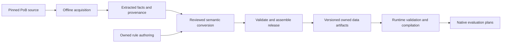

# Data acquisition, rule execution and the current migration

Snapshot: 2026-10-02, including legacy retirement, incoming inputs and native usage preferences.
This explains the implementation and
the accepted direction. The owner confirmed on 2026-10-02 that SQLite and an ORM
are not needed; generated owned artifacts and loaded Rust indexes remain the plan.
[Domain architecture](domain-architecture.md) controls the target design and
[implementation](implementation.md) records the latest evidence and blockers.

## Three execution paths currently coexist

**Development target:** the owned path. New game support belongs there. Changes
to the legacy path require a named remaining consumer or a correctness fix;
unused compatibility features should be removed. PoB remains an optional oracle.

| Path | What executes | Purpose and current status |
| --- | --- | --- |
| Original PoB through `mlua`/LuaJIT | The pinned original Lua, including its application model for full builds | Optional data acquisition and reference calculations. Kept for parity and updates. |
| Legacy Import/Engine path | Source-shaped import/inspection and a Rust interpreter for a supported subset of extracted Lua-like programs | Remaining acquisition and independent component comparisons. NativeBackend, its CLI and its orphaned profile-template coordinator are removed; legacy Import/Engine retirement is incomplete. |
| Owned native path | Our typed game definitions, expression graphs, relationships and reusable Rust algorithms | Target architecture. Real component execution exists; none of the five original builds completes this path yet. |

`mlua` hosts LuaJIT; it is not our own Lua interpreter. The separate legacy Rust
VM was built to execute selected extracted logic without LuaJIT. The new owned
engine uses neither that compatibility VM nor LuaJIT. It evaluates a different,
project-owned rule representation in Rust.

The native CLI entry points `evaluate-owned` and `resolve-owned-effects` use the
owned Core/Data/Engine path. `evaluate` and `metrics` are explicitly PoB reference
commands behind `--features pob`. The old native backend selector, `prepare-build`,
`search-build` and `benchmark-native` are removed. No obsolete search input is
silently sent through the owned evaluator.
The default executable has no PoB/Lua or NativeBackend dependency. Its Import/Data/Engine
dependency closure still compiles some legacy Rust modules for inspection and
conversion. Isolated Data/Engine builds with
`--no-default-features` exclude those modules. These are different guarantees.

See [legacy source runtime](../crates/poe-optimizer-engine/src/source_program.rs),
[CLI entry points](../src/main.rs),
[owned metrics CLI](../src/owned_metrics.rs) and
[retirement inventory](legacy-retirement.md).

## 1. Extracting and packaging game definitions

Three kinds of input must stay separate:

- **Game definitions:** skills, level tables, items, passives and mechanic rules.
- **A user's build:** particular equipment, allocations, skills, supports and
  scenario choices. XML/share-code decoding and normalization handle this input.
- **Reference results:** outputs from executing original PoB, used to check our
  implementation. They are not calculation inputs or substitutes for mechanics.

The owned data pipeline is:

Acquisition is currently mixed, with explicit tools:

| Mechanism | Actual implementation | Limit |
| --- | --- | --- |
| Restricted source/table reading | Existing Python exporters recognize reviewed literal Lua shapes or read pinned JSON/catalogs | They reject unsupported forms; they do not evaluate arbitrary Lua. |
| Executing definitions | Optional Rust `export-owned-*` tools use `mlua`/LuaJIT to run finite authenticated chunks or constructors and project their results | Some use LuaJIT with JIT compilation disabled. They export finite facts, not automatically understood game mechanics. |
| Semantic conversion and assembly | Rust `compile-owned-*`, `extend-owned-*` and `assemble-owned-*` tools validate authored definitions, rules and bindings | Conversion remains family-specific and partly manually authored. Unsupported content stays explicit. |
| Legacy extraction | `extract-game-data` runs an isolated extraction worker | It produces the older PoB-shaped GameDataPackage, not the new general owned package. |

For examples, see the [literal mechanics exporter](../scripts/export-owned-mechanics.py),
[intrinsic acquisition](../crates/poe-optimizer-pob/src/owned_intrinsic_attack.rs),
[actor acquisition](../crates/poe-optimizer-pob/src/owned_actor_baselines.rs),
[augment acquisition](../crates/poe-optimizer-pob/src/owned_augments.rs) and
[release assembly](../crates/poe-optimizer-import/src/owned_release.rs).
Some owned acquisition tools still reuse old extraction helpers internally;
their output boundary is owned, while that tooling cleanup remains unfinished.

Extracting a numeric table is relatively direct. Recovering what a callback means
requires semantic conversion: ownership, applicability, ordering, rounding,
activation and interactions may be encoded in PoB code rather than table cells.
There is no universal automatic Lua-to-owned-mechanics translator. An acquired
definition can be known while its input schema, programs or contributors remain
Partial. Catalog size therefore does not measure supported builds.

Current rule authoring uses verbose structured data and family conversion tools;
there is no compact textual domain DSL frontend yet. Such a frontend could emit
the same typed representation. It would be an authoring improvement, separate
from adding another runtime language or adopting database storage.

**This does not currently run automatically in `cargo build`.** The root
[build script](../build.rs) only configures the Windows executable stack.
The data-build commands are separate offline operations. The latest family
publication also uses an explicit release-test helper to orchestrate checked
library APIs; there is not yet one unattended command rebuilding the complete
game package. The intended distribution pipeline runs acquisition/conversion
before shipping and permits independent data-package updates. It need not run
PoB or regenerate all data on every incremental Rust build.

## Persisted format: owned artifacts and in-memory indexes

There is currently no SQLite, DuckDB or ORM layer. Owned releases use canonical
JSON files with strict typed schemas, versioned identities, hashes and explicit
coverage declarations. The data loader builds indexed Rust structures; the
engine compiles rules and binds them to the supplied build.

Runtime artifacts include the definition schema, rule programs/tables, action
routes and, for an evaluation-bearing release, metric and optional support-stage
artifacts. Development releases also carry source mappings, normalization/item
policies and provenance. The engine needs the owned runtime contracts; full
distribution separation from adapter tooling remains a migration gate.

The latest checked development release is eighteen files, about 60 MB. It is a
Partial data release with no evaluation bundle; it cannot be passed off as a
complete runnable game database. See [owned releases](owned-releases.md).

The accepted storage path is:

1. Extract facts and convert behavior into owned definitions/rules.
2. Persist and version the generated owned artifacts.
3. Validate and load a frozen snapshot, then execute typed plans in memory.

UI search and autocomplete will use a derived index over the loaded model.
SQLite, DuckDB and ORM adoption are outside the implementation plan. The
[storage investigation](definition-storage.md) retains the historical comparison;
its old package-size and schema details describe the legacy checkpoint. No
database service, connection or lazy query belongs in candidate evaluation.

## 2. Conditional logic in the owned engine

The persisted [rule contract](../crates/poe-optimizer-core/src/owned_rules.rs)
contains typed reads, expression nodes and effects. Nodes form a directed acyclic
graph; named intermediate results express dependencies without mutable Lua locals.
Supported operations include arithmetic, finite level-table lookup, explicit-unit
scaling/ratios, rounding, comparisons, Boolean operations and lazy branch selection.
Effects contribute to a stat, derive a final value, activate a grant or project
values into an explicitly supplied skill/actor.

Conditions require typed Boolean inputs. A false effect guard or unused branch
does not demand its numerical inputs. Unknown activation remains unknown.
Required occurrence inputs, provider activation and completeness are separate
gates: laziness cannot make an incompletely described skill ready to execute.
An absent contribution inventory cannot silently become zero or multiplier one.
Current final-metric coverage is conservative across the plan: an incomplete
selected contributor/receiver/program inventory can withhold final results even
when an individual formula is known. Finer occurrence/channel coverage is a
separate pending proposal, not behavior already delivered by the rule compiler.

There are no general author-written loops, mutable tables, arbitrary function
calls, recursion or PoB callbacks in this rule language. Bounded Rust algorithms
perform repeated domain work such as enumerating actual recipients, reducing
contributions and selecting/admitting supports. More complex reusable numerical
operations can call Rust kernels; ordinary action timing is an implemented
example. Coefficients, applicable domains and recipe selection remain injected.
A genuinely new operation requires a versioned engine implementation, not an
automatic Lua fallback.

Compilation has three distinguishable products:

1. **Stored owned package:** portable typed definitions/rules and their content
   identities. Release assembly compiles them as validation, but does not ship
   generated machine code.
2. **Compiled rules:** validated types, units, scopes and acyclic dependencies,
   lowered into private indexed programs.
3. **Occurrence-bound plan:** concrete item/skill/actor/action relationships,
   activation gates, effect dependencies and requested output routes for a build.

Rust evaluates that plan using reusable worker-owned scratch. Immutable programs
and plans can be shared between workers. The prepared evaluation path has no
PoB process, Lua state, SQL access, source parser or serialization. This is an
indexed Rust graph evaluator, not a machine-code JIT for each rule. Repeated
evaluation and Rayon isolation are tested; general search integration and
performance measurements across complete real builds remain unfinished.

Support preparation has explicit stages and dependency checks. A current missing
contract is the distinction between preparation readiness and final execution
readiness: supports can affect a skill's final inputs, while today's generated
context gates require those inputs before preparation. That phase contract remains
proposed. Usage preferences follow the separately accepted composition contract
below. Neither contract can be supplied by observed defaults. See
[readiness](owned-preparation-readiness-proposal.md) and
[accepted usage composition](owned-skill-usage-proposal.md).

### Saved usage preferences and scenario overrides

The selected skill preset owns typed usage preferences for its exact supplying
Skill, Action or generated Actor occurrences. Reusing the same physical Gem in
another preset does not reuse its occurrence preferences. The shared
`owned_project::compose_request` boundary combines that selected layer with the
explicit scenario; draft finalization calls the same operation. A scenario row
replaces a preference only at the exact `(policy, target)` key, replacing its
whole parameter record. It cannot borrow omitted parameters from the preference.

Complete projects and editable drafts retain the layer. An omitted legacy field
keeps its old serialized representation and means no authored preferences; it
does not prove complete imported usage. Pending preferences on the selected
preset block finalization, while an unselected preset remains independently
editable. Structural validation checks both raw layers before replacement and
charges them before deduplication. Definition binding remains a separate step.

The resulting native request still uses `ScenarioInput.usage`. Usage programs
execute through the ordinary compiled rule graph, exact target resolution and
activation gates. Supported contexts are Skill-to-Skill, Action-to-Action and
Actor-to-Actor, with ordinary derivation, contribution, capability and requirement
effects. Policies do not create provider topology: their grant/projection,
support and transformation effects retain explicit unsupported-relation gaps.
Other context pairs stay unsupported. No usage-specific VM,
Lua callback or subprocess is introduced. Complete source projection, count
consumers and effect-activation producers are additional work; merely persisting
a preference does not establish their numerical behavior.

### Concrete example: Pain Offering

The owned data now supplies the real Offering skill from its physical Gem, reads
an injected forty-level damage table, computes each source/recipient candidate's
effect scaling and rounding, then chooses the maximum per exact recipient,
stacking family and modifier. Equal winners retain their source identities. The engine contains no
Pain Offering-specific opcode or hard-coded sample-build bonus.

This exercises lookup, inputs, activation, ownership and reduction as separate
concepts. The table and delivered modifier agree with fresh original PoB controls.
However, final supported level/quality, saved activation and resolved scaling
still need production input producers. Finite tests explicitly supply those
boundaries; the real build remains unresolved. See the
[authored family](../data/owned/poe2/3887ae68/pain-offering/README.md).

Incoming enemy damage uses the same separation. Its import policy maps named
source controls to typed external inputs, including an injected finite category
option. The owned data supplies the damage table, defaults, rounding, contribution
channels and DoT branch. The existing native engine evaluates that program. A
separate optional PoB witness observes original preparation and calculation calls
to check the results. Adding this family requires neither a new interpreter nor
PoB UI objects in the production model.

## Where the older interpreter and original Lua still fit

The [legacy source program module](../crates/poe-optimizer-engine/src/source_program.rs)
reuses a shared parser-program compiler, VM and heap. Its extracted language has
assignments, mutable tables, branches, loops, calls and returns with selected
Lua-compatible behavior. The old modifier parser and source-shaped item
preparation still use it. The abandoned PoB class-capture/Common.new and
configuration-control replay experiments have been removed. Generic session
observation remains only where it supports maintained parser reference checks.
The project never completed a general native recreation of PoB's entire UI.

The accepted migration replaces that runtime model with domain semantics. Some
source-lowering code can remain in offline acquisition while it has a named
consumer; it must not become an owned evaluation dependency. Existing Python
exporters/tests are also transitional tooling, not runtime dependencies.

Original PoB remains separate. Its [reference runtime](../crates/poe-optimizer-pob/src/runtime.rs)
uses `mlua` with vendored LuaJIT, executes `HeadlessWrapper.lua` and loads the
build through PoB's application objects with rendering stubbed. Supervised
workers isolate that state and failures. This is still coupled to PoB internals,
appropriately inside the optional reference adapter. Parity compares imported
meaning and calculated results; it does not require the native engine to expose
PoB's UI objects or reproduce irrelevant internal callbacks.

## Migration status and remaining deliverables

| Gate | Current state |
| --- | --- |
| D0 — own the boundary | Accepted architecture and retirement inventory; legacy expansion is constrained. |
| D1 — owned inputs/import | Project/build/draft/scenario contracts exist and preserve all five originals with explicit gaps; several input/composition contracts remain unresolved. |
| D2 — owned data/compiler | Typed packages, validation, explicit release assembly and real converted families work. Full semantic coverage and an unattended complete data-build pipeline remain open. |
| D3 — general evaluation | Native effect/metric/support/application components work. Full native originals: **0/5**. |
| D4 — general optimization | Binding joint search to the owned evaluator remains incomplete. The obsolete profile search CLI is removed. |
| D5 — retirement/breadth | NativeBackend crate, its CLI and class/UI experiments are removed. Independent component comparisons and Import's source-shaped dependency closure remain. |
| D6 — performance/applications | Real full-build throughput, general reuse/invalidation and GUI/web integration still need delivery. |
| T1 — Rust tooling/tests | Existing Python migration is deferred; Rust is the direction for new maintained tooling/tests. |

The intended end state is one owned build/evaluation/search model, with a
separate reproducible data-build toolchain and optional original-PoB oracle.
Generated artifacts feed immutable loaded Rust indexes. Lua and PoB application
objects remain outside the native calculation model; no database layer is planned.
