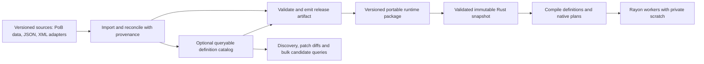

# ADR: definition storage and generated runtime artifacts

**Status:** investigation recorded; recommend retaining generated packages and using the loaded model for UI search. DuckDB/ORM adoption is deferred, not a required implementation phase. The existing immutable data-injection boundary remains accepted.
**Date:** 2026-09-11
**Decider:** project owner, following the request to consider DuckDB, an ORM and build-time data generation.

## Context

Definition storage should support independent game-data updates, inspection, reconciliation
and efficient preparation without constraining the fully native parallel evaluator. The
[shared build model](general-build-input-proposal.md) separately represents user instances,
providers and selected views. Database rows must not become those instances or native plan
handles. Correct structural boundaries take priority over preserving current profile shapes.

Today, game definitions already ship as a generated JSON package, not XML.
[`game_data.rs`](../crates/poe-optimizer-data/src/game_data.rs) embeds `game-data.json` and
loads supplied bytes through `GameDataLoader::from_bytes` into `GameDataSnapshot`.
The optional [extractor](game-data-extraction.md) reads pinned PoB data and produces that
package. XML is chiefly caller build interchange and exact source evidence. It can also be
an input to a future definition importer, but it is not the only possible source format.
Eliminating definition XML from a release does not require eliminating build XML import/export.

The schema29 package is 26,286,752 bytes. This is artifact size, not resident memory
or full-game numerical coverage. No project benchmark currently compares it with DuckDB,
compressed JSON or a portable binary package. Complete native supplied builds remain 0/5.
A storage change cannot supply the missing actor/action/calculation semantics.

## Proposed boundary

The catalog, release artifact and in-memory calculation layout are separate choices.
Retain a generated portable package and immutable Rust tables/compiled typed programs for
calculation. DuckDB remains an option for a demonstrated catalog workload, rather than a
prerequisite for preparation or UI discovery.
An ORM, if useful, belongs inside the catalog adapter; neither ORM entities nor lazy queries
cross the data-model or evaluator boundary.

Sources converge on the same validated definition contract. Initially an experimental
DuckDB exporter can emit the existing canonical JSON package and use its current loader;
this gives an exact-content comparison without a premature second validator. If direct
binary/database ingestion is later justified, factor common validation beneath both
readers. SQL constraints complement validation; they cannot certify supported mechanics.

A future acquisition interface belongs in host/tooling code and returns one frozen
artifact or owned batch, with explicit identity and resource limits. It must not be a
per-stat provider that opens files or performs queries during evaluation. Add a trait
when a second working adapter requires it. Keep `poe-optimizer-data`, engine and native
calculation independent of DuckDB, an ORM, database connections and operating-system I/O.

## UI search and autocomplete

Use the loaded definition model as the source of truth. Build a small immutable search
index for the selected data snapshot, containing stable definition references plus names,
source-provided aliases, kind, tags and other displayed/filterable metadata. Keep distinct
records when names collide. Display original labels; search normalization is derived metadata
and must not rewrite identity, source records or calculation inputs.

Start with a bounded prefix/substring search over a compact label index and rank exact and
prefix matches before broader matches. Measure latency and memory against the actual full
catalog before adding a trie, n-gram index or fuzzy-search library. An index is a rebuildable
view of the existing snapshot, not a second editable definition database. For a browser that
does not load all calculation data immediately, the same release pipeline can emit a compact
discovery artifact bound to the definition identity.

Keep the search service API independent of that implementation: query, filters and a bounded
result limit produce typed definition references and display metadata. A Tauri host can query
Rust-owned shared data and return only the suggestions; sending the whole definition package
to the renderer per keystroke is unnecessary. Browser hosting may use the same portable index
or a generated discovery view, with latency/transfer costs validated separately. Avoid sharing
an evaluator worker's mutable scratch or holding a global evaluation lock for UI queries.

Version/bind search indexes and responses to the active data snapshot so a late response from
an old release cannot select a new definition accidentally. Catalog presence is not evidence
of implemented native coverage or compatibility with a particular build. Show known coverage
metadata and perform context-dependent support/item/provider validation when applying a choice;
retain unknown outcomes rather than hiding potentially valuable interactions.

This UI workload alone does not justify DuckDB or an ORM. Defer database prototyping and
resume the shared-model/breadth work. Reopen storage selection only for measured startup or
memory problems, substantial cross-release/catalog queries, or an explicit authoring need.

## Options and trade-offs

| Option | Useful properties | Costs and limits |
| --- | --- | --- |
| Existing JSON package; optionally compress transport/storage | Reviewable, already validated, portable; lowest migration cost | Decode and current catalog construction still cost time/memory; compression adds bounded decompression |
| DuckDB catalog plus generated runtime package | SQL for reconciliation, joins, catalog discovery and bulk filtering; runtime retains current native ownership | Additional schema, adapter and release pipeline; catalog and package equivalence must be tested |
| Ship a read-only DuckDB database and bulk-load at startup | One queryable artifact; allows selecting data before native compilation | Client/native dependency and format compatibility; conversion still needed; browser integration differs |
| Portable binary package or compiled-definition artifact | May reduce parse time, transfer size or repeated setup | Versioned encoding, bounds and cross-platform validation; compiled artifacts also bind to engine semantics; speedup requires measurement |
| SQL/ORM access from each evaluator operation | Flexible ad hoc access | Adds query/materialization and connection management to repeated calculations; conflicts with the existing no-I/O, allocation-free steady-state target |

DuckDB supports selective indexes and prepared statements, but explicitly prioritizes
larger, less frequent queries over many small concurrent ones. This supports the proposed
catalog role; it is not a measured speed comparison for this project.
[Workload guidance](https://duckdb.org/docs/current/guides/performance/how_to_tune_workloads),
[indexing](https://duckdb.org/docs/current/guides/performance/indexing).

An ORM provides mapping and maintenance conveniences, not an automatic speed improvement.
If a database prototype is justified, start with typed bulk queries through `duckdb-rs`;
assess an ORM only against
concrete relationship/migration needs and confirmed DuckDB support. The official client
already maps rows into Rust structs. Its connection is `Send` but not `Sync`, so a shared
connection is not a substitute for our shared immutable snapshot. Host-side query concurrency
also needs a CPU/memory budget to avoid competing with the Rayon search pool.
[Rust client](https://github.com/duckdb/duckdb-rs),
[connection API](https://docs.rs/duckdb/latest/duckdb/struct.Connection.html).

DuckDB-Wasm is available, but brings its own JavaScript/worker/Wasm integration. A browser
host could optionally query it and supply the same runtime package; native `duckdb-rs`
portability must not be inferred from that separate product. Preserve a browser evaluator
that needs only portable definition bytes and Rust calculation code.
[Wasm overview](https://duckdb.org/docs/current/clients/wasm/overview),
[deployment](https://duckdb.org/docs/current/clients/wasm/deploying_duckdb_wasm).

## Data fidelity and reconciliation

Use explicit game namespace, release, definition kind and source keys. Keep stable definition
IDs independent of row numbers, display labels, file offsets, caller instance IDs and private
compiled indices. Suggested catalog families include releases/provenance, definitions,
level/quality tables, ordered effects, references, typed programs and coverage/admissions.
These are logical families, not a finalized relational schema. Do not flatten nested typed
programs into generic name/value rows simply to fit an ORM.

Import into a staging release, preserve source digests and unresolved records, validate,
then publish an immutable release. Conflicting definitions require explicit reconciliation;
never silently overwrite by label or treat a partial import as authoritative deletion.
A running search retains its original snapshot. User inventory and build edits have their
own lineage/lifecycle and are not mutable shared definition rows.

Store explicit ordinals for ordered modifiers, effects and program operations; preserve
reference sharing and scalar distinctions such as absence, false, zero, signed zero, exact
integer/bitmask values and floating-point round trips wherever the existing contract needs
them. Do not use SQL aggregation to replace source-ordered calculation. Joins and grouping
do not generally preserve input order, so reconstruct sequences using explicit keys and
ordering. [Order preservation](https://duckdb.org/docs/current/sql/dialect/order_preservation).

Artifact integrity and logical content identity need separate treatment. Today
`DataIdentity.content_sha256` is the exact input-package byte digest. Do not silently redefine
it as a database file digest or declare equivalent records interchangeable. A future
encoding-neutral digest needs a versioned canonical logical representation and coordinated
migration of trust, caches, reports, admissions and prepared-input checks. Retain exact
artifact/source digests alongside it. Equivalent independently generated DuckDB files must
not be presumed byte-identical; its storage compatibility guarantees address a different
question. Pin and test supported reader/storage versions.
[Storage compatibility](https://duckdb.org/docs/current/internals/storage).

Catalog queries may narrow candidates by explicit user constraints or proven compatibility.
Heuristic filters must be labeled and accounted for: low standalone stats do not establish
that an item is dominated when grants, conversions or support/provider interactions can
change the entire build. Optional seeded-jewel indexes can use this seam later, once
[J1 applicability and data compatibility](seeded-jewel-feasibility.md) are established.

## Generation, shipping and updates

Use an explicit developer/CI data-generation command over pinned inputs. Generate before
release packaging, checkpoint/close a database if distributing one, reopen it for verification,
and publish the manifest plus artifact hash. Ordinary native builds and end-user launches
must not require PoB, network access, XML definition sources or regeneration. The current
optional PoB feature remains available for matched-source parity and development extraction.

Ship an embedded default or external versioned artifact through the same validation path.
Compatible external data updates continue to work without recompiling Rust. If compiled
artifacts are introduced, use portable encodings rather than dumps of Rust memory or native
handles; bind them to operation/compiler semantics and regenerate when incompatible.
Reference/source evidence can ship separately from the runtime artifact, with enough
provenance retained to reproduce it.

## Investigation and acceptance gates

The [implementation record](implementation.md#definition-storage-and-ui-search) tracks the
completed assessment and future UI work. The following database/format experiments are
conditional evaluation criteria, not mandatory next phases. Reopen them only when a measured
workload or product requirement warrants the additional storage layer.

1. Freeze workload and fidelity cases using the entire current package, all five supplied
   imports as definition-reference workloads, and custom/invalid packages. Record which
   complete-build evaluations are actually supported; parser timing is not whole-build timing.
2. Prototype optional DuckDB catalog import, a useful patch-diff/discovery query, and export
   back to the existing canonical package. Keep every section, ordered record, program,
   admission and diagnostic intact. Include unchanged round trips and controlled changes.
3. Compare current JSON, compressed JSON, DuckDB bulk load and a candidate portable binary
   encoding with equal validation. Measure artifact/dependency size, cold and warm loading,
   validation/compilation, peak and retained memory, point/batch lookup and preparation.
   Separate query execution, row mapping and database thread counts. Use scaled synthetic
   rows only for scaling evidence, not game parity. Measure supported complete evaluation
   and serial/Rayon throughput using the same prepared inputs; verify no hot-path queries.
4. Choose the database and runtime encoding from the evidence and owner review before making
   either mandatory. If adopted, add supported native/browser reader tests, corruption and
   bounds tests, reproducible logical export, data-update isolation and release packaging
   without source definitions/PoB. Prove matching parity and diagnostic outcomes within the
   actual supported scope; preserve the outstanding full-build breadth requirements.

This investigation need not delay source/instance identity work: that model stays independent
of storage. It should settle the serialization/identity seam before a production database
adapter or compiled artifact changes the public data contract.
