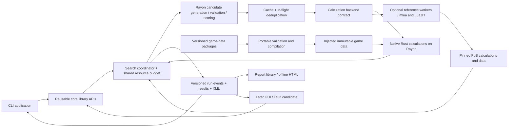

# Build optimizer design

Status: agreed direction; this document describes the target system and its contracts.
Initial target: Path of Exile 2, multicore core libraries with a CLI, Windows development.
See the [living implementation record](implementation.md) for delivery sequence, current
capabilities, validation evidence, unresolved work, and the next session's resume point.
The [source investigation](pob-integration.md) records the inspected PoB baseline.
The [native item-assembly design](native-item-assembly.md) defines injected policy,
preparation identity and partial-state contracts below the build evaluator.

## Recommendation

Build a Rust search engine with a fully native, parallel build evaluator. Keep versioned
Path of Building (PoB) as an optional calculation reference for differential testing and
validating game updates.
First prove that imported builds and controlled changes reproduce PoB's results. The first
usable optimizer must then search class, ascendancy, passive allocations, equipment, support
gems, and supporting skills jointly. It must preserve any user-required set of 1..N skills
and 1..N equipped item instances. A passive-only or gear-only search is an internal test
baseline, not the agreed first product.

Use explicit, versioned candidate catalogs and inventory bounds to make the domain finite.
Within that domain, class/ascendancy changes and all requested build dimensions must remain
searchable unless the user locks them. Reject unsupported requested capabilities explicitly.
Target useful best-found results over configurable 5–30 minute runs, with both bossing and
mapping benchmark cases; this is a validation target, not a performance or optimality promise.

User-configurable goals are a core requirement. Skill selection, damage, resistance,
and effective hit pool are illustrative use cases, not an exhaustive objective catalog
or mandatory requirements. Each run chooses what to optimize, what must hold, and which
build choices may change. Finite candidate catalogs do not fix the user's goals.

Treat multicore execution and reusable core libraries as initial engine requirements.
Build the CLI over those libraries, with structured results and offline visualization
before a later desktop GUI. Rayon executes native calculations directly over shared immutable
data and independent candidate state. Isolated Lua workers serve the optional PoB reference
backend. Tauri is a candidate for the later GUI.

Use a budgeted heuristic search that returns verified improvements and explains their
trade-offs. Do not promise the global optimum. Finite item and skill/gem catalogs are part
of the initial joint search. Defer unconstrained rare-item generation, live trade ingestion,
and unbounded discovery outside the user's allowed catalogs.

The production native distribution must not require a PoB checkout, Lua runtime or evaluator
subprocesses. For reference builds, keep PoB source unmodified in a pinned submodule. Own the compatibility shim and
worker protocol in this repository. Prefer Rust workers embedding LuaJIT through `mlua`
for Lua hosting and interaction. Preserve process isolation and fresh-process verification.
A separate upstream LuaJIT harness supplies independent host/extraction reference evidence
and can diagnose embedding incompatibilities.

## Problem and boundaries

A build's value depends on interactions among passive paths, skills, items, resources,
damage conversion, conditional effects, and defensive assumptions. Neither independent
node scores nor an additive item score captures this reliably. We need an authoritative
calculation oracle for each proposed combination, with inexpensive structural checks
before invoking it.

The first useful workflow:

1. Import a complete local PoB XML build.
2. Resolve required skills/items, independent locks, allowed catalogs, and scenario assumptions.
3. Configure the objective policy and any hard constraints from the supported capabilities.
4. Evaluate the seed and show the exact interpreted metrics.
5. Search within a time and evaluation budget.
6. Return the best feasible alternatives, before/after metrics, changes, and PoB XML exports.

Support lists of required skills and equipped items from the first problem schema. A required
skill must exist in a legal, enabled, usable configuration; merely leaving a disabled gem in
an unused group is insufficient. Its identity and role are separate from optional locks on
supports, level/quality, group placement, or weapon assignment. A fixed item means the exact
concrete item instance/rolls must be equipped, not merely present in an inventory. An exact
slot lock is optional and distinct from allowing any legal compatible slot.

Requirements can identify active damage skills, supporting active skills, or support gems
through unambiguous adapter IDs and explicit placement/role constraints. Keep the metric's
actor/skill/group/part selector separate from presence and lock requirements. Required skills
need not all be damage objectives. Class/ascendancy changes must preserve these requirements;
if a required mechanic is unavailable for a candidate class, that candidate is invalid.

Initial non-goals: building from an empty character; discovering every viable archetype;
perfect rare items; crafting or purchase automation; an online service; a GUI in the first
milestone (desktop interaction is planned later); frame-level
combat simulation. Replacing the complete calculation core in Rust is an explicit target.
PoB's modeled numbers are the initial parity target, with its supported-mechanic limitations
carried into our reports. Narrow native profiles are incremental validation steps, not
completion of that replacement.

## Data-driven builds and breadth of validation

Every production build comes from caller-provided input. Item and skill instances, levels,
quality, support groups, selected sets/actors/actions, passives, conditions and encounter
assumptions belong to versioned data. Game definitions and numeric constants enter through
the injected game-data seam; reusable Rust operations implement mechanics. No embedded
example character, fixture identifier, source hash or known build combination may supply a
hidden default or choose a special numerical branch. Test fixtures may be fixed, but the
same production APIs must accept unrelated caller inputs within declared mechanic coverage.

Validation spans complete builds and interacting mechanics, in addition to small numerical
oracles. Maintain a caller-configurable corpus, preserve original imports and reference
provenance, and reserve whole-build holdouts before extending mechanics. Include both
mapping and bossing and a range of skills, weapons, support interactions, actors, ailments,
triggers, reservations and defences. Report what remains excluded. A growing number of
passing variations of one profile does not establish broad evaluator coverage.

Keep import fidelity, realized candidate identity, legality, supported mechanics, metric
availability and numerical agreement as independent outcomes. Reference calculations must
be fresh and version-matched; cached statistics inside an import are not expected values.
An original build must remain intact when creating a reduced diagnostic or a perturbation.
Use coverage evidence to prioritize shared pipelines, and preserve exact failures rather
than adjusting tolerances or selections to make a build appear supported.

Ordinary and ascendancy allocations have distinct roots, ownership and point budgets.
A valid ascendancy component does not need an ordinary-tree route. Missing source node
references, disconnected candidate paths and supported exceptional allocation mechanisms
require distinct diagnostics; graph layout alone cannot establish legality.

## Product workflows and gaps identified in review

The [WoW prior-art and product review](prior-art-and-product-review.md) compares Raidbots,
Ask Mr. Robot, SimulationCraft, and WoWSims using official documentation and source schemas.
Its transferable lessons are workflow and trust requirements, not assumptions that the
same algorithms or stochastic simulation methods apply to PoB.

Plan distinct workflows over the same libraries:

- **Preflight/evaluate:** show supported metrics/mechanics, imported assumptions, active
  selections, and frozen dimensions before committing to a search.
- **Compare:** evaluate supplied alternatives against an explicit common baseline and scenario.
- **Optimize:** jointly search allowed classes/ascendancies, passives, equipment, supports,
  and supporting skills while preserving explicit requirements.
- **Inspect/rerank:** change goals over compatible retained measurements, clearly labeling
  that the saved candidate set was reranked rather than newly searched.
- **Upgrade ranking (inventory stage):** distinguish a one-item marginal comparison from
  joint re-optimization or an eventual multi-item plan.

Persist portable problem/project data and recovery checkpoints for long runs. Support
a compatible warm start from saved candidates with explicit verification status;
evaluated-only recovery seeds must be freshly revalidated before trusted reuse. Exact search-state resume
is a separate capability whose priority depends on expected run length. Include practical
near-equal alternatives, readable grouped changes, and per-constraint failure explanations.

Include both bossing and mapping contexts in the initial benchmark suite. A run chooses
its own named scenarios, applicable constraints, and objective scope; testing both contexts
does not silently require every user to optimize a combined goal. Explicit sensitivity
checks consume a reserved budget and do not automatically imply robustness. Known unsupported
mechanics, unvalidated coverage, and numerical/fresh verification are distinct report statuses.

## What the upstream source establishes

The pinned source contains a headless wrapper, XML build loading, tests that use that
wrapper, calculation outputs, and helpers for evaluating local changes. It is not a
documented stable library API. Our source review also found runtime compatibility and
state-management questions. Runtime validation status belongs in the
[implementation record](implementation.md#fixture-ledger-and-technical-unknowns).

See [the integration notes](pob-integration.md) for exact source links, dependencies,
metric mappings, and dated observations. In particular:

- The headless wrapper initializes application objects, not just a pure formula function.
- Global state and calculation caches require explicit lifecycle control.
- The existing marginal-change helpers can aid proposal generation; they do not solve
  joint constrained optimization or establish full candidate legality.
- The wrapper's standard-Lua comment does not establish actual runtime compatibility.
- Fields resembling DPS and EHP need semantic checks, not just extraction by name.

A working Rust build in this repository is not evidence that the PoB evaluator works.

## Architecture



Use a Cargo workspace with library/application boundaries from the first engine implementation:

| Planned package | Responsibility |
| --- | --- |
| `poe-optimizer-core` | Problem/candidate models, metric/evaluator interfaces, generic scoring/search, execution policy, events/results |
| `poe-optimizer-data` | Versioned game-data model, portable package loading/validation and immutable snapshots; no evaluator or acquisition I/O |
| `poe-optimizer-engine` | Portable Rust calculation semantics and compilation of injected data into resolved calculation tables; no Lua or OS scheduler |
| `poe-optimizer-native` | Native build preparation, calculation backend, typed results and export |
| `poe-optimizer-import` | Bounded build/share-code decoding and portable interchange/materialization |
| `poe-optimizer-pob` | Optional reference backend, Lua supervision, source extraction and parity evidence |
| `poe-optimizer-report` | Structured artifacts, comparison models, CSV/JSON exports and offline HTML reports |
| `poe-optimizer-cli` | Configuration/flags, adapter composition, progress display and exit codes; binary named `poe-optimizer` |
| Later desktop application | GUI using the same libraries; Tauri remains a candidate |

Core libraries must not depend on CLI parsing, terminal output, Tauri, or a webview.
Expose typed validation/run/cancellation/result APIs and progress events, allowing the
CLI and later GUI to share all calculation, feasibility, and search behavior.

See [parallel execution, interfaces, and visualization](execution-and-interfaces.md) for
the proposed package dependencies, resource policy, event/artifact contracts, and GUI path.
PoE1 can share these libraries while supplying its own rules, topology, and metric capabilities.

### Game-data boundary

Most game content and balance parameters load from versioned configuration packages owned
by `poe-optimizer-data`. Hosts select and load bytes, then inject a validated immutable
snapshot compiled for the chosen native engine. Skills, item bases, passive effects,
monster tables, rewards and numeric rules must not require edits to Rust source when their
values change within supported semantics. Rust owns calculation operations and coverage
checks; data cannot enable an unimplemented mechanic.

The same loader accepts embedded default and external data. Each backend and prepared build
retains its dataset identity; parallel jobs can use different snapshots without global
state. Search catalogs, results and caches bind to that identity. Run objectives, inventory,
selected quest rewards and encounter choices remain separate problem inputs. The
[data-boundary decision](game-data-boundary.md) defines the model, ownership, validation,
compatibility and data-update contracts.

### Evaluator boundary

The shared calculation and evaluation interfaces are in-process Rust traits with typed
requests/results; see the [boundary decision](calculation-boundary.md). Native preparation
produces immutable versioned build inputs and independent mutable calculation state. It
must not invoke PoB, require IPC or silently fall back to Lua for unsupported mechanics.
Backend selection is explicit and participates in provenance and cache compatibility.

The optional PoB backend privately uses versioned JSON Lines with request IDs and a startup handshake.
Only protocol messages go to stdout; PoB logging is captured on stderr. A worker declares
game, upstream revision, runtime/ABI, adapter revision, supported metrics, and capabilities.

Logical operations:

- `initialize`: validate identities and capabilities; load immutable data.
- `evaluate`: accept seed content/identity, complete candidate choices, and resolved scenario;
  return validity, metrics, warnings, and timing.
- `export`: serialize a specified, re-evaluated candidate into PoB-compatible XML.
- `shutdown`: release the process and temporary state.

Do not require the coordinator to understand arbitrary Lua object graphs. Each evaluation
must reconstruct a candidate from the same baseline, not rely on whatever mutation the
previous request left behind. For PoB reference evaluation, initially use fresh processes or an independently verified
full reset. Reuse initialized reference workers only after A/B/A and request-order
tests demonstrate isolation.

For the PoB backend, use a bounded process pool with one active calculation per worker.
These processes give independent
globals, working directories, and recoverable timeouts. They are a reliability boundary,
not a security sandbox. Kill and replace a worker after a timeout, startup hang, or corrupt
response; return a typed error and count the attempt against the budget. Cap retries.

Use `mlua` as the Rust/Lua boundary inside each evaluator worker, with its LuaJIT backend
to retain PoB's runtime assumptions. Rust owns process startup, protocol serialization,
callbacks and typed value conversion; a small Lua shim adapts PoB's private object model.
The [mlua build documentation](https://github.com/mlua-rs/mlua#compiling) supports LuaJIT
and vendored runtime builds. Vendoring the interpreter does not supply PoB's native modules.

Keep one VM owned by one execution thread in each worker process. The coordinator sends
complete candidates through the versioned protocol; `mlua` values stay inside the worker.
The [mlua threading model](https://docs.rs/mlua/0.12.1/mlua/#send-and-sync-support) does not
make simultaneous calculations in one state independent. Parallelism comes from workers;
Rayon handles Rust compute work under the shared resource budget. Embedding preserves IPC
between the coordinator and workers and does not by itself establish a speed improvement.

Validate Windows/native-module ABI and symbol linkage, `lua-utf8` loading, required host
callbacks, ordinary-frame calculations, and export parity before declaring this host usable.
If dynamic C-module loading is used, isolate the required unsafe initialization in the
adapter and load only controlled runtime modules; the [default Lua constructor](https://docs.rs/mlua/0.12.1/mlua/struct.Lua.html#method.new)
disallows C modules. Imported build data and objective configuration are never executable Lua.
A fresh Rust/`mlua` process remains the PoB reference-backend correctness baseline. Use a separate
upstream-runtime harness for independent host/extraction calibration and to diagnose
embedding incompatibilities. Record source, runtime and harness identities with tolerances;
shared PoB source remains a shared dependency, not independent validation of game mechanics.

### Parallel execution policy

Multicore execution is part of the first working search engine. Use an engine-owned,
explicitly sized Rayon pool for independent Rust CPU tasks and a supervised pool of
single-calculation Lua workers when the reference backend is selected. Native calculations
run directly on the CPU pool without per-candidate processes. Independent starts/islands share those pools. Keep process
I/O and waits off the Rayon compute path, and never share one mutable Lua VM across workers.

Resolve a total CPU concurrency budget (`jobs = "auto"` or a user limit) plus evaluator
and memory limits. Coordinate admission across Rust tasks and Lua processes so multiple
pools/runs do not each claim the whole machine. Bound queues, deduplicate in-flight
evaluations, and reserve budget tokens before dispatch. The single-core path remains a
reference, not the default target architecture.

Offer throughput scheduling for ordinary runs and deterministic batches for regression
tests. Record resolved limits and scheduling parameters. Full details, including cancellation,
oversubscription avoidance, and scaling acceptance, are in the
[execution design](execution-and-interfaces.md#multicore-execution-is-an-initial-engine-requirement).

### Candidate identity and provenance

Keep original XML immutable. A candidate is a complete materialized choice of class,
ascendancy, passive state, equipped item assignments, support-gem assignments, supporting
skill selections and enabled states, and any other permitted skill/weapon configuration.
Use the seed as a starting point, not a mandatory class or skill-setup boundary.

Preserve exactly the user's locks and requirements, including locked jewel/socket and
alternate-set state where specified. Candidate state must capture all derived effects
needed for faithful evaluation/export. Every requested dimension participates in import,
mutation/repair, legality, cache identity, reporting, and export from the first usable release.

Node and item identities are namespaced by game and data revision. A sorted list of node
IDs alone is not a complete build identity: class, ascendancy, selection state, weapon sets,
and other choices affecting those nodes also matter.

Every reported delta identifies its baseline build, candidate, scenario, evaluator, and
metric-schema versions. Comparing against the seed and comparing against a best-known
owned-inventory build are separate views; never silently mix their denominators.

An evaluation cache key includes:

- Game and verified effective data digest; calculation semantic, adapter and metric-schema versions; runtime identity and optional reference-source revision. Data identity is separate from a PoB commit or human patch label.
- Seed content hash and canonical complete candidate state.
- Resolved scenario, all implicit defaults, and requested metric set.
- Candidate inventory snapshot when relevant to validity or reported cost.

Keep raw evaluation caching separate from objective ranking. Changing a threshold should
reuse compatible measurements and recompute feasibility. Never cache an error as a valid
zero-valued evaluation. Do not reuse results across dirty or mismatched upstream revisions.

Use in-memory caching for the first prototype and local run manifests/results. Consider
SQLite for persistent evaluations only when repeated workloads justify it.

## Objective and constraint contract

For the initial scalar policy, with candidate `x`, fixed scenario `s`, and evaluator `E`,
search legal states `L` using the configured score `f` (negated for minimization):

```text
maximize f(E(x, s))
subject to x in L and every user constraint being satisfied
```

`L` includes game rules, point limits, and user locks. A legal state need not satisfy the
user's requirements. Keep these outcomes separate:

| Outcome | Meaning | Treatment |
| --- | --- | --- |
| Invalid/unsupported/error | Illegal state, failed evaluation, or required metric unavailable | Exclude from scored results; explain reason |
| Infeasible | Legal and evaluated, but at least one user constraint fails | May support exploration; label clearly |
| Feasible | Legal, supported, and all hard constraints pass | Eligible for recommended results |

Every run supplies an objective policy and zero or more hard constraints. No damage,
resistance, EHP, or skill requirement is inserted implicitly. Presets are editable starting
points; the resolved specification must show all active requirements before search begins.

The intended configuration supports these independently:

- **Goals:** maximize or minimize any applicable registered metric, including measured
  build properties and supplied cost or change-count metrics as their providers become available.
- **Hard constraints:** user-selected lower/upper bounds, ranges, or required structural
  choices. A metric may be an objective, a constraint, both, or neither.
- **Preferences:** explicit soft targets and trade-offs, kept separate from hard feasibility.
- **Objective policy:** a single score, a composite score with explicit normalization and
  weights, ordered priorities (lexicographic ranking), or a Pareto set of alternatives.
- **Domain and scenario:** locks, allowed choices, inventories, and fixed encounter assumptions
  are configured separately from scoring, subject to the implemented search capabilities.

For example, a user might prioritize movement speed, reduce resource cost, minimize gear
cost while meeting performance thresholds, maximize a defensive measure, or compare several
trade-offs. These are non-exhaustive requirements examples, conditional on having reliable
metric providers; they are not claims that the initial adapter exposes all such measurements.

Support explicit operators such as `>=`, `>`, `<=`, and `<`; reject unknown names,
contradictory bounds, invalid units, and non-finite thresholds. The policy model supports
unit-checked derived expressions, composite/priority policies, soft targets, and Pareto
selection alongside a single selected metric. Declare supported modes through capabilities;
reject unavailable modes rather than silently falling back to DPS or a scalar approximation.
The [implementation plan](implementation.md#delivery-plan-and-gates) sequences these modes.
The [objective assessment contract](objective-assessment.md) defines the initial scalar
assessment interface and its distinction from candidate legality and search.

Keep the search engine independent of metric names. It consumes a validated problem and
a scoring/selection policy; that policy owns objective direction, priority, preference
scoring, and tie-break rules. Pareto selection requires an archive and diversity policy,
not a hidden weighted sum. Derived expressions should use a typed declarative language
with explicit units, normalization, and undefined-value handling; arbitrary Lua execution
is not needed to make user objectives configurable.

See [the illustrative TOML](../examples/objective.toml). It is a proposed format, not an
implemented parser or a runnable optimization request. Its chosen metrics, constraints,
thresholds, and locks are examples and can be replaced or omitted where capabilities permit.

### Metric semantics

Use an extensible, discoverable metric registry. Each definition has a stable name,
description, unit, scope, scenario dependencies, provider/version, and applicability checks.
Providers may map verified PoB outputs, derive validated measurements, inspect build choices,
or use explicit external inputs such as an inventory cost snapshot. Each declares the inputs
it depends on for evaluation and cache identity. Adding a metric must not require changes
to search operators or embedding game-specific field names in the scoring algorithm.

Expose available metrics and policy modes during problem configuration. Validate the requested
combination against the game, evaluator version, selected build, and supplied data before
search. Missing values, unsupported mappings, NaN, and infinity must be surfaced explicitly;
a non-finite value cannot win the search by accident.

The following table illustrates a few potential mappings; it is not the registry's full
scope or a set of required user goals.

| Proposed metric | Contract |
| --- | --- |
| `skill_dps` with an explicit skill/actor/group/part selector | Supported skill damage per second; multiple selectors can coexist. Pin inclusion/usage policy and reject incompatible average-hit outputs. |
| `fire_resistance_capped_pct` (and cold/lightning) | PoB's capped elemental resistance in percent units: 75 means 75%, not 0.75 |
| `fire_resistance_uncapped_pct` (and cold/lightning) | Uncapped resistance total, for explicit overcap requirements |
| `pob_total_ehp` | PoB's aggregate effective hit pool for the fully resolved defensive scenario |
| `physical_max_hit` (later, likewise other types) | Incoming hit size survived for the documented damage type and scenario; distinct from aggregate EHP |

Do not blindly map `CombinedDPS` to damage per second: the inspected calculations have an
average-damage mode. Require a verified DPS interpretation for each supported skill mode;
publish the exact mapping and reject unsupported modes. Full-build DPS, per-skill DPS,
minion damage, and average-hit damage must not be silently interchanged. Multiple required
skills do not justify summing their standalone DPS: a supported inclusion/usage model must
account for their actual contribution and shared action/resource assumptions. Additional
PoB calculations needed to collect separate selectors consume the evaluation budget.

The original “resistances > 75%” could mean capped resistance, exceeding a cap, or uncapped
overcap. Preserve the chosen operator. If a capped metric's maximum is 75, `> 75` cannot
pass, whereas `>= 75` expresses reaching that cap. Use available capability/bound checks
to explain such conflicts; a failed heuristic search alone cannot prove impossibility.

Likewise, EHP is not a universal defensive scalar. Record damage mix, enemy settings,
avoidance/recovery assumptions, conditional defenses, and other contributing configuration.
The first release must evaluate named bossing and mapping benchmark scenarios with verified
metric meanings. Individual runs can select one or several named scenarios; constraints
declare which scenarios must pass. A scalar objective identifies its scenario or an explicit
supported reducer. Richer aggregation is an explicit scoring-policy capability. Mapping
benchmarks use documented proxies such as applicable area damage, mobility, and resource
metrics; do not invent an end-to-end map-clear-time simulation.

Freeze external encounter assumptions, enemy settings, external buffs, and declared usage/
uptime policies. Recompute build-derived effects from each candidate: changing supporting
skills may change aura/buff availability, debuffs, triggers, reservation, charges, and resource
use. Tag effect provenance so removing its source cannot leave a stale imported configuration
bonus, and adding an unrelated flag cannot create free performance. A fixed uptime assumption
only applies when its declared mechanism exists in the candidate. Report unresolved manual
flags before searching; do not silently treat them as available candidate-derived effects.

Constraint evaluation uses unrounded finite values, with exact declared operators.
Parity-test floating-point tolerances are separate from feasibility semantics; presentation
rounding must not turn a near miss into a pass.

## Search strategy

### Joint domain and required locks

The candidate domain includes classes/ascendancies, tree allocations, finite equipment,
support gems, and supporting skills simultaneously. Level, point budgets, inventory,
available game/data versions, and any prohibited choices are explicit problem inputs.
An imported class is a seed, not an implicit lock. Validate each requested catalog and
report unsupported content rather than freezing an entire requested dimension silently.

Required-skill/item lists may contain 1..N entries; the schema can also represent an empty
list when the user intentionally imposes no such requirement. Item locks preserve exact
instances and availability multiplicity. Skill locks preserve the requested usable identity
and explicitly frozen properties. Validate every lock after class changes, repair, evaluation,
export, and re-import. Conflicting requirements fail preflight.

### Passive, class, and ascendancy operators

Start from the imported allocation as one seed and generate diverse valid seeds for allowed
class/ascendancy choices. Respect separate point categories and level/progression budgets.
A class/ascendancy macro move must rebuild valid root connectivity, remove incompatible
class-specific allocations/effects, and select a compatible tree/skill/item configuration.
Do not transplant node IDs and assume the resulting build is legal.

Implement special passive, jewel/socket, and weapon-set accounting from verified game data.
An unsupported mechanic must be exposed as a capability gap, with any reduced search domain
explicitly chosen by the user rather than advertised as complete joint optimization.

Use game-specific legality, not generic connectivity alone. Validate allocation paths,
point categories, class starts, relevant special-node choices, prerequisites, and preserved
locks. Reconcile our validation with a round trip through PoB; a calculable XML build is
not by itself proof of game legality.

Operators should propose a valid final allocation:

- Add a connecting path to a useful destination, spending only available points.
- Remove an eligible leaf or tail without disconnecting required allocations.
- Exchange connected paths/branches while respecting the point budget.
- Occasionally propose larger exchanges that can reach thresholds or combinations.

Account for shared path segments and node costs. Target-build legality is the initial
contract; a playable sequence of intermediate respec steps and refund costs are later features.

Use marginal scores compatible with the configured objective and cheap heuristics to
order proposals. Upstream damage-specific hints must not dominate a defense, cost, or
other objective; disable incompatible hints. Preserve exploration by reserving
random/diverse proposals. A locally harmful node or item can participate in a strong
combination, so marginal scores are neither an additive objective nor a safe pruning bound.

### Baseline algorithm

Use multi-start local search with a small beam, variable-size mutations, and explicit budgets:

1. Evaluate and retain the seed, including an infeasible seed.
2. Generate and cheaply validate a bounded set of mutations.
3. Canonicalize and deduplicate candidates, using cached measurements when available.
4. Evaluate uncached candidates through the selected backend with the run's immutable data snapshot; native Rust is the production target and PoB is an optional reference.
5. Update a best-feasible archive and a separate near-feasible exploration archive.
6. Select diverse states; increase mutation size or restart after stagnation.
7. Stop at the evaluation/time budget, cancellation, or domain exhaustion.

For reported results, every feasible candidate outranks every infeasible one. In the initial
scalar policy, compare feasible states using the configured objective direction, followed by
the configured tie-break policy and a stable canonical tie-break. Preferring fewer changes is
an optional user preference. Among infeasible states, compare normalized constraint shortfall,
then the configured objective. Later policies supply their own priority or Pareto selection
while retaining the same hard-feasibility boundary. User-defined near-equality tolerances
may group practical alternatives or inform preferences, but never change exact hard-constraint
checks. Preserve raw scores and state any cost/change-count preference explicitly.

For a lower-bound constraint, an example violation is
`max(0, threshold - measured) / violation_scale`; reverse it for an upper bound.
Scales must be positive and in the metric's units. Track exact satisfaction separately:
strict inequality can fail at equality even with zero numeric shortfall. Rank violating
constraint count as an additional discriminator. Hard constraints are never traded away
for a sufficiently large objective improvement.

Reserve beam capacity for legal but infeasible exploration even when a feasible incumbent
exists. Otherwise, a temporary constraint deficit (such as resistance) could prevent a
coordinated improvement.
Keep the best feasible archive independently, so exploration cannot lose it.

Population size, restart schedule, and evaluation budget are parameters to benchmark,
not performance claims. Evaluate independent candidates and starts concurrently through
the shared runtime. Keep a single-worker reference for debugging. Throughput mode uses
completion-driven scheduling; deterministic mode uses stable logical batches and random
streams independent of thread IDs. A random seed alone does not guarantee reproducibility
when timing affects selection or a wall-clock deadline truncates work.

### Equipment and coordinated mutations

Accept a finite inventory of concrete item instances from the first usable release, with slot compatibility,
requirements, uniqueness restrictions, and availability multiplicity. Start with owned or
user-supplied items and preserve full modifier text and rolls. A PoB-representable item is
not evidence that it is obtainable.

Use single-slot replacements, paired replacements, and coordinated proposals spanning
class/ascendancy, passives, gear, support assignments, and supporting skills. Include
moves capable of changing all dimensions together. Alternating isolated optimizers is a
benchmark baseline, not the full search strategy: every one-change path can stall despite
a better combined state.

Materialize and evaluate the complete proposed combination. Intermediate edits need not
improve the objective or satisfy user performance thresholds. Dependency-aware repair may
restore valid paths, attributes, resources, or gem compatibility using the allowed pools,
but must never discard a required skill/item or invent an unavailable item. Keep legal
infeasible exploration states and larger/diverse restarts alongside the feasible archive.
Avoid deleting “dominated” items using scalar stat comparisons when modifiers can interact.

When trade data is introduced, snapshot league, item identifiers, collection time,
currency conversion assumptions, prices, and availability. Treat price/budget as explicit
inputs and stale listings as uncertain availability. Do not introduce live network queries
into each candidate evaluation. Acquiring items remains outside the optimizer.

Defer genetic crossover, surrogate models, mixed-integer formulations, and learned
proposal policies until simpler baselines reveal a concrete limitation. Exact methods remain
useful for tiny subproblems and benchmark ground truth, not a presumed model of all mechanics.
Any future surrogate proposes or prioritizes; final recommendations still pass the selected
exact calculation backend. Production uses native evaluation; PoB remains an explicit reference.

### Finite support and gem configurations

Support-gem assignments and supporting active skills are distinct mutable dimensions in
the first usable release. Search explicit finite pools using game-version-specific
compatibility, counts, prerequisites, weapon restrictions, and resource rules. Supporting
skills can provide buffs, debuffs, triggered effects, or resource interactions; include their
enabled state and effect provenance in candidate identity.

Coordinate their additions/removals/replacements with equipment, paths, and class/ascendancy
changes. Preserve all required skills, including multiple primary or supporting skills, while
allowing their non-locked supporting configuration to change. A locally worse support choice
can be part of a better jointly repaired configuration; marginal gains are not pruning bounds.

## Results and validation

Each run reports the seed, best verified feasible alternatives, precise mutations, objective
and constraints with slack, assumptions, unsupported-mechanic warnings, and PoB XML exports.
Also record source/data/runtime versions, resolved problem, inventory snapshot, random seed,
operator settings, budgets, termination reason, and actual evaluation counts. Include an
explicit comparison baseline, coverage status, readable node/item/skill names, point totals,
and grouped dependencies so the user can apply and assess the change. Conditional ablation
comparisons, if added, must not present interaction effects as additive causal contributions.

If no feasible result is found, say “No feasible build found within this search budget.”
Show the closest legal candidates as infeasible, with failed requirements. Never silently
relax a threshold or claim the task is mathematically impossible from this result.

Reserve evaluation attempts and wall-clock time for fresh finalist verification before
spending the search budget. Both limits cover the whole run, including failed attempts,
export/re-import calculations, and final verification. Check remaining time before each
step; check native work cooperatively and supervise reference workers against the run deadline. If cancellation or timeout prevents
verification, return a previously verified incumbent when available; otherwise return
clearly labeled evaluated-only diagnostics, with no verified recommendation. Record any
reserved capacity that could not be used.

Re-evaluate finalists with fresh native calculation state or a fresh PoB reference worker,
according to the selected backend. Export them, re-import the exported XML, and compare
locked state and relevant metrics. Cache-only scores are insufficient for final verification.

Measure cold startup, warm evaluation p50/p95, worker memory, failures/timeouts, cache hits,
duplicate/invalid proposal rates, time/evaluations to first feasible result, best objective
over budget, and spread across random seeds. Separate candidate requests from actual
candidate/scenario calculation attempts and include failed attempts in budget accounting.
Measure serialization/reset time separately from calculation time before optimizing either.

Use three kinds of evidence:

- **Evaluator parity:** fixtures and known perturbations compared with the same pinned PoB
  UI/reference harness and exact settings; no claim of independent in-game validation.
- **Search correctness:** tiny finite domains with exhaustive ground truth, including
  impossible thresholds, infeasible seeds, interactions, duplicate states, and tied scores.
- **Search quality:** realistic supported builds, comparing random sampling, greedy local
  search, and the proposed method under equal oracle-evaluation budgets and several seeds.

A no-change baseline establishes that the optimizer does not regress a feasible incumbent.
A/B/A, permuted-order, and cold/warm evaluations detect state leaks. Rust-only checks and
Lua parity tests provide distinct evidence; a compiling orchestrator does not establish
evaluator correctness.

## Visualization and application interfaces

Deliver a CLI over core libraries first. Persist versioned manifests/results, sampled
progress events, comparison data, and verified PoB exports. An optional offline HTML report
shows selected metrics, constraint slack, progress, and build changes; supported multi-objective
runs can add Pareto plots. Metric names and axes come from the user's problem and registry.

Plan the desktop GUI after the CLI workflow and report data stabilize. Tauri is a candidate
for a small Rust application layer over the same libraries, with background runs and bounded
progress delivery. The UI should configure goals/resources, start/cancel runs, and compare
results without parsing terminal output or duplicating scoring. Artifact formats and
presentation models should support both saved-run reports and GUI views.

See [run visualization and frontend design](execution-and-interfaces.md#run-data-and-visual-output).
The [implementation record](implementation.md) tracks delivery of these interfaces.

## Acceptance criteria

The delivery sequence and milestone status are maintained in the
[implementation record](implementation.md#delivery-plan-and-gates). The following gates
define what the system must demonstrate, independently of implementation order.

The first usable optimizer must search all six dimensions end to end and produce verified
legal exports. Its acceptance suite includes at least two required skills and two exact
equipped-item locks, plus allowed class/ascendancy changes. Include an exhaustively checked
synthetic case where improvement requires a coordinated move across candidate dimensions
and every single-change improvement path stalls. Verify supporting effects disappear when
their sources are removed and that repair preserves every lock.

Measure both fixed-candidate evaluator scaling and end-to-end best-found quality at 5, 15,
and 30 minutes on recorded reference hardware. Compare against random, greedy and
alternating-domain baselines under equal evaluation budgets and several seeds. Include
explicit bossing and mapping cases with documented proxy metrics and assumptions. Report
individual case results, variability and failures; these measurements do not establish a
global optimum or actual map-clear-time prediction.

Recovery checkpoints may include evaluated-only candidates with explicit status, so a crash
before finalist verification does not lose all progress. Freshly validate these seeds before
trusted reuse in a new run; final recommendations always pass independent verification.
Exact resume must be distinguished from a warm start and declare its compatibility and
budget semantics.

Rich objective policies must validate units/normalization and preserve hard constraints.
A GUI must produce the same results as the CLI through shared libraries, remain responsive
during runs, and package the evaluator reproducibly. Any migrated Rust calculation or PoE1
adapter must demonstrate differential parity and declare its own versioned capabilities.

## Risks and decisions to revisit

| Risk or trade-off | Initial response / revisit trigger |
| --- | --- |
| Upstream dev snapshot does not run with the intended interpreter | Smoke-test first; choose a known passing pin or an explicit minimal compatibility patch, with parity evidence |
| Incomplete or incorrect modeled mechanics | Scope supported fixtures/mechanics; propagate diagnostics; do not market unsupported results as verified |
| Runtime globals/caches contaminate candidates | Fresh native calculation state and order-independence checks; PoB uses a fresh-process baseline and supervised workers, with reset reuse only after parity |
| Calculation cost dominates search | Build complete native pipelines, measure preparation/calculation/result costs, share immutable data and batch work; use the optional oracle for parity |
| Multicore overhead, memory duplication, or UI backpressure limits throughput | Shared CPU/memory limits; bounded queues and events; measure scaling before tuning |
| Search stays in one local optimum | Larger graph moves, diverse starts, infeasible exploration; benchmark interactions |
| User goals hide assumptions | Typed metrics, immutable scenario, unrounded feasibility, clear violation reports |
| PoE2 mechanics and data change | Pin source/data and record schema/runtime; upgrade with fixture parity checks |
| Packaging upstream/native dependencies | Keep notices; inventory dependencies actually shipped; select our distribution license before release |

The fully native Rust calculation engine is the production target. It develops in parallel
with the optional PoB reference adapter and optimizer.
Translate cohesive calculation/data stages with differential parity against actual pinned
Lua functions and representative/adversarial candidate states. Profile before claiming or
tuning speed improvements. Keep the Lua reference adapter for comparison and explicit
unsupported scope. The [calculation boundary decision](calculation-boundary.md) separates
portable calculations, evaluation orchestration and host execution; the
[native engine design](native-engine.md) defines translation and WebAssembly gates.
A shared Rust trait does not imply PoE1 and PoE2 share rules or field semantics.

## Confirmed design decisions

Confirmed direction: Rust core libraries, configurable goals, multicore execution, a CLI
first, visual output, and a later GUI. The user has also confirmed:

1. The first usable optimizer searches class/ascendancy, passives, equipment, support gems,
   and supporting skills jointly; required lists must preserve 1..N skills and 1..N items.
2. Class and ascendancy changes belong in that first release.
3. Benchmark useful results over configurable 5–30 minute runs.
4. Include both bossing and mapping benchmark contexts from the start.
5. Joint equipment optimization is part of the first product, not a deferred alternative
   to support/gem search.
6. Calculation and evaluation APIs must support replacing Lua with a fully native Rust
   backend that is independent of PoB and executes directly in parallel. Keep PoB loadable
   as an optional parity/update reference. Develop complete parity-tested native pipelines
   and retain a browser/WASM path.
7. Most game data belongs in versioned configuration and an independent data model, injected
   into native evaluation. Share immutable data across workers; keep calculation semantics
   in Rust and support compatible data-only updates without rebuilding the evaluator.

The [decision register](prior-art-and-product-review.md#decision-register-and-remaining-input)
preserves the answers and rationale. Exact skill/item requirements, goals, and scenario
settings are explicit inputs to optimization runs rather than universal project defaults.
Finite candidate catalogs bound each run without changing the required search dimensions.

The [implementation record](implementation.md) owns current fixture validation, technical
unknowns, deferred decisions and the next action. Preserve original build exports as
immutable evidence; keep small calibration fixtures separate from complex integration
fixtures and verify their supported mechanics before using them as optimization benchmarks.

## External lookup references

The user supplied [PoE2DB](https://poe2db.tw/us/) and [PoEDB](https://poedb.tw/us/)
as references for targeted mechanic and item lookups. Do not scrape either site or
perform bulk/mass extraction. Record individual page/version context when using one to
investigate a specific discrepancy. A lookup does not replace the pinned calculation/data
identity or independent parity evidence; any eventual data ingestion source needs its own
versioned provenance and supported acquisition method.
