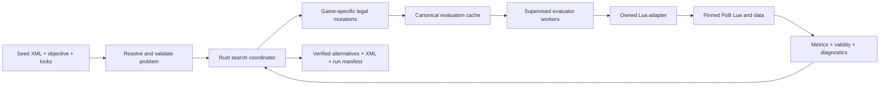

# Build optimizer design

Status: proposal for alignment; no evaluator or search engine is implemented.
Initial target: Path of Exile 2, local CLI, Windows development.
Source baseline: PoB commit `3887ae68a6a6b8bb7b41d1b61998f1aa184201e4`.

## Recommendation

Build a Rust search engine around a versioned Path of Building (PoB) Lua evaluator.
First prove that a known build and small changes reproduce PoB's results. Then optimize
passive allocations on an existing build, keeping skill setup, items, class/ascendancy,
level, weapon configuration, and combat assumptions fixed.

User-configurable goals are a core requirement. Skill selection, damage, resistance,
and effective hit pool are illustrative use cases, not an exhaustive objective catalog
or mandatory requirements. Each run chooses what to optimize, what must hold, and which
build choices may change. The limited first search domain does not fix the user's goals.

Use a budgeted heuristic search that returns verified improvements and explains their
trade-offs. Do not promise the global optimum. Introduce finite item inventories next;
defer unconstrained item generation, live trade ingestion, and broad skill discovery.

Keep PoB source unmodified in a pinned submodule. Own the compatibility shim and
worker protocol in this repository. Prefer an external LuaJIT worker for the first
integration spike; benchmark a Rust worker embedding LuaJIT through `mlua` only after
startup and calculation correctness are established.

## Problem and boundaries

A build's value depends on interactions among passive paths, skills, items, resources,
damage conversion, conditional effects, and defensive assumptions. Neither independent
node scores nor an additive item score captures this reliably. We need an authoritative
calculation oracle for each proposed combination, with inexpensive structural checks
before invoking it.

The first useful workflow:

1. Import a complete local PoB XML build.
2. Resolve and lock the selected skill, build configuration, and allowed search domain.
3. Configure the objective policy and any hard constraints from the supported capabilities.
4. Evaluate the seed and show the exact interpreted metrics.
5. Search within a time and evaluation budget.
6. Return the best feasible alternatives, before/after metrics, changes, and PoB XML exports.

When requested, “use skill X” is a structural lock on the imported skill group, gem,
skill part, supports, and applicable weapon set, rather than a string-based score bonus.
If the selection is ambiguous, validation fails with the choices to resolve. The passive
MVP fixes the seed's skill setup as a search-domain restriction; broader domains can
expose those choices independently of the configured scoring policy.

Initial non-goals: building from an empty character; discovering every viable archetype;
perfect rare items; crafting or purchase automation; an online service or GUI; frame-level
combat simulation; rewriting the whole calculation engine in Rust. PoB's modeled numbers
are the initial target, with its supported-mechanic limitations carried into our reports.

## What the upstream source establishes

The pinned source contains a headless wrapper, XML build loading, tests that use that
wrapper, calculation outputs, and helpers for evaluating local changes. It is not a
documented stable library API. Our source review also found runtime compatibility and
state-management questions; this revision has not been booted or validated here.

See [the integration notes](pob-integration.md) for exact source links, dependencies,
metric mappings, and the first smoke-test checklist. In particular:

- The headless wrapper initializes application objects, not just a pure formula function.
- Global state and calculation caches require explicit lifecycle control.
- The existing marginal-change helpers can aid proposal generation; they do not solve
  joint constrained optimization or establish full candidate legality.
- The wrapper's standard-Lua comment does not establish actual runtime compatibility.
- Fields resembling DPS and EHP need semantic checks, not just extraction by name.

A working Rust build in this repository is not evidence that the PoB evaluator works.

## Architecture



Start with one Rust package. Introduce modules as functionality arrives:

| Component | Responsibility |
| --- | --- |
| Problem/model | Seed identity, locks, configurable objective policy, constraints, scenario, immutable candidate state |
| Game adapter | Versioned tree and item identifiers, legal mutations, capability declarations |
| Evaluator | Worker lifecycle and protocol; conversion from PoB outputs to registered metrics |
| Metric registry / scoring | Discoverable metric definitions and providers; validated user goals; generic feasibility and ranking |
| Search | Candidate proposals, budgets, diversity, restarts, feasible/infeasible archives |
| Storage/report | Evaluation cache, run provenance, comparisons, exports |

Split into crates only when stable boundaries or independent testing justify it. Avoid a
universal modifier model now. PoE1 can share search orchestration and reporting while
providing its own evaluator, legality rules, topology, and metric capabilities.

### Evaluator boundary

The proposed protocol is versioned JSON Lines with request IDs and a startup handshake.
Only protocol messages go to stdout; PoB logging is captured on stderr. A worker declares
game, upstream revision, runtime/ABI, adapter revision, supported metrics, and capabilities.

Logical operations:

- `initialize`: validate identities and capabilities; load immutable data.
- `evaluate`: accept seed content/identity, complete candidate choices, and resolved scenario;
  return validity, metrics, warnings, and timing.
- `export`: serialize a specified, re-evaluated candidate into PoB-compatible XML.
- `shutdown`: release the process and temporary state.

Do not require the coordinator to understand arbitrary Lua object graphs. Each evaluation
must reconstruct a candidate from the same baseline, not rely on whatever mutation the
previous request left behind. Initially use fresh processes or an independently verified
full reset per evaluation. Reuse initialized workers only after A/B/A and request-order
tests demonstrate isolation.

Use a bounded pool of processes, one active calculation per worker. Processes give independent
globals, working directories, and recoverable timeouts. They are a reliability boundary,
not a security sandbox. Kill and replace a worker after a timeout, startup hang, or corrupt
response; return a typed error and count the attempt against the budget. Cap retries.

The first spike should use an external LuaJIT runtime with the upstream headless approach.
It is closest to the upstream test environment and exposes missing modules early.
An embedded Rust/LuaJIT worker may simplify packaging and reduce IPC overhead later, but
native-module ABI, bitness, package loading, and Windows compilation still need validation.
The [mlua API](https://docs.rs/mlua/0.12.1/mlua/) exposes Lua state and Rust/Lua value
conversion; using it does not by itself provide PoB's host functions or runtime modules.

### Candidate identity and provenance

Keep original XML immutable. A candidate describes all unlocked choices against that seed:
allocated nodes and relevant tree state initially, then explicit slot-to-item assignments.
Preserve locked build content, including configuration, skill groups, jewel/socket
configuration, alternate sets, and metadata required for faithful export.

Node and item identities are namespaced by game and data revision. A sorted list of node
IDs alone is not a complete build identity: class, ascendancy, selection state, weapon sets,
and other choices affecting those nodes also matter.

An evaluation cache key includes:

- Game and PoB commit; adapter and metric-schema versions; runtime identity.
- Seed content hash and canonical complete candidate state.
- Resolved scenario, all implicit defaults, and requested metric set.
- Candidate inventory snapshot when relevant to validity or reported cost.

Keep raw evaluation caching separate from objective ranking. Changing a threshold should
reuse compatible measurements and recompute feasibility. Never cache an error as a valid
zero-valued evaluation. Do not reuse results across dirty or mismatched upstream revisions.

Use in-memory caching for the first prototype and local run manifests/results. Consider
SQLite for persistent evaluations only when repeated workloads justify it.

## Objective and constraint contract

For the initial scalar policy, with candidate `x`, fixed scenario `s`, and evaluator `E`,
search legal states `L` using the configured score `f` (negated for minimization):

```text
maximize f(E(x, s))
subject to x in L and every user constraint being satisfied
```

`L` includes game rules, point limits, and user locks. A legal state need not satisfy the
user's requirements. Keep these outcomes separate:

| Outcome | Meaning | Treatment |
| --- | --- | --- |
| Invalid/unsupported/error | Illegal state, failed evaluation, or required metric unavailable | Exclude from scored results; explain reason |
| Infeasible | Legal and evaluated, but at least one user constraint fails | May support exploration; label clearly |
| Feasible | Legal, supported, and all hard constraints pass | Eligible for recommended results |

Every run supplies an objective policy and zero or more hard constraints. No damage,
resistance, EHP, or skill requirement is inserted implicitly. Presets are editable starting
points; the resolved specification must show all active requirements before search begins.

The intended configuration supports these independently:

- **Goals:** maximize or minimize any applicable registered metric, including measured
  build properties and supplied cost or change-count metrics as their providers become available.
- **Hard constraints:** user-selected lower/upper bounds, ranges, or required structural
  choices. A metric may be an objective, a constraint, both, or neither.
- **Preferences:** explicit soft targets and trade-offs, kept separate from hard feasibility.
- **Objective policy:** a single score, a composite score with explicit normalization and
  weights, ordered priorities (lexicographic ranking), or a Pareto set of alternatives.
- **Domain and scenario:** locks, allowed choices, inventories, and fixed encounter assumptions
  are configured separately from scoring, subject to the implemented search capabilities.

For example, a user might prioritize movement speed, reduce resource cost, minimize gear
cost while meeting performance thresholds, maximize a defensive measure, or compare several
trade-offs. These are non-exhaustive requirements examples, conditional on having reliable
metric providers; they are not claims that the initial adapter exposes all such measurements.

Stage implementation: M2 starts with one user-selected registered metric to maximize/minimize
and any conjunction of typed constraints. Support explicit operators such as `>=`, `>`,
`<=`, and `<`; reject unknown names, contradictory bounds, invalid units, and non-finite
thresholds. Subsequent stages add unit-checked derived expressions, composite/priority policies,
soft targets, and Pareto selection. Declare supported policy modes through capabilities;
reject unavailable modes rather than silently falling back to DPS or a scalar approximation.

Keep the search engine independent of metric names. It consumes a validated problem and
a scoring/selection policy; that policy owns objective direction, priority, preference
scoring, and tie-break rules. Pareto selection requires an archive and diversity policy,
not a hidden weighted sum. Derived expressions should use a typed declarative language
with explicit units, normalization, and undefined-value handling; arbitrary Lua execution
is not needed to make user objectives configurable.

See [the illustrative TOML](../examples/objective.toml). It is a proposed format, not an
implemented parser or a runnable optimization request. Its chosen metrics, constraints,
thresholds, and locks are examples and can be replaced or omitted where capabilities permit.

### Metric semantics

Use an extensible, discoverable metric registry. Each definition has a stable name,
description, unit, scope, scenario dependencies, provider/version, and applicability checks.
Providers may map verified PoB outputs, derive validated measurements, inspect build choices,
or use explicit external inputs such as an inventory cost snapshot. Each declares the inputs
it depends on for evaluation and cache identity. Adding a metric must not require changes
to search operators or embedding game-specific field names in the scoring algorithm.

Expose available metrics and policy modes during problem configuration. Validate the requested
combination against the game, evaluator version, selected build, and supplied data before
search. Missing values, unsupported mappings, NaN, and infinity must be surfaced explicitly;
a non-finite value cannot win the search by accident.

The following table illustrates a few potential mappings; it is not the registry's full
scope or a set of required user goals.

| Proposed metric | Contract |
| --- | --- |
| `selected_skill_dps` | Supported selected-skill damage per second, with exact skill part and inclusion policy pinned; reject average-hit or otherwise incompatible output |
| `fire_resistance_capped_pct` (and cold/lightning) | PoB's capped elemental resistance in percent units: 75 means 75%, not 0.75 |
| `fire_resistance_uncapped_pct` (and cold/lightning) | Uncapped resistance total, for explicit overcap requirements |
| `pob_total_ehp` | PoB's aggregate effective hit pool for the fully resolved defensive scenario |
| `physical_max_hit` (later, likewise other types) | Incoming hit size survived for the documented damage type and scenario; distinct from aggregate EHP |

Do not blindly map `CombinedDPS` to damage per second: the inspected calculations have an
average-damage mode. For M1 select a fixture and skill mode with a verified DPS interpretation;
publish the exact mapping and reject unsupported modes. Full-build DPS, selected-skill DPS,
minion damage, and average-hit damage must not be silently interchanged.

The original “resistances > 75%” could mean capped resistance, exceeding a cap, or uncapped
overcap. Preserve the chosen operator. If a capped metric's maximum is 75, `> 75` cannot
pass, whereas `>= 75` expresses reaching that cap. Use available capability/bound checks
to explain such conflicts; a failed heuristic search alone cannot prove impossibility.

Likewise, EHP is not a universal defensive scalar. Record damage mix, enemy settings,
avoidance/recovery assumptions, conditional defenses, and other contributing configuration.
The first release supports one fixed scenario and PoB's documented metric semantics.
Later, allow named scenarios with constraints required in every scenario and an explicit
objective aggregation such as minimum DPS.

Freeze all resolved combat settings, charges, buffs, uptime assumptions, enemy values,
and custom configuration before searching. Optimization must not improve a score by
switching on a favorable assumption. Derived build effects may change; declared scenario
assumptions may not.

Constraint evaluation uses unrounded finite values, with exact declared operators.
Parity-test floating-point tolerances are separate from feasibility semantics; presentation
rounding must not turn a near miss into a pass.

## Search strategy

### First domain: bounded passive reallocations

Start from the imported allocation with a fixed point budget (default: its allocated
ordinary points). Lock ascendancy, jewel/socket contents, weapon-set-specific allocations,
and unusual tree mechanics until their legality and point accounting are verified.
Reject unsupported tree configurations explicitly instead of approximating their rules.

Use game-specific legality, not generic connectivity alone. Validate allocation paths,
point categories, class starts, relevant special-node choices, prerequisites, and preserved
locks. Reconcile our validation with a round trip through PoB; a calculable XML build is
not by itself proof of game legality.

Operators should propose a valid final allocation:

- Add a connecting path to a useful destination, spending only available points.
- Remove an eligible leaf or tail without disconnecting required allocations.
- Exchange connected paths/branches while respecting the point budget.
- Occasionally propose larger exchanges that can reach thresholds or combinations.

Account for shared path segments and node costs. Target-build legality is the initial
contract; a playable sequence of intermediate respec steps and refund costs are later features.

Use marginal scores compatible with the configured objective and cheap heuristics to
order proposals. Upstream damage-specific hints must not dominate a defense, cost, or
other objective; disable incompatible hints. Preserve exploration by reserving
random/diverse proposals. A locally harmful node or item can participate in a strong
combination, so marginal scores are neither an additive objective nor a safe pruning bound.

### Baseline algorithm

Use multi-start local search with a small beam, variable-size mutations, and explicit budgets:

1. Evaluate and retain the seed, including an infeasible seed.
2. Generate and cheaply validate a bounded set of mutations.
3. Canonicalize and deduplicate candidates, using cached measurements when available.
4. Evaluate uncached candidates through PoB.
5. Update a best-feasible archive and a separate near-feasible exploration archive.
6. Select diverse states; increase mutation size or restart after stagnation.
7. Stop at the evaluation/time budget, cancellation, or domain exhaustion.

For reported results, every feasible candidate outranks every infeasible one. In the initial
scalar policy, compare feasible states using the configured objective direction, followed by
the configured tie-break policy and a stable canonical tie-break. Preferring fewer changes is
an optional user preference. Among infeasible states, compare normalized constraint shortfall,
then the configured objective. Later policies supply their own priority or Pareto selection
while retaining the same hard-feasibility boundary.

For a lower-bound constraint, an example violation is
`max(0, threshold - measured) / violation_scale`; reverse it for an upper bound.
Scales must be positive and in the metric's units. Track exact satisfaction separately:
strict inequality can fail at equality even with zero numeric shortfall. Rank violating
constraint count as an additional discriminator. Hard constraints are never traded away
for a sufficiently large objective improvement.

Reserve beam capacity for legal but infeasible exploration even when a feasible incumbent
exists. Otherwise, a temporary constraint deficit (such as resistance) could prevent a
coordinated improvement.
Keep the best feasible archive independently, so exploration cannot lose it.

Population size, restart schedule, and evaluation budget are parameters to benchmark,
not performance claims. Begin with a single worker for deterministic experiments; for
parallel runs assign request sequence IDs and stable batch selection, and record scheduling
policy. A random seed alone does not guarantee reproducibility when timing affects selection.

### Extending to items and joint optimization

Next accept a finite inventory of concrete item instances, with slot compatibility,
requirements, uniqueness restrictions, and availability multiplicity. Start with owned or
user-supplied items and preserve full modifier text and rolls. A PoB-representable item is
not evidence that it is obtainable.

Use single-slot replacements, paired replacements, and joint tree/item moves. Alternating
tree search and gear search is a useful baseline, but coordinated moves are needed to
escape local optima. Avoid deleting “dominated” items using simple stat comparisons when
special modifiers or requirements can interact.

When trade data is introduced, snapshot league, item identifiers, collection time,
currency conversion assumptions, prices, and availability. Treat price/budget as explicit
inputs and stale listings as uncertain availability. Do not introduce live network queries
into each candidate evaluation. Acquiring items remains outside the optimizer.

Defer genetic crossover, surrogate models, mixed-integer formulations, and learned
proposal policies until simpler baselines reveal a concrete limitation. Exact methods remain
useful for tiny subproblems and benchmark ground truth, not a presumed model of all mechanics.
Any future surrogate proposes or prioritizes; final recommendations still pass PoB evaluation.

## Results and validation

Each run reports the seed, best verified feasible alternatives, precise mutations, objective
and constraints with slack, assumptions, unsupported-mechanic warnings, and PoB XML exports.
Also record source/data/runtime versions, resolved problem, inventory snapshot, random seed,
operator settings, budgets, termination reason, and actual evaluation counts.

If no feasible result is found, say “No feasible build found within this search budget.”
Show the closest legal candidates as infeasible, with failed requirements. Never silently
relax a threshold or claim the task is mathematically impossible from this result.

Reserve evaluation attempts and wall-clock time for fresh finalist verification before
spending the search budget. Both limits cover the whole run, including failed attempts,
export/re-import calculations, and final verification. Check remaining time before each
step and supervise workers against the run deadline. If cancellation or timeout prevents
verification, return a previously verified incumbent when available; otherwise return
clearly labeled evaluated-only diagnostics, with no verified recommendation. Record any
reserved capacity that could not be used.

Re-evaluate finalists in a fresh worker, export them, re-import the exported XML, and compare
locked state and relevant metrics. Cache-only scores are insufficient for final verification.

Measure cold startup, warm evaluation p50/p95, worker memory, failures/timeouts, cache hits,
duplicate/invalid proposal rates, time/evaluations to first feasible result, best objective
over budget, and spread across random seeds. Separate candidate requests from actual
candidate/scenario calculation attempts and include failed attempts in budget accounting.
Measure serialization/reset time separately from calculation time before optimizing either.

Use three kinds of evidence:

- **Evaluator parity:** fixtures and known perturbations compared with the same pinned PoB
  UI/reference harness and exact settings; no claim of independent in-game validation.
- **Search correctness:** tiny finite domains with exhaustive ground truth, including
  impossible thresholds, infeasible seeds, interactions, duplicate states, and tied scores.
- **Search quality:** realistic supported builds, comparing random sampling, greedy local
  search, and the proposed method under equal oracle-evaluation budgets and several seeds.

A no-change baseline establishes that the optimizer does not regress a feasible incumbent.
A/B/A, permuted-order, and cold/warm evaluations detect state leaks. Ordinary scaffold CI
is separate from future Lua parity tests; it currently does not check the submodule runtime.

## Milestones and acceptance gates

| Milestone | Deliverable | Acceptance gate |
| --- | --- | --- |
| M0: bootstrap (this change) | Rust CLI scaffold, pinned submodule, design, example objective, CI configuration | Rust builds/lints, clean submodule, source findings documented |
| M1: evaluator spike | Headless startup; seed load; selected skill and scenario; metrics; one legal mutation; export | Runtime blockers resolved and recorded; baseline/mutation/export parity; reset isolation; timing and dependencies measured |
| M2: problem/search harness | Metric registry, configurable single-metric policy and constraints, candidate identity, budgets, synthetic evaluator | Swap goals/constraints without search-code changes; maximize/minimize and unsupported-capability cases; tiny exhaustive references; determinism and budgets |
| M3: passive optimizer | Supported tree reallocations through PoB with fixed equipment/skills | Legal exported candidates; no incumbent regression; quality measured against greedy/random baselines |
| M4: finite inventory | Concrete item pools and coordinated item/tree moves | Slot/availability rules; reproducible item provenance; improvements on item-interaction fixtures |
| M5: richer goal policies | Typed derived expressions, composite/priority objectives, soft targets, Pareto alternatives, scenario robustness | Unit/normalization validation; hard constraints preserved; policy-specific selection checked; all finalists independently revalidated |
| Later | Selective Rust calculations and PoE1 adapter | Differential parity and explicit versioned game capabilities |

Do not begin a large optimizer implementation before M1 confirms the calculation boundary.
M2's independent synthetic harness can proceed alongside M1 once the metric contract is agreed.

## Risks and decisions to revisit

| Risk or trade-off | Initial response / revisit trigger |
| --- | --- |
| Upstream dev snapshot does not run with the intended interpreter | Smoke-test first; choose a known passing pin or an explicit minimal compatibility patch, with parity evidence |
| Incomplete or incorrect modeled mechanics | Scope supported fixtures/mechanics; propagate diagnostics; do not market unsupported results as verified |
| Runtime globals/caches contaminate candidates | Fresh-process baseline, isolation tests, supervised workers; optimize resets only after parity |
| Oracle evaluations dominate cost | Measure first; cache and batch; improve proposals; consider embedding or hot-path migration later |
| Search stays in one local optimum | Larger graph moves, diverse starts, infeasible exploration; benchmark interactions |
| User goals hide assumptions | Typed metrics, immutable scenario, unrounded feasibility, clear violation reports |
| PoE2 mechanics and data change | Pin source/data and record schema/runtime; upgrade with fixture parity checks |
| Packaging upstream/native dependencies | Keep notices; inventory dependencies actually shipped; select our distribution license before release |

Rust migration should start with orchestration, hashing, graph operations, and independent
validation. Port a calculation subsystem only when profiling shows value and fixture coverage
can compare it against Lua over representative and adversarial cases. Keep a Lua fallback.
A shared Rust trait does not imply PoE1 and PoE2 share rules or field semantics.

## Decisions to align on

Proposed defaults, to confirm or revise before implementation:

1. **First product:** improve an existing build's passive tree, with gear, exact skill setup,
   weapon configurations, class/ascendancy, and combat settings fixed.
2. **Configurable goals (required):** user-selected objectives, constraints, and preferences
   through extensible metric and policy definitions. DPS, resistance, and EHP can serve as M1
   parity fixtures; they are neither mandatory goals nor an exhaustive catalog. The proposed
   first implementation supports one selected metric plus optional hard constraints, with
   richer policies staged behind the same configuration boundary.
3. **Search behavior:** hard constraints, best-found alternatives, and a fixed budget; allow
   infeasible internal exploration while preserving verified feasible results.
4. **Items:** supplied finite inventory first, with trade and hypothetical crafting deferred.
5. **Runtime:** external LuaJIT spike first; retain a process boundary and benchmark embedding later.
6. **Generalization:** design narrow adapter boundaries now; add PoE1 only after the PoE2 evaluator
   and passive MVP establish which abstractions are actually shared.
7. **Distribution:** local development first; select a license and packaging approach before release.
