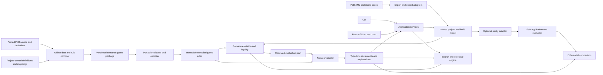

# ADR: project-owned game semantics and independent evaluation

**Status:** architectural boundary accepted by the owner on 2026-09-14. The contracts
below describe the target. Companion contract documents and the implementation log identify
delivered Rust/wire APIs and remaining gates. This decision supersedes conflicting source-shaped runtime and parity
requirements in earlier designs. See [migration](architecture-migration.md) for delivery
and [implementation](implementation.md) for actual capability and the resume point.

## Context

The product optimizes characters, skills and equipment. It does not need to implement
Path of Building's application. The current Rust interpreter avoids a Lua runtime but
still imports PoB callback bodies, capture graphs, class protocols and loader/control
lifecycles into the native design. This transfers compatibility work into production
without establishing a general build evaluator: none of the five supplied originals
currently completes natively. The remaining Spark/Mace profile dispatch is a separate
legacy implementation, not the foundation for a third profile.

Keep what we have learned about game mechanics, identities, interactions and numerical
parity. Change the representation and integration boundary now, before further extending
PoB object construction or UI synchronization in native code.

## Decision

Own the build schema, game-definition schema, rule semantics, evaluation plans and search
contracts. Import PoB definitions offline into that model. Keep PoB's evaluator as an
optional reference implementation behind an adapter. UI, import formats, source acquisition,
calculation, optimization and presentation have separate dependencies and lifecycles.

The default native application and its data package contain no PoB Lua source, PoB class
or control graph, source AST/bytecode, Lua VM, or PoB subprocess requirement. Source provenance
is metadata, not executable authority. A game update within implemented semantics can ship
as a new data package without rebuilding the engine. A genuinely new mechanic can require a
new versioned native operation; calling arbitrary PoB code is not a runtime fallback.

Distribution builds may run the offline converter and ship its generated owned artifact
with a provenance manifest. Loading that artifact must not require a PoB checkout, XML,
or source evaluator. Importing a user's saved PoB build is a separate boundary operation:
it produces owned records and optional source diagnostics before evaluation/search begins.
Neither definition conversion nor saved-build parsing runs for each search candidate.
A source-format compatibility policy belongs to that importer, not to domain rule execution.

The chosen direction is **typed domain rules plus reusable native Rust algorithms**.
Whether authors edit a small textual DSL or structured documents is a tooling choice.
Both compile to the same project-owned typed rule representation. Optional Lua authoring
bindings may emit this representation in offline tools; Lua callbacks cannot escape into
it. Do not build another general language interpreter in order to translate all Lua syntax.

Offline conversion and runtime semantics have different formats and release cadences.
A source text pattern may emit zero, one or several owned declarations; the runtime never
receives that pattern as a rule to execute. Preserve import uncertainty and origin metadata
outside evaluation inputs. Likewise, computed parameters of a provider-granted skill belong
to that skill and provider occurrence, not to a fabricated authored gem or a UI group.
Intrinsic facts absent from an imported item must remain unspecified rather than receiving
sample-build defaults. Domain resolution determines which facts each requested result needs.

Physical records and their supplied capabilities are distinct. For example, a gem use
can supply a skill through a declared slot; that skill can supply a summoned actor with
its own action outputs. Each transition has an explicit activation rule and retains its
provider identity. Neither a possible-definition list nor a UI's current selection creates
an occurrence. Import adapters translate source selections to these addresses once; the
native evaluator and future UI consume the same owned graph.

Computed intermediate values also need domain identities. The
[modifier occurrence contract](owned-modifier-values.md) distinguishes a modifier's own
values from its supplying item's shared properties. This extends the existing native
dependency graph; it does not expose PoB Item instances or parser state to the evaluator.

The [passive topology contract](owned-passive-topology.md) separates implicit roots,
physical allocations, attached choices, scope eligibility and injected legality budgets.
It prevents source node lists or UI point totals from becoming native game semantics.

## Components and dependency direction



These are responsibilities before they are crate names. Retain existing useful crate
boundaries rather than adding a crate for every box. Core owns portable value contracts;
data owns portable packages; engine owns rule compilation and numerical operations;
native composes resolution/evaluation; search owns proposals, objectives and scheduling.
Import owns external codecs and origin sidecars. Offline acquisition/compiler tooling and
the optional PoB oracle depend inward on these contracts. They are not dependencies of
production data/model/evaluation code. CLI/Tauri/web adapters depend on application APIs;
none owns independent rules, legality or optimization behavior.

No XML decoding, UI control notification, source-method replay, process protocol or
filesystem access occurs inside a candidate calculation. Package generation is an explicit
build/release tooling step, not an unconditional Cargo build.rs task that starts PoB,
fetches a submodule or requires Lua for native consumers.

## Enforced ownership and release boundary

Design from the optimizer's operations: author a character, resolve its legal choices,
evaluate a scenario, propose a candidate and compare results. PoB is one external source
and one reference backend. Its table layout, callback graph and selected UI controls do
not define those operations. The following rules apply even during incremental delivery:

| Layer | Owns | Must not require |
| --- | --- | --- |
| Definition conversion/build tooling | Pinned source readers, reviewed mappings, source syntax/defaults, conversion diagnostics and provenance | A source-shaped representation in the emitted runtime package |
| Game package/model | Stable domain IDs, definitions, topology, typed effects/tables, instances, scenarios and queries | PoB IDs as semantic identity, XML, source AST, closures, controls or filesystem access |
| Resolution/evaluation | Legality, provider/action relationships, dependency plans, native kernels, coverage and measurements | UI selection, source parsing, callback replay, named-build profiles or subprocesses |
| Search/optimization | Domain edits, exact locks, objective/constraint policy, budgets, candidate scheduling and cancellation | XML rewrites, UI widgets, or separate calculation formulas |
| Application/UI | Loading/saving through adapters, commands, progress/events, presentation and user choices | Independent game rules, legality, candidate scoring or evaluator state hidden in controls |
| Optional oracle | Translation of admitted semantic requests to the pinned reference, observations and comparison | Authority to silently fill missing native results or change objective inputs |

Release tooling publishes two distinct artifact sets. The **runtime package** has owned
schemas, effects, tables, routes and metric bindings. The **import/tooling bundle** adds
source mappings, syntax policies and diagnostics for users who import external builds.
They may share a release directory for development, but the native distribution includes
only its declared runtime set. Changing a PoB field spelling changes the adapter; changing
a game coefficient changes data; changing a mathematical operation may require a new
engine operation version. These are separate review and invalidation events.

The current typed domain executor is not permission to reintroduce a generic Lua
interpreter under a different name. New rule features need a game-domain consumer and
bounded execution semantics. Compile and validate once per package/plan; worker scratch
and candidate inputs remain private. Compare compact execution, generated native kernels
and authoring DSLs on actual interacting builds before making speed claims. Optional Lua
bindings can emit owned declarations offline, never callable runtime escape hatches.

Dependency checks must eventually inspect compiled modules and distributed artifacts as
well as Cargo edges: a crate can exclude mlua while still compiling a source interpreter.
The acceptance test loads an owned build and runtime package in a directory with no PoB
checkout, import sidecar or legacy snapshot, evaluates changed candidates in serial and
Rayon, and preserves the same metrics/coverage. This is a migration exit gate, not a claim
about today's native-only build. Refer to the retirement inventory for live consumers.

## Project, build and scenario models

Separate stored user work from a concrete evaluation input:

| Model | Meaning |
| --- | --- |
| BuildProject | Saved alternatives, inventories, names, editor preferences, imported originals, scenarios and optimization requests. UI state is optional presentation metadata. |
| BuildSpec | One explicit character choice: progression/rewards, class/ascendancy, allocations by point pool and weapon state, concrete equipped item instances, authored skills/support assignments and user-selected mechanic choices. It can be created without any import. |
| ScenarioSpec | Enemy/environment assumptions, uptime/encounter policy and externally chosen conditions. Candidate-derived state is computed, not frozen here. |
| MetricQuery | Requested actor/action/part and measurement semantics, units, aggregation and scenario. A selection is not a runtime array index or an implied sum over every skill. |
| OptimizationProblem | Seed BuildSpec, inventories/catalog bounds, allowed dimensions, exact instance requirements/locks, objective expressions, constraints, scenarios and budgets. |
| ResolvedBuild / EvaluationPlan | Private, validated interpretation bound to semantic build revision, scenario/query and rules/evaluator identity: actors, actions, grants, supports, resource/dependency graph and required operations. No source document or UI receiver is needed. |

Use project-owned definition IDs with game/version namespaces and stable instance IDs.
External PoB IDs, XML occurrences, labels and raw text belong in adapter mappings and
optional provenance. Dense compiled indices belong to their owning package/plan and are
not serialized user selectors. Reject foreign or stale plan handles even when their dense
indices happen to match; a changed scenario/query requires compatible resolution or a new
plan. Names and array order never merge distinct item uses,
manual versus granted skills, or player versus minion actions.

Keep physical inventory identity separate from slot use. Preserve provider ownership:
removing an item or passive removes its granted actions and effects and invalidates their
selectors. Keep ordinary, ascendancy and other allocation pools distinct. Explicit saved
view selection resolves to one BuildSpec before evaluation; PoB loadout labels/dropdown
fallbacks are import concerns. The evaluator never replays tab construction to find the
selected character.

Allocation identity, topology and legality are separate. Class/ascendancy definitions
supply implicit roots; a build need not pretend the player spent points to acquire them.
A choice attached to an allocation is not automatically another paid allocation. Injected
legality metadata defines point costs, earned capacity, pool relations and conditional
access; a node's location in a source tree or UI list establishes none of these. Import
classifies source tokens into these domain roles or preserves an unresolved obligation.
Changing class or provider invalidates the affected roots/access without replaying a UI.

Import returns owned semantic input plus diagnostics and a source sidecar for faithful
export/inspection. Unknown fields may remain in that sidecar, but an unknown field that
can affect requested semantics blocks coverage. An adapter cannot invent a default from
a known fixture. Effective imported choices must be explained when source defaults or
selection rules resolve ambiguity. A legacy format's history-dependent meaning must be
normalized to explicit domain state or reported unresolved. Undo stacks, UI buffers and
Lua object identities are not public model requirements.

## Semantic data package and rules

The package contains versioned definitions for skills, supports, item bases/affixes/uniques,
passive topology and effects, class/ascendancy rules, resources, encounters, stat/metric
semantics, and any declared mechanic programs. Content is injected; Rust does not dispatch
on a particular build, skill name, item name or source hash.

Rules describe game operations: applicability predicates; actor/action/provider scope;
flat, increased, more, conversion and replacement contributions; typed derived values;
resource/reservation costs; grants; triggers; allocation transforms; and explicit
interactions. Preserve noncommuting stages such as local item arithmetic, conversion,
rounding and caps as declared semantics, not arbitrary callback order. Reusable algorithm
families implement the operations; game coefficients, selectors, thresholds and effect
composition remain data.

Common final-stat formulas need semantic ownership independent of a character class,
encounter or user usage choice. The [stat-owned actor receivers](owned-stat-receivers.md)
reuse typed rule programs with explicit Player or exact owned-actor-slot applicability.
Receivers bind actual actor occurrences, preserve grant/required-input activation and
participate in ordinary dependency, producer-collision and closure checks. This is a
implemented component boundary; it does not adopt partial-build evaluation.

The rule compiler checks types/units, valid scopes and references, declared operations,
resource bounds, dependency ordering and declared mechanic coverage, with provenance when
available. Runtime uses compact validated
instructions/tables and shared native kernels. Bounded domain iteration may be needed over
actors, effects or links; arbitrary tables, closures, metatables and unbounded loops are not
part of the contract. A new operation requires semantics, validation and contrasting tests.
Unsupported rule content is recorded with its affected mechanic, not silently omitted.

For example, an item effect that grants a skill compiles to a GrantAction rule referencing
a definition and its item-use provider. Support applicability uses action tags and rules.
A condition based on effective attributes depends on the computed attribute node. None of
these requires the item editor, a PoB callback identifier or a named build-specific handler.

Keep dependency cycles explicit. Reject unsupported cycles during plan construction.
Where the game requires feedback, define its semantics (for example capped stacks or a
specific steady-state solver), convergence/iteration limits and failure behavior. Do not
use global repeated evaluation until numbers happen to settle. Timing/trigger rates,
resource sustainability and uptime approximations have named policies and diagnostics.

Tooltip/modifier text parsing is an input concern. The shipped package carries canonical
effects where extraction resolves them. User-supplied item text may require a portable
project-owned grammar/parser to produce those same effects; unknown text remains visible
and prevents unsupported evaluation. Retain useful lexical/numerical kernels, but do not
make the data schema expose ModParser tables or require its cache/history representation.

## Offline acquisition and updates

The toolchain reads a pinned PoB revision, applies explicit mappings/lowering into our
schema, validates it and writes a deterministic package with content/semantics identity.
It may execute Lua to read upstream data or use PoB to resolve a reference case. Source
extraction is not automatic proof of semantic equivalence. Complex unmapped source produces
an actionable conversion diagnostic or a reviewed domain-rule implementation.

A manifest records source revision, compiler/mapping versions, content hashes, supported
operations and unresolved coverage. Put full source spans/diagnostics in an optional debug
sidecar. Runtime compatibility depends on the package schema and required semantic features,
not exact source file layouts. The update workflow compares converted data and affected
rules, runs component and real-build parity, then publishes the package and evidence.
Do not ship original XML/Lua just to deserialize it again at startup. Runtime storage can
be compact pre-generated bytes; keep a readable authoring/review representation. Database
or autocomplete indexing remains optional tooling over this model, outside evaluation.

## Evaluation, search and presentation

Proposed API shape (not delivered Rust):

```rust
resolve(rules, build_spec, scenario_spec, query) -> ResolutionOutcome;
evaluate(plan, worker_scratch, cancellation) -> EvaluationOutcome;
optimize(problem, evaluator, execution_policy, event_sink) -> SearchResult;
```

Resolution reports legality, identity ambiguity, mechanic coverage and metric availability
separately. Evaluation returns typed measurements, explanations/contribution origins and
coverage; it never reports a partial number as a complete result. Generic scoring consumes
these values, including configurable hard constraints and multi-scenario policies. Missing
metrics or unsupported mechanics cannot win by becoming zero. Feasibility and agreement
with PoB are distinct. Invalid-but-computable builds retain their measurements and separate
infeasibility diagnostics; for example, a negative unreserved resource is not clamped or
turned into an unavailable result solely because it violates a constraint.

Candidate edits operate on semantic BuildSpec values. Reuse immutable compiled rules and
structural plans where valid; give each Rayon worker its own scratch/state. Incremental
invalidation follows declared dependencies. Cache keys include semantic build/scenario/query,
rule package and evaluator versions; names, UI state and source formatting are excluded.
Verify reused results against fresh resolution and evaluation, including A→B→A changes.
No candidate requires XML serialization or a subprocess. Browser hosts provide their own
scheduling/cancellation; portable kernels contain no Rayon/OS/GUI dependency.

Applications receive the same progress, cancellation, diagnostics, comparisons and result
contracts. CLI, later Tauri and web frontends format those outputs and issue semantic edits.
They can search an index derived from the loaded catalog; they do not interpret game rules.
PoB export is an adapter action on a chosen result, not an evaluator return requirement.
Owned-format roundtrips and supported PoB import/export roundtrips preserve semantic meaning
and explicit instance/provider correspondence. Unresolved and non-exportable features produce
diagnostics; neither roundtrip requires reproducing original XML bytes or UI identities.

## Distribution and retirement boundary

The final production feature/crate closure must exclude the legacy source parser/interpreter,
UI/loadout replay, profile preparation and bundled source-shaped snapshot as well as the
PoB/Lua crates. Enforce this structurally, rather than relying on callers to avoid legacy APIs.
Data and Engine now expose an owned-only library closure through `default-features = false`.
Their transitional `legacy` feature retains existing consumers; it is not part of a new
application's native calculation contract. Shared timing/resistance primitives are always
available, while their source-package adapters compile only with `legacy`.

`check-owned-boundaries.py` inspects the resolved normal/build feature graph and rustc's
actual dependency files. Only owned modules and explicit pure numerical leaves may enter
that isolated closure; source programs, bundled snapshots and profile modules fail the check.
CI runs it separately because workspace feature unification can re-enable legacy through
Import or Native. Default CLI builds now exclude PoB/Lua, but still include those live legacy
native consumers. Neither an isolated library build nor the absence of Lua establishes that
the complete CLI distribution has reached the end state. The final shipped-artifact test
must exercise the real application with only an owned package and caller-authored input.

Use an explicit offline release/data-build step to acquire/convert PoB definitions and
validate the owned package. This is the requested build-time PoB import: source data,
source parsing and any authoring-language bindings terminate at the generated artifact.
A frontend or search worker loads the same owned package regardless of which source or
authoring tool produced it. Source syntax changes require converter work; they must not
force changes to native operation semantics or UI records when game meaning is unchanged.

Ordinary Cargo compilation and candidate evaluation must not acquire the
source or regenerate data. Test the shipped native distribution from a fresh directory
with only its owned package and caller-owned project. Keep optional reference tooling
behind a separate feature or executable and verify the dependency/package contents in CI.
Do not turn an unavailable PoB oracle into a native runtime requirement.

Retire the smallest coherent consumer closure after preserving its meaningful observable
laws. For numerical preparation, migrate both fresh calculation and independent candidate
realization validation; feeding a cached result back as its own verifier is insufficient.
Remove obsolete entry points, schemas and support code with their last consumer. Keep
source-only acquisition tools only when a named offline or reference workflow still needs
them. New semantic work must not extend the frozen legacy interpreter frontier.

## Tooling and test language

The end state is Rust for project-maintained tooling and tests as well as the evaluator.
New tooling and test suites should use Rust, sharing the owned types and validators where
appropriate. Existing Python exporters, corpus/expectation checks and boundary checks are
transitional utilities; their Python tests protect those utilities, not a separate game
calculation implementation. Maintain that coverage until each utility is replaced.

Migrate a utility and its tests together, preserving independent fixtures and observable
contracts. Moving only the test harness to Rust while retaining a required Python program
does not complete migration. The supported build, data-generation and validation workflows
should ultimately require no Python interpreter. Optional upstream PoB/Lua remains a
separate reference oracle; this policy does not require rewriting upstream tests.
See the [T1 migration milestone](architecture-migration.md#t1-rust-tooling-and-test-consolidation).

## Parity boundary

PoB is a differential oracle for **observable game/evaluation behavior**. Compare resolved
input meaning, selected actor/action/part, requested metrics and availability, semantic
intermediate quantities, and controlled build mutations under matched scenarios. Keep
fixed expectation manifests and tolerances; the existing five originals remain in the
denominator. Add mapping cases and holdouts. Do not change selections or discard active
effects to make comparisons pass.

Do not require equality of PoB UI graphs, callbacks, constructor events, private table
aliases, parser caches, allocation layout or loader execution order. Those observations
can diagnose adapter mistakes, but they are not release gates for the native evaluator.
Where source ordering/history changes a game-visible result, model the relevant domain
state or an explicit import compatibility rule and test its observable effect. A PoB bug
or nondeterministic reference result gets a recorded discrepancy and deliberate policy;
never silently copy it into the domain model or relax parity to hide it.

The oracle adapter may still use PoB's headless UI/application machinery internally.
Its subprocesses, Lua and internal diagnostics remain optional tooling. It must explicitly
report inputs it cannot represent. Finalist verification can run a fresh native evaluation
and an optional matched PoB comparison; native correctness and deployment do not require
a reference process for every search candidate.

## Options and consequences

| Approach | Benefit | Cost / decision |
| --- | --- | --- |
| Translate PoB Lua and UI lifecycles into the native interpreter | Reuses source behavior closely | Reproduces application/language compatibility in production; not the target architecture. Freeze expansion and retire consumers. |
| Runtime Lua with project-owned bindings | Fast authoring and familiar tooling | Mutable runtime state, sandboxing and parallel/WASM concerns; optional offline tooling, not the default evaluation ABI. |
| Only hand-written Rust content handlers | Direct execution | Couples balance and individual content to code and encourages profiles; reject as the content model. |
| Domain rules compiled to typed IR plus native operations | Independent model, injected content, portable parallel execution, useful explanations | Requires explicit translation, semantic decisions and coverage tests; selected direction. |

This correction delays the next narrow parity increment and requires migrating existing
adapters/tests. It removes the requirement to implement all PoB internals before a useful
build evaluator exists. Numerical kernels and reference fixtures remain valuable. Runtime
code without a consumer in the target model must be migrated, quarantined as reference-only,
or deleted; leaving two permanent calculation paths is not completion.

## Action items

Follow [architecture migration](architecture-migration.md). Freeze further PoB UI/class-
protocol expansion in native production. Audit active dependencies before removing legacy
profiles; delete their commands/adapters with the implementation that supersedes them or
with an explicit documented removal of an experimental feature. Keep independent numerical
and full-build validation evidence. Update this ADR only when a concrete counterexample
requires changing the domain contract; the implementation log records progress instead.

## Import breadth obligations

Import evidence is separate from semantic membership. The first all-five normalizer exposes
independent passive-socket equipment contributions, now represented by typed allocation
preset membership composed with the item preset. Known-unavailable oracle projections must retain comparison rows
without fabricating concrete actor targets. These belong in project composition and the
parity adapter respectively, never PoB UI replay inside native evaluation. See the
[owned normalization contract](owned-normalization.md) for the delivered conservative seam
and remaining integration gates.

Source categories are not domain types. Offline conversion may emit zero, one or several
owned declarations from one upstream definition. Physical gems, provider-granted actions
and their capabilities are explicit owned semantics; a PoB Gem/UI row is insufficient to
create any of them. Identity-only import placeholders cannot become executable definitions
without semantic conversion. The final package and native evaluator must express these
relationships using owned types, with no source-format flags or source interpreter required.
