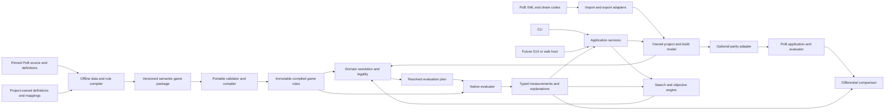

# ADR: project-owned game semantics and independent evaluation

**Status:** architectural boundary accepted by the owner on 2026-09-14. The contracts
below describe the target. Companion contract documents and the implementation log identify
delivered Rust/wire APIs and remaining gates. This decision supersedes conflicting source-shaped runtime and parity
requirements in earlier designs. See [migration](architecture-migration.md) for delivery
and [implementation](implementation.md) for actual capability and the resume point.

## Context when this decision was accepted

The product optimizes characters, skills and equipment. It does not need to implement
Path of Building's application. The previous Rust interpreter avoided a Lua runtime but
imported PoB callback bodies, capture graphs, class protocols and loader/control
lifecycles into the native design. This transferred compatibility work into production
without establishing a general build evaluator: none of the five supplied originals
currently completes natively. The separate Spark/Mace profile dispatch has since
been removed. The [execution overview](data-and-evaluation-overview.md) describes
the delivered owned rule runtime and the remaining migration work.

Keep what we have learned about game mechanics, identities, interactions and numerical
parity. Change the representation and integration boundary now, before further extending
PoB object construction or UI synchronization in native code.

## Decision

Own the build schema, game-definition schema, rule semantics, evaluation plans and search
contracts. Import PoB definitions offline into that model. Keep PoB's evaluator as an
optional reference implementation behind an adapter. UI, import formats, source acquisition,
calculation, optimization and presentation have separate dependencies and lifecycles.

The default native application and its data package contain no PoB Lua source, PoB class
or control graph, source AST/bytecode, Lua VM, or PoB subprocess requirement. Source provenance
is metadata, not executable authority. A game update within implemented semantics can ship
as a new data package without rebuilding the engine. A genuinely new mechanic can require a
new versioned native operation; calling arbitrary PoB code is not a runtime fallback.

Distribution builds may run the offline converter and ship its generated owned artifact
with a provenance manifest. Loading that artifact must not require a PoB checkout, XML,
or source evaluator. Importing a user's saved PoB build is a separate boundary operation:
it produces owned records and optional source diagnostics before evaluation/search begins.
Neither definition conversion nor saved-build parsing runs for each search candidate.
A source-format compatibility policy belongs to that importer, not to domain rule execution.

Scaling semantics, artifact encoding and execution layout are separate concerns.
The [table/curve investigation](owned-scaling-data-investigation.md) evaluates
lossless range segments and genuine formulas without changing current exact
table semantics. Compact discrete data may compile once to shared arrays;
curve fitting never supplies missing domain, rounding or extrapolation authority.
Public representation and numerical-law changes require a reviewed decision.

Accepted preset-owned generated inputs retain provider-level authority. The
[accepted field-accounting pass](owned-generated-skill-dispositions-proposal.md)
independently proves remaining source fields against actual imported outputs
and existing usage obligations. Keep one current importer behavior and rebuild
affected data; old development behavior needs no compatibility branch. Source
accounting itself does not implement native participation.

The [Lua compatibility cleanup gate](legacy-retirement.md#lua-compatibility-cleanup-gate-requested-2026-10-05)
audits behaviors as well as types. Exact PoB parity is evidence for supported
game semantics, not a requirement to recreate incidental Lua coercion, aliasing
or initialization bugs. Every retained compatibility law needs a valid-domain
purpose and evidence; source-format conversion remains at its adapter. Record
upstream defects as narrow reference exceptions, never native fixture branches.
Review uncertain numerical differences before changing semantics or goldens.

Offline conversion must account for effect-specific mappings before a global
fallback and establish units from the actual operation. An unmapped source input
remains unresolved; absence of an oracle handler does not prove game inactivity.
Keep category-specific contributions distinct from a final aggregate. A support's
cast-speed increase belongs to an Action cast-speed channel; Spell membership
alone does not establish the timing branch that consumes it. Likewise ordinary
resource-cost and reservation multipliers have different consumers. Missing
coefficients do not authorize fabricated identity contributions. An exact
source-store parent chain may authenticate reference evidence, but is not a
native ownership or inheritance model. Native routing follows owned occurrences,
declared recipients and proven applicability.
Contribution production and reduction have separate numerical contracts. Proving
individual factors does not establish aggregate rounding, final resource cost or
reservation. An oracle's shared numeric-precision table must be classified by
valid game behavior before becoming an owned rule. Keep exact raw contributor
checks and unrounded native reduction checks explicit while that decision is
unresolved; do not round test results merely to hide a difference.
Where numeric order matters, use [declared contribution groups](owned-ordered-contribution-queries.md)
bound to actual candidate occurrences. Definitions declare membership and semantic
ranks; item modifier order and selected equipment supply occurrence order. Opaque
IDs and source-cache layout are not numerical authority. Compile those bindings
to immutable reduction inputs before worker execution. Explicit stages and typed
intermediate values express attribute dependencies; a flat subtotal does not
stand in for a resolved attribute or authorize a dependent resource result.
Attribute inputs use distinct pass-specific Count channels, while final
attributes remain bounded Integers. Preserve each contributor occurrence through
that boundary, including numeric conversion failures. Retire superseded live
contribution wiring in a checked transition; frozen offline artifact contracts
do not justify a second runtime calculation path. Publication of input channels
alone supplies no final reducer or contributor completeness.
Keep the scalar consumer separate from an unresolved reduction law. The six
ordinary attribute receivers use actual BASE/INC queries and explicit typed
effective-MORE inputs. Their formula can be implemented while the factor
producer and query memberships remain unresolved. An absent producer is not a
neutral factor. A finite fixture may prove a closed empty domain, but that proof
must not become a general production default or import source-cache entities.
Likewise, a non-damaging player action and the buffs it applies to other actors
are distinct graph entities. Duration contributions attach to the declared
action; final duration and any effect-application lifetime transfer need their
own complete contributors and explicit rule ownership. A minion recipient does
not turn its source action into a minion action.
Reference comparison may disregard incidental ordering only with a finite,
checked proof that distinct records are independent, retained raw diagnostics
and explicit refusal of ambiguous records. Numerical determinism stays mandatory.

The owner confirmed on 2026-10-02 that this layering does not need SQLite or an
ORM. Ship generated owned data artifacts, load immutable Rust definitions/indexes,
and derive UI discovery indexes from that same model. No database adoption is
planned. Retained legacy code needs a named useful consumer; unused experiments
and duplicate feature paths should be deleted with their exclusive scaffolding.

The chosen direction is **typed domain rules plus reusable native Rust algorithms**.
The owner accepted a [build generality checkpoint](build-generality-review.md)
on 2026-10-04. Shared contracts must be exercised by contrasting real mechanic
shapes, with data-only extension inside implemented semantics and independent
whole-build validation. Current bounded support is not proof of generality.
This supplements the five-build MVP; it does not authorize named-build dispatch,
fixture-supplied runtime defaults or relaxed completeness gates.

Whether authors edit a small textual DSL or structured documents is a tooling choice.
Both compile to the same project-owned typed rule representation. Optional Lua authoring
bindings may emit this representation in offline tools; Lua callbacks cannot escape into
it. Do not build another general language interpreter in order to translate all Lua syntax.

Offline conversion and runtime semantics have different formats and release cadences.
During development, backward compatibility is not a requirement. Prefer one
current contract and rebuilt/reimported data over parallel legacy implementations.
Semantic identities and caches must be invalidated when behavior changes; retain
historical source evidence without preserving obsolete execution paths.
A source text pattern may emit zero, one or several owned declarations; the runtime never
receives that pattern as a rule to execute. Preserve import uncertainty and origin metadata
outside evaluation inputs. Likewise, computed parameters of a provider-granted skill belong
to that skill and provider occurrence, not to a fabricated authored gem or a UI group.
Intrinsic facts absent from an imported item must remain unspecified rather than receiving
sample-build defaults. Domain resolution determines which facts each requested result needs.

Physical records and their supplied capabilities are distinct. For example, a gem use
can supply a skill through a declared slot; that skill can supply a summoned actor with
its own action outputs. Each transition has an explicit activation rule and retains its
provider identity. Neither a possible-definition list nor a UI's current selection creates
an occurrence. Import adapters translate source selections to these addresses once; the
native evaluator and future UI consume the same owned graph.

Imported catalogue associations are not supplied capabilities. In particular,
the primary effect used to identify a support gem remains Import metadata; its
modifier behavior belongs to the support assignment. Offline conversion must
classify each associated effect separately, since both active and support gems
can have additional effects of either kind. Potential non-support capabilities
remain incomplete until their occurrence, activation and numerical ownership
are proved. A source sidebar/display flag is not a native capability rule.
Correct conversion at the producer and migrate published data through checked
release transitions; do not retain a second source-shaped evaluator mode.

Exact target identity and execution readiness are separate proofs. A support
assignment can identify an authored root whose raw values, participation or
numerical rules remain unresolved. Import must prove that correspondence from
the full admitted source frame; the native graph still enforces the target's
actual input, activation, ancestry and contributor requirements before evaluation.

Conditional applicability uses explicit domain inputs with declared producers.
For example, an action's Area eligibility can depend on its selected part and
support effects; its catalogue types alone are insufficient authority. Offline
conversion must account for the relevant mutations before publishing that input.
An unavailable eligibility input stays unresolved. Source diagnostic helpers may
omit neutral modifiers, but that presentation behavior does not authorize dropping
their conditions or inventing an unconditional native default.

Channels describe distinct game quantities, even when their units and current
values coincide. In particular, a support's ordinary resource-cost multiplier
and its reservation multiplier have different producers and consumers. They
must not share a reduction merely because both are dimensionless. A missing
contribution is not an authored neutral contribution; complete membership must
justify the consumer's identity value.

The [resource-obligation proposal](owned-resource-obligations-proposal.md) is
pending owner review. It addresses sustained reservation that must be evaluated
independently of metric selection, recommending Skill-owned obligations with
explicit Action dependencies where mechanically necessary. Skill support
recipients and dependency demand require reviewed contracts; the current
Action-based component is not silently reinterpreted by this proposal.

Rules may inspect the bound Action's existing part, mode and stat-set identities
through typed Boolean equality predicates. These are read-only request facts:
they do not add a choice store, expose source ordinals, select a reference UI tab
or activate an unavailable occurrence. They require Action context and known
typed definitions; a different known selection yields false. The implementation
opts in through operations V20 while existing operation versions retain their
semantics and identities. Exact routing remains useful for transporting values;
it need not introduce artificial carrier stats merely to inspect a selection.

Keep classification channels specific to their consumers. In particular, Area
modifier eligibility is distinct from a skill catalogue type or a later computed
radius. An observed change in a reference display flag does not establish a new
gameplay law or justify silently changing an earlier modifier query.

Generated raw inputs use the accepted [preset-owned exact bindings](owned-generated-skill-inputs-proposal.md),
with explicit producer authority; provider-produced levels retain their writer.
Usage preferences remain separate. How a saved enabled preference gates whole-Skill
execution follows the accepted [participation contract](owned-skill-participation-proposal.md):
separate mechanical supply from requested participation on the existing graph.
Its native implementation uses the existing `SkillReadiness` row's optional
Boolean Skill-stat requirement. An ordinary early usage rule produces that
stat; a shared execution gate applies it to the exact occurrence and its actual
Skill/Actor/Action ancestry. Preparation keeps mechanical supply. Unknown stays
unresolved, and false cannot hide incomplete contributor or owner inventories.
The declaration is part of the current stages V4 / operations V21 contract;
there is no second graph, input store or compatibility alias.
Import can preserve independent occurrence and containing-group values, with
no fallback for a strict group input. Authenticated, data-defined combination
and publication for the real builds remain separate work.
Source global-effect switches and UI-selected previews do not implicitly acquire
that native meaning. Incomplete coverage stays unresolved regardless of a toggle.

Shared equipment-derived Actor conditions also need explicit ownership. The
[Class coverage audit](owned-class-coverage-audit.md) distinguishes intrinsic
class facts, shared initialization, equipment state and per-Action source
selection. Existing equipment-to-Player delivery is reusable, but general hand
state uses the accepted [Player slot relation](owned-equipment-slot-state-proposal.md):
read validated occupancy and the exact equipped occurrence's computed values,
without crossing raw parameter ownership. Core/Data/Engine implement this in
current V21 through one bounded cold resolver shared with Action selection.
Only actual existing-Player applications have this authority; their computed
reads join the normal dependency and stage checks. Game-state data publication
remains open. Do not derive shared state
from which metric or Action a user queries, or close Class coverage merely by
moving its unfinished responsibility into a generic Actor marker.

Computed intermediate values also need domain identities. The
[modifier occurrence contract](owned-modifier-values.md) distinguishes a modifier's own
values from its supplying item's shared properties. This extends the existing native
dependency graph; it does not expose PoB Item instances or parser state to the evaluator.

The [effect-application contract](owned-effect-applications-proposal.md), accepted
on 2026-10-02, represents buffs and debuffs as exact source-to-recipient
applications. Injected rules own activation, recipient scaling and stacking
families. The native planner binds occurrences and compiles their reductions into
the shared dependency graph; evaluation uses worker-owned scratch. Per-modifier
maximum is the first supported stacking policy. Discovery, activation and
completeness remain distinct, and the optional PoB adapter supplies reference
evidence rather than runtime behavior.

The [passive topology contract](owned-passive-topology.md) separates implicit roots,
physical allocations, attached choices, scope eligibility and injected legality budgets.
It prevents source node lists or UI point totals from becoming native game semantics.

## Components and dependency direction


```mermaid
flowchart LR
    PoBData[Pinned PoB source and definitions] --> Compiler[Offline data and rule compiler]
    Authored[Project-owned definitions and mappings] --> Compiler
    Compiler --> Package[Versioned semantic game package]
    Package --> Loader[Portable validator and compiler]
    Loader --> Rules[Immutable compiled game rules]
    XML[PoB XML and share codes] --> Import[Import and export adapters]
    Import --> Project[Owned project and build model]
    CLI[CLI] --> App[Application services]
    GUI[Future GUI or web host] --> App
    App --> Project
    App --> Search[Search and objective engine]
    Project --> Resolve[Domain resolution and legality]
    Search --> Resolve
    Rules --> Resolve
    Resolve --> Plan[Resolved evaluation plan]
    Plan --> Native[Native evaluator]
    Rules --> Native
    Native --> Results[Typed measurements and explanations]
    Results --> Search
    Results --> App
    Project --> OracleAdapter[Optional parity adapter]
    OracleAdapter --> PoB[PoB application and evaluator]
    PoB --> Compare[Differential comparison]
    Results --> Compare
```

These are responsibilities before they are crate names. Retain existing useful crate
boundaries rather than adding a crate for every box. Core owns portable value contracts;
data owns portable packages; engine owns rule compilation and numerical operations;
native composes resolution/evaluation; search owns proposals, objectives and scheduling.
Import owns external codecs and origin sidecars. Offline acquisition/compiler tooling and
the optional PoB oracle depend inward on these contracts. They are not dependencies of
production data/model/evaluation code. CLI/Tauri/web adapters depend on application APIs;
none owns independent rules, legality or optimization behavior.

No XML decoding, UI control notification, source-method replay, process protocol or
filesystem access occurs inside a candidate calculation. Package generation is an explicit
build/release tooling step, not an unconditional Cargo build.rs task that starts PoB,
fetches a submodule or requires Lua for native consumers.

## Enforced ownership and release boundary

Design from the optimizer's operations: author a character, resolve its legal choices,
evaluate a scenario, propose a candidate and compare results. PoB is one external source
and one reference backend. Its table layout, callback graph and selected UI controls do
not define those operations. The following rules apply even during incremental delivery:

| Layer | Owns | Must not require |
| --- | --- | --- |
| Definition conversion/build tooling | Pinned source readers, reviewed mappings, source syntax/defaults, conversion diagnostics and provenance | A source-shaped representation in the emitted runtime package |
| Game package/model | Stable domain IDs, definitions, topology, typed effects/tables, instances, scenarios and queries | PoB IDs as semantic identity, XML, source AST, closures, controls or filesystem access |
| Resolution/evaluation | Legality, provider/action relationships, dependency plans, native kernels, coverage and measurements | UI selection, source parsing, callback replay, named-build profiles or subprocesses |
| Search/optimization | Domain edits, exact locks, objective/constraint policy, budgets, candidate scheduling and cancellation | XML rewrites, UI widgets, or separate calculation formulas |
| Application/UI | Loading/saving through adapters, commands, progress/events, presentation and user choices | Independent game rules, legality, candidate scoring or evaluator state hidden in controls |
| Optional oracle | Translation of admitted semantic requests to the pinned reference, observations and comparison | Authority to silently fill missing native results or change objective inputs |

Release tooling publishes two distinct artifact sets. The **runtime package** has owned
schemas, effects, tables, routes and metric bindings. The **import/tooling bundle** adds
source mappings, syntax policies and diagnostics for users who import external builds.
They may share a release directory for development, but the native distribution includes
only its declared runtime set. Changing a PoB field spelling changes the adapter; changing
a game coefficient changes data; changing a mathematical operation may require a new
engine operation version. These are separate review and invalidation events.

The current typed domain executor is not permission to reintroduce a generic Lua
interpreter under a different name. New rule features need a game-domain consumer and
bounded execution semantics. Compile and validate once per package/plan; worker scratch
and candidate inputs remain private. Compare compact execution, generated native kernels
and authoring DSLs on actual interacting builds before making speed claims. Optional Lua
bindings can emit owned declarations offline, never callable runtime escape hatches.

Dependency checks must eventually inspect compiled modules and distributed artifacts as
well as Cargo edges: a crate can exclude mlua while still compiling a source interpreter.
The acceptance test loads an owned build and runtime package in a directory with no PoB
checkout, import sidecar or legacy snapshot, evaluates changed candidates in serial and
Rayon, and preserves the same metrics/coverage. This is a migration exit gate, not a claim
about today's native-only build. Refer to the retirement inventory for live consumers.

## Project, build and scenario models

Separate stored user work from a concrete evaluation input:

| Model | Meaning |
| --- | --- |
| BuildProject | Saved alternatives, inventories, names, editor preferences, imported originals, scenarios and optimization requests. UI state is optional presentation metadata. |
| BuildSpec | One explicit character choice: progression/rewards, class/ascendancy, allocations by point pool and weapon state, concrete equipped item instances, authored skills/support assignments and user-selected mechanic choices. It can be created without any import. |
| ScenarioSpec | Enemy/environment assumptions, uptime/encounter policy and externally chosen conditions. Candidate-derived state is computed, not frozen here. |
| MetricQuery | Requested actor/action/part and measurement semantics, units, aggregation and scenario. A selection is not a runtime array index or an implied sum over every skill. |
| OptimizationProblem | Seed BuildSpec, inventories/catalog bounds, allowed dimensions, exact instance requirements/locks, objective expressions, constraints, scenarios and budgets. |
| ResolvedBuild / EvaluationPlan | Private, validated interpretation bound to semantic build revision, scenario/query and rules/evaluator identity: actors, actions, grants, supports, resource/dependency graph and required operations. No source document or UI receiver is needed. |

Occurrence-specific usage intent belongs to a skill preset. Authored targets
retain that preset's supplying ownership. The accepted
[generated-usage extension](owned-generated-skill-usage-proposal.md) allows exact
item/tree providers from other selected axes with explicit applicability:
proven nonselection can leave intent dormant, but stale or ambiguous sources
remain obligations. This never grants or activates the target, and never
retargets a preference to another source of the same skill. Validate the stored
policy/parameters even when dormant or overridden. A shared checked composition
operation applies the selected scenario's
explicit whole-record overrides at exact `(policy, target)` keys and emits one
immutable evaluation request. Physical Gem properties remain shared separately.
Typed policy definitions and native programs supply the meanings; neither import
nor UI code invents counts, activation, actor populations or numerical defaults.
See the accepted [usage composition contract](owned-skill-usage-proposal.md).

The owner accepted [preset-specific generated raw inputs](owned-generated-skill-inputs-proposal.md)
on 2026-10-05. Exact provider-backed Skill targets reuse the shared typed slots,
with explicit supplying-declaration permission for preset-authored inputs.
Composition selects one preset's bindings before preparation; existing provider
projections remain unique writers. Applicability proof is shared with usage,
while raw input production remains distinct from usage execution. Alternative
presets may retain different values without duplicating providers or physical
gems. This does not authorize scenario raw overrides, a new occurrence graph or
unproved game legality. Core now implements the versioned preset/draft/request
contract and full-content schema proofs; Data declares exact supply permissions
under schema V6, and Engine consumes selected inputs under operations V19.
Focused contract tests pass. A source-authenticated Import policy and V6/V19
publication now join the reviewed generated families to actual selected providers.
Unreviewed families, archived cross-axis correspondence, gameplay usage and final
quality retain separate gates in the implementation plan. These bounded adapter
rules do not narrow the native input model to particular skills or item names.

The accepted [socket configuration separation](owned-socket-configurations.md)
keeps rolled item descriptors, desired ordered socket contents and physical
inventory copies distinct. An equipment use selects a configuration; its child
providers and local effects bind to that exact host use. Unused items can retain
their setup without inventing an equipped use or a physical copy. Stock,
modification feasibility/cost and numerical effects are independently checked.
The concrete codec, projection, receiving and migration work is still pending.

Use project-owned definition IDs with game/version namespaces and stable instance IDs.
External PoB IDs, XML occurrences, labels and raw text belong in adapter mappings and
optional provenance. Dense compiled indices belong to their owning package/plan and are
not serialized user selectors. Reject foreign or stale plan handles even when their dense
indices happen to match; a changed scenario/query requires compatible resolution or a new
plan. Names and array order never merge distinct item uses,
manual versus granted skills, or player versus minion actions.

Keep physical inventory identity separate from slot use. Preserve provider ownership:
removing an item or passive removes its granted actions and effects and invalidates their
selectors. Keep ordinary, ascendancy and other allocation pools distinct. Explicit saved
view selection resolves to one BuildSpec before evaluation; PoB loadout labels/dropdown
fallbacks are import concerns. The evaluator never replays tab construction to find the
selected character.

Allocation identity, topology and legality are separate. Class/ascendancy definitions
supply implicit roots; a build need not pretend the player spent points to acquire them.
A choice attached to an allocation is not automatically another paid allocation. Injected
legality metadata defines point costs, earned capacity, pool relations and conditional
access; a node's location in a source tree or UI list establishes none of these. Import
classifies source tokens into these domain roles or preserves an unresolved obligation.
Changing class or provider invalidates the affected roots/access without replaying a UI.

Import returns owned semantic input plus diagnostics and a source sidecar for faithful
export/inspection. Unknown fields may remain in that sidecar, but an unknown field that
can affect requested semantics blocks coverage. An adapter cannot invent a default from
a known fixture. Effective imported choices must be explained when source defaults or
selection rules resolve ambiguity. A legacy format's history-dependent meaning must be
normalized to explicit domain state or reported unresolved. Undo stacks, UI buffers and
Lua object identities are not public model requirements.

Item completeness has independent facets: physical modifier membership and order,
item parameters, definition input schemas, and evaluated effect/contributor coverage.
An importer may prove the first facet while the others remain unresolved. A base's
inherent effects and quality-derived effects are not additional authored modifier
instances. Conversely, knowing every authored modifier does not establish rarity,
corruption, catalyst state or requirements. Import proofs must bind the exact
injected definitions and conversion policies and join source members to retained
canonical occurrences; a public diagnostic status or recognized header alone cannot
grant completeness. The evaluator consumes the resulting owned facts and explicit
order without needing source syntax or source runtime state.

Ordered aggregation must account for every admitted provider destination,
including character slots, passive sockets and item sockets. Physical source
records, prepared contributions and grouped/scaled bonus copies are different
stages of the same occurrence graph; closing the first does not close the
others. The [BASE audit](owned-base-contribution-audit.md) exposes current gaps
in socket-origin ranking and post-passive bonus projection. Their public model
remains to be reviewed; source UI traversal is not an owned ordering law.

Source ownership and numerical consumption are separate proofs. A saved item
range belongs to its exact item and, when conversion proves the target, to the
actual emitted modifier occurrences. A range attached to a fixed literal does
not prove that the fraction affected a value. An unresolved target retains the
item's actual modifier-inventory obligation, rather than an unrelated global
configuration obligation. This correspondence closes no inventory and supplies
no game rule; malformed or ambiguous source lifecycles remain unresolved.

The [physical item input contract](owned-item-inputs.md) separates authored item
facts, injected base facts and derived equipment results. Source absence is
normalized explicitly in Import; native programs never infer source defaults
from missing parameters. Known catalyst inputs do not close unconverted rarity,
corruption, requirement or other physical-input obligations.

Numeric source normalization is an explicit, versioned Import contract. An injected
item-line recipe may capture or interpolate a quantity, negate it, apply a declared decimal
transport, and project a signed quantity, magnitude or qualifier direction. Validate units,
finite intermediates and bounded work before emitting owned values. Negative zero may
inform a qualifier during conversion; its lexical spelling and temporary sign state never
enter Core. Existing policies retain their own numerical and identity semantics. See the
[item-line contract](owned-normalization.md#injected-item-line-conversion).

An authored nonphysical skill stores intrinsic typed inputs on its exact `SkillUse`.
Repeated uses of one definition can have independent raw levels and qualities.
Injected Skill slots explicitly permit authored values, provider projections, or
either producer at the appropriate occurrence. Generated descendants retain their
own declared projections; they do not inherit raw values through an arbitrary
ancestor lookup. Raw and effective inputs have distinct identities. Input authority
does not create a self-parameter writer or establish supported-property aggregation.
See the [accepted occurrence-input contract](owned-skill-occurrence-input-proposal.md).
Skill-preset usage preferences and scenario overrides remain separate from these
intrinsic values.

Source correspondence is one reusable Import proof, separate from each value
consumer. Raw inputs and usage must not have competing provider matchers or make
target identity depend on successful decoding of an unrelated value. The current
shared resolver serves exact generated raw inputs and occurrence usage; typed
recipes independently decode each consumer's parameters. A usage importer cannot
acquire physical inventory authority merely by sharing that decoder.

Requested count, reporting inclusion, skill activation and actor population are
different semantic responsibilities. A count parameter does not grant all four.
The [damage-reporting investigation](owned-full-dps-aggregation-proposal.md)
proposes exact contributors and explicit aggregate metrics without changing
selected-action DPS. The [configuration-disposition proposal](owned-configuration-dispositions-proposal.md)
accounts for saved controls, source defaults and independent owned destinations
without replicating a UI. Both retain their separate implementation and coverage
gates; neither introduces a new native source-language contract.

Known raw inputs do not prove either complete input membership or final numeric authority.
A modifier with Partial parameter declarations may retain validated known rolls, including
all known required slots, while its imported roll collection remains Pending. Missing or
invalid required values still block that declaration. Likewise, admitting an unrounded
component does not establish corrupted-base or magnitude factors, source cache behavior,
or a final contribution. Resolve those obligations through owned inputs and declared
numeric semantics; retain unresolved encoding/history in Import diagnostics rather than
replaying source state inside evaluation.

## Semantic data package and rules

The package contains versioned definitions for skills, supports, item bases/affixes/uniques,
passive topology and effects, class/ascendancy rules, resources, encounters, stat/metric
semantics, and any declared mechanic programs. Content is injected; Rust does not dispatch
on a particular build, skill name, item name or source hash.

Rules describe game operations: applicability predicates; actor/action/provider scope;
flat, increased, more, conversion and replacement contributions; typed derived values;
resource/reservation costs; grants; triggers; allocation transforms; and explicit
interactions. Preserve noncommuting stages such as local item arithmetic, conversion,
rounding and caps as declared semantics, not arbitrary callback order. Reusable algorithm
families implement the operations; game coefficients, selectors, thresholds and effect
composition remain data.

Common final-stat formulas need semantic ownership independent of a character class,
encounter or user usage choice. The [stat-owned actor/equipment receivers](owned-stat-receivers.md)
reuse typed rule programs with explicit Player, owned-actor-slot or equipment-template
applicability. Receivers bind actual actor/equipment occurrences, preserve provider
activation and required inputs, and participate in ordinary dependency, producer-collision
and closure checks. Item-quality access stays in exact template-owned adapters. This is
an implemented component boundary; it does not adopt partial-build evaluation.

Shared actor mechanics use an Actor definition and an injected
[`existing_actor_rules` applicability inventory](owned-existing-actor-rule-ownership-proposal.md).
The current contract binds each declared owner once to the actual Player; it
allocates no actor or build-local ID and creates no supply path. The owner runs
ordinary Actor-context contribution or derivation programs in the same dependency
graph as provider rules and final-stat receivers. Stat receivers retain their
Derive-only contract. Applicability currently admits only Player and requires
Complete-empty declarations; other actor targets need separate activation,
ancestry and readiness proof before adoption.

This is one current-format contract, with no compatibility execution branch.
An omitted inventory represents a deliberately empty applicability domain;
it does not prove that a game's shared mechanics are covered. Explicit Partial
applicability and Partial owner inventories remain mandatory whole-plan gaps.
Duplicate applications, final producers, cycles and unsupported ordered origins
are rejected through the checked compiler and planner. Binding resolves the
immutable invocation once, and native workers reuse the plan with separate
scratch, without Lua or subprocess evaluation. Core/Data/Engine contract tests
pass. The [published Player ownership packet](../data/owned/poe2/3887ae68/player-rule-ownership/README.md)
removes intrinsic Life from all eight Class owners and runs it once through
Actor `332a`. Class base attributes, unarmed facts and Partial coverage remain
unchanged; unfinished shared initialization remains Partial on the Actor. Four
native migration tests cover all five selected Character inputs, all eight
classes, source level controls, coverage refusal, scratch reuse and Rayon
execution. This establishes shared intrinsic ownership, not final Life or
complete-build coverage; the active receipt is in the implementation plan.

Local equipment calculations retain distinct raw profiles, modifier contribution
groups, intermediate item values and final actor values. A hybrid bonus can
contribute to several defences, but each projection has an explicit unit and
recipient. Preserve the declared addition and multiplication order within each
formula instead of combining unlike groups into a single subtotal. A value
calculated before overrides or per-level additions must identify that boundary;
it cannot be substituted for the item's final value or an actor's defence.
Quality comes from explicit owned inputs and reviewed producers. Item-editor
normalization and mutable construction history are source concerns, not implicit
quality defaults in the evaluator. Missing quality preparation or contributor
coverage leaves the dependent value unavailable.

Represent global versus item-local modifiers through owned recipient and
contribution semantics. For example, a global maximum Energy Shield increase
contributes percentage points to the Player's resource channel; local Energy
Shield modifies the item's defence calculation. Similar display text does not
make them interchangeable. Source parser tags are acquisition evidence, not
runtime tags or automatic catalyst properties. The
[global Energy Shield packet](../data/owned/poe2/3887ae68/global-energy-shield-inputs/README.md)
uses this existing boundary; complete contributor collection and final resource
calculation remain separate obligations.

Applicability facts must name the precise delivery law they establish. Passing
one exclusion does not authorize every other routing or scaling branch. For
example, an item unaffected by Amulet diversion may still require grouped Focus
scaling before numeric delivery. A rule for ordinary unscaled own-item records
therefore needs explicit positive applicability; a missing producer remains
unresolved. Extend reviewed applicability through injected definitions, while
keeping copied records, grouped scaling, placement and activation as their own
obligations. Do not substitute an unconditional contribution guarded only by a
related but weaker predicate.

The rule compiler checks types/units, valid scopes and references, declared operations,
resource bounds, dependency ordering and declared mechanic coverage, with provenance when
available. Runtime uses compact validated
instructions/tables and shared native kernels. Bounded domain iteration may be needed over
actors, effects or links; arbitrary tables, closures, metatables and unbounded loops are not
part of the contract. A new operation requires semantics, validation and contrasting tests.
Unsupported rule content is recorded with its affected mechanic, not silently omitted.

For example, an item effect that grants a skill compiles to a GrantAction rule referencing
a definition and its item-use provider. Support applicability uses action tags and rules.
A condition based on effective attributes depends on the computed attribute node. None of
these requires the item editor, a PoB callback identifier or a named build-specific handler.

Keep dependency cycles explicit. Reject unsupported cycles during plan construction.
Where the game requires feedback, define its semantics (for example capped stacks or a
specific steady-state solver), convergence/iteration limits and failure behavior. Do not
use global repeated evaluation until numbers happen to settle. Timing/trigger rates,
resource sustainability and uptime approximations have named policies and diagnostics.

Tooltip/modifier text parsing is an input concern. The shipped package carries canonical
effects where extraction resolves them. User-supplied item text may require a portable
project-owned grammar/parser to produce those same effects; unknown text remains visible
and prevents unsupported evaluation. Retain useful lexical/numerical kernels, but do not
make the data schema expose ModParser tables or require its cache/history representation.

Source compatibility must distinguish raw semantic recognition from proof of physical input
boundaries. If a source can reformat a value and combine following lines, the importer must
validate explicit lexical and contextual prerequisites before assigning source member indices.
Unknown context withholds attribution; a finite typed value alone does not prove that the
source parsed one independent member. These prerequisite contracts are injected import data
and terminate at normalized owned records. They do not introduce source parser/formatting
execution into the evaluator. Final numerical eligibility and item-generation legality remain
separate from both raw conversion and source attribution.
The implemented import vocabulary is documented in [source membership conditions](owned-source-conditions.md).

## Offline acquisition and updates

The toolchain reads a pinned PoB revision, applies explicit mappings/lowering into our
schema, validates it and writes a deterministic package with content/semantics identity.
It may execute Lua to read upstream data or use PoB to resolve a reference case. Source
extraction is not automatic proof of semantic equivalence. Complex unmapped source produces
an actionable conversion diagnostic or a reviewed domain-rule implementation.

A manifest records source revision, compiler/mapping versions, content hashes, supported
operations and unresolved coverage. Put full source spans/diagnostics in an optional debug
sidecar. Runtime compatibility depends on the package schema and required semantic features,
not exact source file layouts. The update workflow compares converted data and affected
rules, runs component and real-build parity, then publishes the package and evidence.
Do not ship original XML/Lua just to deserialize it again at startup. Runtime storage can
be compact pre-generated bytes; keep a readable authoring/review representation. Database
or autocomplete indexing remains optional tooling over this model, outside evaluation.

## Evaluation, search and presentation

Proposed API shape (not delivered Rust):

```rust
resolve(rules, build_spec, scenario_spec, query) -> ResolutionOutcome;
evaluate(plan, worker_scratch, cancellation) -> EvaluationOutcome;
optimize(problem, evaluator, execution_policy, event_sink) -> SearchResult;
```

Resolution reports legality, identity ambiguity, mechanic coverage and metric availability
separately. Evaluation returns typed measurements, explanations/contribution origins and
coverage; it never reports a partial number as a complete result. Generic scoring consumes
these values, including configurable hard constraints and multi-scenario policies. Missing
metrics or unsupported mechanics cannot win by becoming zero. Feasibility and agreement
with PoB are distinct. Invalid-but-computable builds retain their measurements and separate
infeasibility diagnostics; for example, a negative unreserved resource is not clamped or
turned into an unavailable result solely because it violates a constraint.

Candidate edits operate on semantic BuildSpec values. Reuse immutable compiled rules and
structural plans where valid; give each Rayon worker its own scratch/state. Incremental
invalidation follows declared dependencies. Cache keys include semantic build/scenario/query,
rule package and evaluator versions; names, UI state and source formatting are excluded.
Verify reused results against fresh resolution and evaluation, including A→B→A changes.
No candidate requires XML serialization or a subprocess. Browser hosts provide their own
scheduling/cancellation; portable kernels contain no Rayon/OS/GUI dependency.

Applications receive the same progress, cancellation, diagnostics, comparisons and result
contracts. CLI, later Tauri and web frontends format those outputs and issue semantic edits.
They can search an index derived from the loaded catalog; they do not interpret game rules.
PoB export is an adapter action on a chosen result, not an evaluator return requirement.
Owned-format roundtrips and supported PoB import/export roundtrips preserve semantic meaning
and explicit instance/provider correspondence. Unresolved and non-exportable features produce
diagnostics; neither roundtrip requires reproducing original XML bytes or UI identities.

## Distribution and retirement boundary

The final production feature/crate closure must exclude the legacy source parser/interpreter,
UI/loadout replay, profile preparation and bundled source-shaped snapshot as well as the
PoB/Lua crates. Enforce this structurally, rather than relying on callers to avoid legacy APIs.
Data and Engine now expose an owned-only library closure through `default-features = false`.
Their transitional `legacy` feature retains existing consumers; it is not part of a new
application's native calculation contract. Shared timing/resistance primitives are always
available, while their source-package adapters compile only with `legacy`.

`check-owned-boundaries.py` inspects the resolved normal/build feature graph and rustc's
actual dependency files. Only owned modules and explicit pure numerical leaves may enter
that isolated closure; source programs, bundled snapshots and profile modules fail the check.
CI runs it separately because workspace feature unification can re-enable legacy through
Import and retained legacy consumers. Default CLI builds now exclude PoB/Lua, but still include those live legacy
native consumers. Neither an isolated library build nor the absence of Lua establishes that
the complete CLI distribution has reached the end state. The final shipped-artifact test
must exercise the real application with only an owned package and caller-authored input.

Use an explicit offline release/data-build step to acquire/convert PoB definitions and
validate the owned package. This is the requested build-time PoB import: source data,
source parsing and any authoring-language bindings terminate at the generated artifact.
A frontend or search worker loads the same owned package regardless of which source or
authoring tool produced it. Source syntax changes require converter work; they must not
force changes to native operation semantics or UI records when game meaning is unchanged.

Ordinary Cargo compilation and candidate evaluation must not acquire the
source or regenerate data. Test the shipped native distribution from a fresh directory
with only its owned package and caller-owned project. Keep optional reference tooling
behind a separate feature or executable and verify the dependency/package contents in CI.
Do not turn an unavailable PoB oracle into a native runtime requirement.

Retire the smallest coherent consumer closure after preserving its meaningful observable
laws. For numerical preparation, migrate both fresh calculation and independent candidate
realization validation; feeding a cached result back as its own verifier is insufficient.
Remove obsolete entry points, schemas and support code with their last consumer. Keep
source-only acquisition tools only when a named offline or reference workflow still needs
them. New semantic work must not extend the frozen legacy interpreter frontier.

## Tooling and test language

The end state is Rust for project-maintained tooling and tests as well as the evaluator.
New tooling and test suites should use Rust, sharing the owned types and validators where
appropriate. Existing Python exporters, corpus/expectation checks and boundary checks are
transitional utilities; their Python tests protect those utilities, not a separate game
calculation implementation. Maintain that coverage until each utility is replaced.

Migrate a utility and its tests together, preserving independent fixtures and observable
contracts. Moving only the test harness to Rust while retaining a required Python program
does not complete migration. The supported build, data-generation and validation workflows
should ultimately require no Python interpreter. Optional upstream PoB/Lua remains a
separate reference oracle; this policy does not require rewriting upstream tests.
See the [T1 migration milestone](architecture-migration.md#t1-rust-tooling-and-test-consolidation).

## Preparation and execution readiness

Preparation and execution use the same canonical occurrence topology and native
effect graph. Versioned data declares each phase's required inputs and each
program's readiness requirement. Preparing supports may precede final input
assembly; executing actions and metrics requires all final inputs. Concrete reads,
activation dependencies and output consumers must respect that ordering, with
ordinary cycle and coverage checks intact. This accepted direction is detailed in
the [readiness contract](owned-preparation-readiness-proposal.md). Legacy operation
versions retain their full required-input gates. V16 requires checked phase
metadata; omission cannot opt a program into early execution. Descendants retain
their supplying ancestors' phase requirements as well as their own.

Item and modifier intermediates belong on this same graph. Explicit early local
derivation authority preserves their original typed inputs and exact equipment
or modifier occurrence; it does not copy computed values between evaluators.
The [local item preparation note](owned-preparation-item-facts.md) specifies a
stages V4 opt-in for existing local `Derive` effects. Other effects, complete
ownership, exact output declarations and later-dependency checks retain their
existing rules. Historical stage versions keep their original permissions.

Shared source properties use an explicit relation over existing Skill occurrences,
not a second source-input entity. Definitions declare exact member effects, input
ownership and actor/query context. Ordinary per-effect support admission feeds a
source-specific contributor census; supported properties aggregate once per exact
source and are then applied to every eligible effect before final validation.
Actor/query property contributors remain required even when no support is admitted.
Repeated uses, backing-Gem aliases and retained support positions require explicit
correspondence; a shared definition or an arbitrary first effect cannot supply it.
The census preserves retained-position multiplicity even when two positions refer
to one support instance. Source aggregation runs once, with every admitted position
represented in both its count and property contributions.

Source-target writes and reads need versioned permissions in the same graph.
Producer context remains distinct from destination: support and modifier programs
retain their checked raw reads and transformations while explicit relation
authority binds their numeric outputs to the exact source Skill. Discover these
relations from the selected build topology, including sources with no support
assignments and no explicitly requested Action.
Incomplete membership or incoming contributors remain unresolved. Generated final
inputs use declared-child projections; Direct effective inputs use existing Skill
channels. Worker order does not select a first-reader context, and cache reuse must
preserve exact source and dependency identity. This accepted end-state contract is
specified in [source-property preparation](owned-source-property-preparation-proposal.md);
its implementation and supporting source evidence remain separate delivery gates.

The bounded first contract uses receiving V3 relations, operations V18 and stages
V3. Its `PropertyOwner` scope authorizes only declared numeric inputs/channels in
a sealed relation; it does not change a producer's ordinary `Current` scope.
Relation membership, external programs, support programs and assembly inventories
must be Complete. The native census distinguishes active-empty, inactive and
unknown states. Compile-time validation includes every potential source producer
and its dependency closure, even when runtime support selection would omit it.
The initial ownership grammar admits authored Gem/Direct inputs with exact
self/generated endpoints and a stable Player/scenario frame. Shared backing-Gem
aliases and other source/context grammars require explicit future semantics.

The [generated-source ownership proposal](owned-generated-source-properties-proposal.md)
was accepted on 2026-10-07. It extends this same relation to exact
item/tree-generated Skill owners and separates their property ownership from
final-parameter write authority. The recommendation keeps projections on the
exact declaring provider, retaining Actor or EquipmentUse context. Generated
and authored occurrences of one definition need explicit applicability; a
definition-wide shortcut must not bind both. Implementation of this accepted extension remains pending; it uses the same
evaluator. Raw slots cannot stand in for
unimplemented final inputs while this gap remains.

A data release may store Partial rule fragments under the explicit operations
version that understands them. That is distinct from publishing executable
receiving/stages metadata: those contracts still require complete owner programs
and contributor inventories. Ordinary item Gem properties belong before support
admission; source-supported properties belong after the sealed census. A neutral
reduction value is usable only after the exact incoming inventory is Complete.

Owner closure certifies that definition's full declared behavior and ports. A
reviewed default passive can be complete while a separately supplied radius
transformation or recipient family remains unsupported; the selected transform
or receiver must retain its own coverage gate. Conversely, implementing one
line of a multi-line passive cannot close its owner. Publish such refinements
against exact predecessor rows, preserving program bodies and unrelated owners,
rather than inferring completeness from a program's presence.

Copied modifiers retain the original occurrence and a distinct copy effect. Apply
rounding to the individual record where the mechanic requires it; rounding an
aggregate can change the result. A copy that reads bonuses before copying must
consume a separately defined snapshot channel. Its own outputs cannot feed that
snapshot. The snapshot inventory includes any eligible earlier copies as well as
direct contributors; a direct-only inventory is insufficient unless the declared
domain proves the earlier paths absent. These are typed data dependencies and
ordinary rule effects, not source execution order or a second evaluator.

Shared aggregation laws belong to stat-owned programs with explicit receiver
targets, not incidental class or skill owners. Contribution streams and scalar
results are distinct channels. Freezing a channel rejects later potential writers;
it does not select a historical subset of a stream. A mechanic with pre-copy and
post-copy quantities must declare those semantic inputs separately and preserve
complete incoming coverage for each reduction.

Equipment-template facts can stand for a positive placement match only when
complete legal destination declarations establish that equivalence. Both
character-slot and socket destinations matter. A separately proved incompatible
item type can establish a negative match without closing its placement inventory.
Partial placement by itself, an unsupported template or a missing snapshot stays
unresolved; none supplies a false eligibility or zero bonus default.

## Parity boundary

PoB is a differential oracle for **observable game/evaluation behavior**. Compare resolved
input meaning, selected actor/action/part, requested metrics and availability, semantic
intermediate quantities, and controlled build mutations under matched scenarios. Keep
fixed expectation manifests and tolerances; the existing five originals remain in the
denominator. Add mapping cases and holdouts. Do not change selections or discard active
effects to make comparisons pass.

Do not require equality of PoB UI graphs, callbacks, constructor events, private table
aliases, parser caches, allocation layout or loader execution order. Those observations
can diagnose adapter mistakes, but they are not release gates for the native evaluator.
Where source ordering/history changes a game-visible result, model the relevant domain
state or an explicit import compatibility rule and test its observable effect. A PoB bug
or nondeterministic reference result gets a recorded discrepancy and deliberate policy;
never silently copy it into the domain model or relax parity to hide it.

The oracle adapter may still use PoB's headless UI/application machinery internally.
Its subprocesses, Lua and internal diagnostics remain optional tooling. It must explicitly
report inputs it cannot represent. Finalist verification can run a fresh native evaluation
and an optional matched PoB comparison; native correctness and deployment do not require
a reference process for every search candidate.

## Options and consequences

| Approach | Benefit | Cost / decision |
| --- | --- | --- |
| Translate PoB Lua and UI lifecycles into the native interpreter | Reuses source behavior closely | Reproduces application/language compatibility in production; not the target architecture. Freeze expansion and retire consumers. |
| Runtime Lua with project-owned bindings | Fast authoring and familiar tooling | Mutable runtime state, sandboxing and parallel/WASM concerns; optional offline tooling, not the default evaluation ABI. |
| Only hand-written Rust content handlers | Direct execution | Couples balance and individual content to code and encourages profiles; reject as the content model. |
| Domain rules compiled to typed IR plus native operations | Independent model, injected content, portable parallel execution, useful explanations | Requires explicit translation, semantic decisions and coverage tests; selected direction. |

This correction delays the next narrow parity increment and requires migrating existing
adapters/tests. It removes the requirement to implement all PoB internals before a useful
build evaluator exists. Numerical kernels and reference fixtures remain valuable. Runtime
code without a consumer in the target model must be migrated, quarantined as reference-only,
or deleted; leaving two permanent calculation paths is not completion.

## Action items

Follow [architecture migration](architecture-migration.md). Freeze further PoB UI/class-
protocol expansion in native production. Audit active dependencies before removing legacy
profiles; delete their commands/adapters with the implementation that supersedes them or
with an explicit documented removal of an experimental feature. Keep independent numerical
and full-build validation evidence. Update this ADR only when a concrete counterexample
requires changing the domain contract; the implementation log records progress instead.

## Import breadth obligations

Import evidence is separate from semantic membership. The first all-five normalizer exposes
independent passive-socket equipment contributions, now represented by typed allocation
preset membership composed with the item preset. Known-unavailable oracle projections must retain comparison rows
without fabricating concrete actor targets. These belong in project composition and the
parity adapter respectively, never PoB UI replay inside native evaluation. See the
[owned normalization contract](owned-normalization.md) for the delivered conservative seam
and remaining integration gates.

Source categories are not domain types. Offline conversion may emit zero, one or several
owned declarations from one upstream definition. Physical gems, provider-granted actions
and their capabilities are explicit owned semantics; a PoB Gem/UI row is insufficient to
create any of them. Identity-only import placeholders cannot become executable definitions
without semantic conversion. The final package and native evaluator must express these
relationships using owned types, with no source-format flags or source interpreter required.
