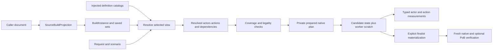

# General build input and native preparation: proposal for review

Status: **accepted on 2026-09-10**. The owner directed us to prioritize the most correct
structural design and avoid larger later refactors. This accepts the shared instance,
resolution and native-plan migration; ordinary API/storage choices proceed autonomously.
This B3 design follows the
[source-container work](build-source-containers.md), [breadth inventory](breadth-validation.md)
and [configuration catalog](configuration-data-proposal.md). It does not add mechanic
coverage or admit the five supplied originals. The [implementation record](implementation.md)
remains the authority for delivered capabilities and the next resume point.

The subsequent [whole-corpus mechanism inventory](breadth-mechanism-inventory.md) adds
item-range loading, allocation-provider, parent-actor and conditional receiver evidence to
this proposal. It does not change the proposal's approval status or claim broader native
calculation support. The [concrete API proposal](real-build-api-proposal.md) now specifies
identity layers, selected views, partial preparation and incremental migration using all
five originals. Its R1 contract does not claim complete effective actor/action construction;
those producers and numerical comparisons belong to R2/R3. Both documents now record the accepted direction; implementation gates remain separate.

## Recommendation

Introduce a portable build-instance model between source projection and native preparation.
Resolve its selected instances, actions and actor relationships against injected definitions,
then compile the supported calculation dependencies into private native plans. Migrate the
existing Spark/Mace paths through that boundary before replacing their remaining specialized
preparation with shared operations. Preserve complete source documents and optional fresh PoB
verification throughout the transition.

This advances the agreed fully native evaluator without making a catalog entry or a parsed
graph a certificate of support. The target remains joint class, ascendancy, passive, equipment,
support and supporting-skill search with 1..N required skills and items. It is not narrowed to
a primary damage action, a fixed set of builds, or independent optimizations per skill.

## Why the current boundary needs to change

Caller inputs already supply production builds and inventories. The remaining coupling is
structural: [native profile preparation](../crates/poe-optimizer-native/src/profile.rs) and
[controlled templates](../crates/poe-optimizer-import/src/controlled_build_template.rs) require
one skill set, one group, a main gem followed by a bounded support list, and selected-data
Spark/Mace dispatch. [Prepared candidate evaluation](../crates/poe-optimizer-native/src/build_candidates.rs)
retains that profile choice. The shared actor, modifier, local-item and timing operations are
reusable, but these complete-build assemblers are not yet a general evaluator.

The current [candidate model](../crates/poe-optimizer-core/src/candidate.rs) already permits
multiple skill assignments, but an assignment has one active instance and a set of supports.
That is insufficient to represent ordered source entries, multiple effects from one entry,
generated groups, actor ownership and conditional support relationships. Extending only the
XML allowlist would leave those effects unaccounted for.

The B2 inventory records **15 saved skill sets, 200 groups and 541 gem occurrences** across
all five originals. It finds 537 exact external game-ID/variant matches, one explicit known
effect without a gem ID, and the three previously investigated unresolved name-only rows.
There are 42 authored source-marked groups and 20 slot-assigned groups; the five active sets
contain 19, 18, 14, 15 and 12 groups. These are source and identity observations, not claims
that every action or dependency resolves or calculates. The local audit artifact is
`runs/root-container-skill-inventory.json`. Current injected-package overlap is only seven
support occurrences and no active Spark/Mace entry, so existing native calculations cannot
supply a broad-build result merely by accepting more groups.

The B2 source audit establishes requirements that cannot be recovered from display names:

- Saved sets retain both source order and their own IDs. Two supplied builds have six skill
  sets in nonnumeric order; one selects skill set 4 and item set 2. Do not pair independent
  skill, item, passive or configuration sets by position or by coincidentally equal IDs.
- `SkillsTab.LoadSkill` resolves the external gem game ID and variant before its explicit
  skill ID. The internal gem catalog key is a separate identity. A single gem may expose its
  primary effect and additional granted effects; `mainActiveSkill` indexes the calculated
  effect list, not the raw Gem row.
- `enableGlobal1/2` controls those effects' global application. Weapon scope comes from the
  group's slot, the slot's weapon-set association and the active item-set weapon flag.
  Neither meaning should be inferred from the similarly numbered field names.
- Source-grant assembly can create, replace and remove runtime groups according to provider,
  slot, effect and level. Authored entries, effective groups and generated grant instances
  must remain distinguishable. Equal effect IDs alone do not authorize deduplication.
- Minion actions belong to their summoning instance. MAIN and CALCS action, part and stat-set
  selections are distinct. The three unresolved name-only entries in the supplied minion
  build remain unresolved; related minion actions and ambiguous spectres are review hints.

Pinned source anchors are [SkillsTab](../vendor/path-of-building-poe2/src/Classes/SkillsTab.lua)
`:303–405` for identity precedence, [Data](../vendor/path-of-building-poe2/src/Modules/Data.lua)
`:972–1053` for primary/additional effects and display-order remapping, and
[CalcSetup](../vendor/path-of-building-poe2/src/Modules/CalcSetup.lua) `:1671–1733` and
`:1837–1846` for grant matching/rebuilding/removal, `:1981–2070` for global-effect switches,
and `:2131–2155` for calculated action indexing. Minion ownership is established in
[CalcActiveSkill](../vendor/path-of-building-poe2/src/Modules/CalcActiveSkill.lua) and summarized
with existing observations in [skill coverage](skill-coverage.md). These identify
representation needs, not a complete translation of those modules.

## Keep four kinds of information separate

| Boundary | Owns | Does not establish |
| --- | --- | --- |
| Source projection | Exact caller bytes, hashes, ranges, authored order, all saved sets, unresolved fields and unknown fragments | Effective state, support, legality or metrics |
| Build instance and resolution | Concrete item/gem/group instances, selected sets, provider relationships, resolved references and an explicit normalization trace | That every referenced mechanic has a native implementation |
| Injected definitions | Versioned gem/effect/actor/support definitions, grant rules, numerical tables, defaults, modifiers and audited capability metadata | A user's build, chosen objective or implicit example character |
| Request and resolved context | Requested metric targets, actor/action selection, encounter and usage assumptions; separately recorded effective choices | Mutation of the imported source or automatic Full DPS membership |

“Normalized” means typed, explicit interpretation with provenance. It does not mean rewriting
source XML, silently repairing an unresolved label, sorting semantically ordered rows, or
substituting UI defaults for effective configuration. Keep the authored value, the requested
selection and any source-defined fallback or migration as separate records. The existing
configuration catalog's initial defaults and callback descriptors are metadata; implementing
effective configuration remains a prerequisite wherever a build depends on those callbacks.

An occurrence ID identifies a concrete entry, not a game definition. An imported occurrence
can initially be keyed by document identity plus source position. Candidate-created instances
need independent stable IDs with an origin reference so moving a row or editing an unrelated
source range does not change every candidate identity. Equal copies of a physical item or a
gem remain separate instances. Generated identities include the provider instance, grant
record and occurrence; their lifetime follows the provider. Names are labels only.

## Staged representation

The names below illustrate accepted responsibilities; concrete Rust APIs and wire schemas
are versioned as implementation proceeds.

`BuildInstance` retains every saved set and ordered occurrence. Each set has its own identity;
its title is not an identity. The active view explicitly chooses a skill set, item set,
passive spec, configuration set and weapon state according to the source format's rules.
An inactive saved set is preserved and inspectable, not evaluated or searched unless the
request selects it. Unsupported content in an inactive set can remain preserved only when
its inactivity and lack of cross-set effects are established; switching to it requires fresh
resolution and admission. Do not reject a whole source merely because its inactive alternative
cannot yet be calculated, or ignore an active dependency merely because it is not a metric target.

`ResolvedSkillInstance` binds an authored or generated instance to the selected definition
catalog. Resolution states include exact resolution, empty entry, unresolved reference and
ambiguous reference, with source-derived candidates retained separately. A `ResolvedAction`
identifies an effect instance, its owning actor and provider, its selected part/stat set and
its effective enablement. It is distinct from a gem row, a display group and a metric target.
A source-defined fallback attack, where implemented, has explicit synthesized provenance.

`ResolvedActor` identifies a player, a particular summoned/provider-owned actor or another
supported actor role. It carries the actor definition, owner, population/count model and
context dependencies. This is an actor calculation model, not an event-level instance for
every projectile or summoned creature. Summoner stats, transferred modifiers and minion
local stats must remain separate. Additional actor roles remain opaque or unsupported until
their complete producer and consumer stages exist; adding an enum variant is not coverage.

Use typed edges for support application, grants, ownership, triggers, reservations, resource
or buff dependencies, and weapon scope. Preserve source order and the conditions governing
each edge. A support assignment may be present but disabled, incompatible, conditionally
applicable or applied to only one effect; these outcomes need evidence. Definition-wide
compatibility sets may accelerate checks, but cannot replace conditional compatibility.
Supporting active skills participate in the dependency closure even when their damage is
not requested.

This descriptive relationship graph is not automatically an executable DAG. Grants, flags,
resource conditions and trigger/buff interactions can be mutually dependent. Native lowering
must use explicit, source-tested stages and ordering. Reject an unimplemented cycle with its
participants and required mechanic; do not invent a topological order or generic fixed-point
iteration that changes the source calculation model.

## Native compilation, search and backend ownership

Keep portable instance/selector contracts in `poe-optimizer-core`, source-format parsing and
materialization in `poe-optimizer-import`, and immutable definition catalogs in
`poe-optimizer-data`. Put reusable numerical operations and compiled operation semantics in
`poe-optimizer-engine`. `poe-optimizer-native` owns dependency resolution into complete native
plans, backend binding and measurement adaptation. The current import-to-engine use for
requirement admission can remain during migration; do not introduce a cycle or make the
source-only inspection path compile game calculations. A new crate is not required initially.
Keep game/ruleset identity explicit. A later PoE1 adapter and package can reuse proven operations,
but must supply their own definitions and resolution semantics; PoE1 behavior is not an implicit
fallback for missing PoE2 mechanics.

The [definition-storage investigation](definition-storage.md) considers an optional database
catalog and generated artifacts behind the data seam. Source occurrences, build instances,
definitions and native handles remain independent of storage row IDs or ORM objects.
This does not block the shared instance model or select a database implementation.

The data migration replaces dedicated per-skill package fields with versioned skill/effect
records and references as their operations become representable. Numeric values, level/quality
tables, effect lists, modifier records, target relationships and applicability data are
injected. Rust implements audited operations such as ordinary direct-action timing; it does
not dispatch on a fixture name, source hash or known complete build. A typed operation or
mechanic ID may select an implementation, with an explicit semantic version and validation
rules. Preserve unrepresented callback behavior as an exclusion; do not serialize Lua callback
names and claim the native engine implements their effects.

Preparation compiles reusable item, passive, skill, support and actor contributions once.
Candidate evaluation selects those components, resolves their changing relationships and
checks requirements before calculation. Reuse the existing exact modifier insertion/layer
order, after-condition stages and per-slot receiving inputs. A shared actor stage must not be
rerun independently for every action when its dependencies are unchanged, nor cached across
candidates whose equipment, supports or provider state changes it.

Private admitted handles bind to the source/candidate catalog, compiled-data instance,
scenario, selected sets and resolved plan. A matching digest alone is not permission to mix
foreign owner-bound components. Raw public records remain untrusted. Candidate-specific
unsupported or numerical errors remain attached to the selected components or candidate;
one unused invalid alternative must not abort valid alternatives. Whole-build support,
requirement legality, metric availability and numerical verification remain separate outcomes.

Prepared immutable catalogs/plans are shared across Rayon workers. Each worker owns bounded,
resettable actor/action scratch, dependency state and output storage. The hot path uses dense
resolved references and preselected metric slots; it does not parse or serialize XML, construct
diagnostic JSON, call Lua, spawn processes or retain a Cartesian cache of build results.
Variable actor/action counts require capacity planning and explicit size limits during
preparation. Bounds protect resources; they are not invented game rules. Any capacity-growth
or unsupported-plan failure must be visible rather than silently dropping an action.

The performance target is allocation-free successful repeated admission/calculation after
worker preparation, including changing component selections. Preparation, graph rebuilding,
owned report conversion and complete search have separate costs and must be measured. Keep
cancellation and Rayon pool ownership in the host. The same portable engine can be hosted in
WASM without embedding an OS thread pool; browser execution still needs its own validation.

Retain `CalculationBackend`/`EvaluationEngine` and complete-document baseline/finalist
verification. Add or version prepared-input contracts without exposing native internal handle
types to generic search. The optional PoB backend receives source-preserving materializations
through its adapter, never native plans or Lua-free kernels through mandatory IPC. PoB remains
an explicit parity reference, not a fallback when native coverage fails.

## Selection, objectives and export contracts

A required skill means an enabled, usable instance in the selected candidate configuration,
with its provider and constraints satisfied. Leaving an identically named entry in an inactive
set is insufficient. Support, level/quality, placement and exact-instance locks remain separate
from definition-presence requirements. The same distinction applies to a required equipped
item and a spare inventory copy. All 1..N requirements are evaluated together.

Metric queries need stable actor/action references beyond the current player/minion aliases.
Introduce them through a versioned selector contract; legacy aliases can map to the explicitly
selected action when unambiguous. MAIN selection, CALCS display selection and user-requested
measurement selection remain distinct, with requested and resolved values recorded. Do not
change the source MAIN selector to evaluate a different metric target without an explicit
request and resulting context evidence.

Independent action DPS values do not imply simultaneous use. Full DPS membership, population,
uptime, trigger rate, resource sustainability and average-hit versus rate-based output need
explicit implemented semantics and user/scenario assumptions. No generic sum becomes an
objective by default. Unknown metrics and unavailable or nonfinite outputs retain the current
classified contract rather than being replaced with zero.

Materialization edits selected semantic instances and their source spans while retaining
unselected sets and opaque content. Each mutation records its changed identities, including
provider additions/removals and resulting generated actions. Re-resolve fresh exported source
and check realized selections/relationships as well as numeric outputs. Native exact-byte
preservation and PoB normalized exports are different evidence; PoB may rewrite or recreate
groups. Neither an equal XML hash nor a successful graph parse proves game legality or parity.

## Incremental delivery and acceptance gates

1. Review this architectural direction. Complete the B2 skill/grant/actor inventory and retain
   exact corpus identities, unresolved entries and source anchors. Select independent whole-build
   holdouts by missing mechanism family before implementing them.
2. Add bounded source skill/group/set projection and injected identity catalogs without widening
   native numerical admission. Independently execute original load/resolve consumers to verify
   IDs, ordered duplicates, defaults, primary/additional effects, grants and active/inactive sets.
   Keep effect metadata, applied semantics and callback exclusions explicitly distinct.
3. Introduce the portable instance and resolved-selection model. Route existing supported builds
   through it with unchanged goldens, exports, metric contracts and private ownership checks.
   Use caller-selected sets and groups rather than a fixed first set/group; admit only when the
   complete active dependency closure is implemented. Test additional inactive sets separately
   from active supporting effects.
4. Replace profile-wide dispatch incrementally with shared operation plans. Prove at least two
   active required skills and interacting support/provider changes through the same APIs. Migrate
   existing actor/item/timing operations; add complete missing producers and consumers according
   to the inventory, with independent source oracles and fresh complete-build comparisons.
5. Generalize the candidate/selector schema and materializer, preserving old input versions through
   explicit compatibility adapters. Validate all joint search dimensions, provider removal,
   requirements, metric scope and source realization. Only expand release coverage when complete
   original and held-out builds pass, not when their source graph can be inspected.

For each step, test ordered set IDs and independent active selections, duplicate instances,
primary/additional effects, global enable flags, weapon changes, grant recreation/removal,
minion ownership and action/stat-set selection. Include unresolved and unknown active content,
unsupported inactive-to-active transitions, conditional support and trigger cycles, and
cross-catalog/data/scenario handle rejection. Original-source cold/warm tests establish ordering
and normalization; complete fresh PoB comparisons establish the integrated observation. These
are complementary evidence, not interchangeable test counts.

Parallel tests must vary actual gear/tree/support/skill/actor relationships across workers and
compare deterministic outputs and source realization with serial runs. Measure preparation and
worker storage separately from admission, pure calculation, owned output and complete search.
Disclose exclusions and unchanged narrow coverage while migrating; no speed result by itself
establishes general evaluator completeness.

## Alternatives and decision to discuss

| Option | Benefits | Costs and limitations |
| --- | --- | --- |
| **Recommended: staged portable instances, resolution and native operation plans** | Reuses existing pure kernels and private component plans; supports exact-source inspection independently of numerical coverage; separates game data from caller instances | Requires versioned instance/action selectors and candidate schema changes; migration spans import, data, native and tests before broad builds calculate |
| Continue adding complete per-skill profiles | Small isolated numerical changes and immediate narrow regression cases | Repeats set/grant/actor assembly, preserves closed assumptions and makes cross-skill interactions increasingly expensive to validate |
| Mirror PoB's runtime object graph in Rust first | Close correspondence for porting original consumers and normalization order | Risks exposing mutable UI/runtime state as public build identity and carrying runtime caches/cycles into search; a separate stable source/candidate boundary is still needed |
| Replace all build/candidate contracts and mechanics in one migration | One final model without temporary compatibility adapters | Delays usable parity evidence and makes regressions difficult to localize; high risk of losing source semantics while numerical pipelines also change |

The accepted choice is the shared instance/resolution/plan migration. Structural correctness
and contrasting real-build cases take priority over retaining the Spark/Mace profile shape.
Temporary compatibility adapters may preserve existing behavior, but must not determine the
new public model. Build, definition, source and compiled identities remain separate, and
original-source semantics govern resolution and preparation. This is the route toward the
existing full-native objective, not a reduction in build or search scope.

A secondary product choice is how saved alternative sets should enter optimization. Recommend
preserving all sets and optimizing one explicitly selected view per run initially, while allowing
users to supply several views/scenarios as explicit joint constraints. Automatically searching
across every saved set would need clear semantics for shared item instances, passives and required
skills; source order alone does not define that problem. This can be discussed alongside the
architecture and does not block source projection or identity-catalog work.
