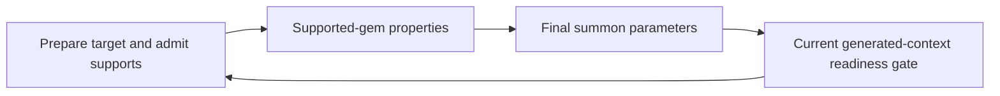

# Proposed: preparation readiness for generated skills

Status: **proposed, not accepted or implemented**. Prepared 2026-09-30 for an
owner design discussion. This changes the meaning of readiness at a public
calculation boundary; implementation must wait for agreement. Existing operation
versions, activation checks, release bytes and coverage behavior remain intact.

## Recommendation

Use **one canonical occurrence topology and one native effect graph**, with an
explicit, versioned contract for preparation readiness versus execution readiness.
A structurally activated generated skill can be eligible for support preparation
before its final numerical inputs exist, but only when its declared preparation
dependencies are complete and satisfied. Ordinary action evaluation and delivery
continue to require the full execution inputs. Do not introduce a second source
interpreter, a second build model, or a caller-supplied `ready` flag.

This proposal does not relax whole-owner or contributor coverage. The current
real endpoint remains Pending, with complete native original-build coverage 0/5.
The distinction is between two well-defined phases of a fully described mechanic,
not between complete and incomplete descriptions of that mechanic.

## Concrete dependency witness

The [effective-input recipe](owned-effective-gem-inputs.md) now emits independent
authored-root active inputs and exact SupportOrigin inputs. The real policy binds
Twister `000a`, Sniper `0011`, Cleric `0916`, Meat Shield II `083e` and Armament II
`0733`. ID suffixes here abbreviate the pinned release's full registered IDs.

The active output `30ac` is a Count quantity **before** supported-gem properties
and final level validation; `30ad` is its corresponding quality. Support-origin
outputs `30ae`/`30af` are prepared level/quality. Neither active output satisfies a
generated skill's required final parameter. Twister/Sniper raw final projections
were explicitly retired in the new endpoint; Cleric has no final producer yet.

For Cleric, the exact structural path is:

| Occurrence | Entering declaration | Required numerical inputs |
| --- | --- | --- |
| Authored physical Gem `0916` | Authored SkillUse root | Physical Gem facts and independent external properties |
| Summon Skill `0325` | Gem grant `309e`, supply `309d` | Final summon level `309f`, final quality `30a0` |
| Cleric actor `309c` | Summon population grant `30a2`, actor slot `30a1` | Actor level stat `001c`, when a rule demands it |
| Heal Skill `01c6` | Actor grant `30a4`, supply `30a3` | Heal level `30a5`, quality `30a6`, actor level `30a7` |

These are exact occurrence paths, including every entering grant; definition IDs
alone cannot distinguish repeated physical gems or sibling actors. Heal remains
separate from the original selected damage action. All five original query files
and their 110 rows must retain their existing identities and selection.

If final summon input assembly consumes admitted supported-gem properties, the
current binding produces the following cycle when preparing that generated
context or a receiver whose activation depends on it:

This is a dependency witness for the intended integration, not a claim that the
current Partial release already compiles that full calculation. The stage/DAG
checks should reject such an integration today. An added stat name or another
stage label does not remove its edges.

There is a second, independent correspondence requirement: supported-gem
properties apply through **physical source-gem membership**, including multiple
effects sharing a source. Per-action admission alone is not a once-per-gem proof.
Solving readiness must not silently invent that relation or sum one property for
each receiving action. The authenticated source ordering, including the witness
`12 + 0.25 + 0.75 -> 13`, remains the reference for later final input assembly.

## What the existing contracts authorize

| Layer | Existing authority | What it does not establish |
| --- | --- | --- |
| Core build/schema binding | Exact authored/generated targets, provider paths, role/membership checks, declared parameter/choice schemas | Phase-specific required-input readiness or a general physical source-gem relation for generated effects |
| `EvaluationStagesInput` | Program stage membership, declared precedence and frozen channel families | Permission to omit a required generated parameter or to execute incomplete mechanics |
| `SupportInputBindingsInput` | Which computed SupportOrigin/Skill stats supply native preparation inputs | Values, target activation, or source-gem bookkeeping authority |
| `SupportReceivingInput` | Finite Actor/Action receivers, exact paths, explicit admission and summoner contexts | Independent receiving topology, relaxed activation, or final property membership |
| Pure `SelectedSupports` / preparation components | Deterministic bounded selection and admission from supplied facts | Build coverage, validated topology or authority for a whole evaluation |
| `OwnedSupportEffectPlan` | Verified packages, one prefix, native selection/admission, retained suffix effects and same-attempt outputs | A public partial-evaluation escape hatch |

In Engine, `compile/preparation.rs::preparation_gates` invokes
`Builder::context_gates`. Ordinary effect instantiation invokes the same function.
That function retains provider/actor grant activation and adds **every**
`RequiredOnce` parameter of the generated Skill. Consequently, altering only the
support driver's activity check would leave the target-fact producer gates cyclic,
or create inconsistent authority between producer and consumer.

`supports.rs::preparation_schedule` checks actual effect dependencies and target
gate dependencies against the stage order. `support_effects.rs::attempt` also
requires complete base coverage, complete stage classification and complete
receiving assignments before running preparation. Those checks remain required.

Core selector binding also validates actual provider choices and path membership.
For example, the Cleric Actor choice inventory is independently known empty;
Heal action-choice coverage remains Partial. A new readiness contract must not
turn an unresolved action selector into a resolved action or change saved queries.

## Alternatives

| Option | Benefits | Costs and risks |
| --- | --- | --- |
| **A. Explicit readiness on one topology/graph — recommended** | Preserves occurrence identity, shared prefix, one budget and ordinary native operations; makes the true dependency boundary inspectable | Requires versioned declaration/validation semantics and careful auditing of all implicit gates |
| **B. Separate preparation topology view** | Strong type separation; a preparation object cannot accidentally be passed to the ordinary evaluator | Requires exact correspondence and promotion proofs between two views; risks duplicate resolution, stale caches, omitted receivers and divergent coverage accounting |
| **C. Restrict finalization to domains with no support-dependent inputs** | Can deliver a narrow source-proven case using current contracts | Does not solve general supported properties, generated receivers or multi-effect source bookkeeping; domain exclusion must be explicit and complete |

Option B can be an internal implementation of A if it is a sealed borrowed view
over the same canonical occurrences, with no independent identities or coverage
claims. A separately authored or serialized preparation build is not recommended.

Deleting required gates, making final parameters optional, copying raw values into
final slots, treating absent properties as a complete empty set, or iterating to a
fixed point are not alternatives with equivalent semantics. None is proposed.

## Proposed contract shape for option A

The names below describe responsibilities, not a committed DTO/API. Choose exact
types and version numbers after agreement and a small dependency proof.

**Core:** introduce an explicit readiness declaration bound to exact definitions
and stage semantics. For each admitted generated Skill, completely classify its
required inputs by the earliest supported readiness phase. Preserve `RequiredOnce`
as a requirement; a later-phase input is deferred, not optional. Associate relevant
programs with a readiness requirement, and distinguish preparation-only output
channels from final execution channels. Legacy packages retain the existing rule
that all required generated inputs gate every generated-context effect.

At minimum the model must distinguish structural occurrence/activation,
preparation inputs, and full execution inputs. It may represent this as a finite
readiness DAG rather than hardcoded game stage names. In particular, the programs
assembling final inputs must be permitted to run at their declared prior readiness
without requiring the very parameter they produce. Delivery and metric consumers
must require execution readiness. A binary flag added only to support activity is
insufficient.

**Data:** validate complete, non-overlapping classification against all declared
required inputs, exact program owners, phases, units and package identities. A
Partial declaration cannot be used to certify that the unlisted preparation inputs
are absent. Reject contradictory classifications, unknown programs, duplicate
writers and any attempt to classify an execution output as a preparation fact
without its required readiness. Classification is data; proof that concrete reads
and activation dependencies obey it also requires Engine binding.

Prefer a narrow package bound to schema, rules and stages if that avoids spreading
calculation phases through otherwise reusable physical-input schemas. Either form
needs versioned public semantics and release identity. It must not be an unchecked
sidecar that removes gates.

**Engine:** cold-bind a single canonical topology and distinct readiness gate sets
for the exact same occurrence. Keep all structural membership/choice checks and
all real grant activation dependencies. Add the declared phase's required inputs
to its gate set. Bind each program to that set, then validate the complete graph,
including implicit gates, routes, deferred application templates, final projections
and query gates. Later readiness includes the full required-input union.

A preparation-only program must be restricted to its declared channels and effects;
it cannot publish a final metric or support delivery merely by requesting an earlier
gate. Final parameter assembly is an explicit allowed producer role. If its actual
reads or grant activation still require later values, reject the cycle. Genuine
mechanical feedback needs a separate source-backed algorithm, not a gate exception.

Continue executing the sealed prefix and retained suffix in one attempt with one
decreasing work budget and worker-owned scratch. Index phase gate sets at compile
time; do not rescan all parameters or rebuild a second topology for each candidate.
All caches and plan identities must include the readiness package/version. Failed
attempts retain no promotable preparation values.

**Physical source correspondence:** separately bind each admitted generated effect
to its exact physical source occurrence, with complete finite effect membership
and explicit inheritance. The existing direct-root Gem read authority should be
reused where sufficient. Generated contexts must not search for an arbitrary Gem
or borrow an unrelated parent's raw values. Source-gem property accumulation and
once-per-source application require their own reviewed membership semantics;
readiness classification does not provide them for free.

## Smallest coherent implementation after agreement

1. Specify the new readiness contract and legacy fallback. Prove the declared
   preparation channels for one generated supplied skill are independent of its
   final parameters; retain a negative case with a genuinely late activation grant.
2. Compile a closed native component through the **public support plan**, with
   exact authored parent, generated target, owned actor and child receiver. The
   initial phase computes types and support-origin scalars; admission is followed
   by final input assembly; execution consumers retain their full gates.
3. Add finite source-gem membership and a source-backed supported-property example,
   including one physical gem with more than one effect/receiver. Prove the
   property is applied once per intended source, not once per action. The fractional
   ordering witness must remain correct through final validation.
4. Integrate real data only as its actual facets become complete. Preserve the
   five original query inventories and remaining Partial closures. Cleric/Heal
   actor-level production and Heal action choices remain separate work; topology
   existence alone does not complete them.

No milestone is established by supplying expected effective inputs from a caller,
weakening the original schema for a test, or evaluating only the pure selection
component.

## Required validation

- Legacy operation versions retain existing plan identities, implicit gate behavior
  and failure ordering where previously guaranteed; missing new metadata cannot
  activate the new behavior.
- The positive phase witness compiles and computes final values. Removing any actual
  early input, membership proof or grant leaves it unresolved. A late dependency in
  a preparation program or activation grant is rejected, including lazy branches
  and deferred support effects that are false in the tested candidate.
- Missing final inputs can never yield an executable action/metric. A preparation
  fact remains confined to its phase. All owner/contributor/receiving completeness
  gates continue to block the same incomplete domains.
- Two identical Gem definitions at different physical occurrences, sibling actors
  and repeated generated abilities preserve exact paths, source membership and
  independent values. Parent admission is not substituted for child admission;
  inherited selection preserves retained duplicates and source scalar identity.
- The final-input source witness includes the fractional active level and
  post-admission adjustment. Disabled-target behavior is explicit; no false gate
  masks a missing input belonging to another occurrence.
- Shared prefix runs once; A→B→A scratch reuse, failure cleanup, deterministic
  parallel evaluation and bounded expansion/work remain covered. No additional
  subprocess, mutable interpreter or full graph clone is introduced.

## Independent quality closure can proceed separately

The real bindings currently require an explicit ordinary quality. Partial quality
kind membership intentionally remains Partial. If an independent audit proves the
complete allowed-kind inventory and absence semantics for a specific Gem, the
existing `OwnedReleaseRevisionInput` can replace its exact Gem descriptor in a new
release **when that predecessor has no evaluation artifact group**, as the current
real endpoint does. It allocates no IDs, preserves rule bodies and rebinds dependent
identities. Full endpoint assembly is also available with an explicit preservation
allowlist. Neither requires the proposed readiness contract.

That schema correction alone does not change `RequireSelectedQuality` into a zero
branch. Recompiling/installing a `ZeroWhenProvenSingleton` program changes its body
and therefore needs explicit full endpoint authoring or a separately approved
replacement mechanism; existing append-only migrations must not be weakened.
Preserve all unrelated Gem declarations/owner gaps and prove missing, explicit zero,
other quality and repeated occurrence cases. No such complete quality proof is
claimed by this proposal.

## Decision requested

Choose whether to adopt **explicit readiness phases over the single canonical
topology and native graph** (recommended), or require a separate, sealed preparation
view with explicit promotion/correspondence checks. The former provides the clearer
long-term shared model for generated skills, supports, actor inputs and GUI/API
consumers while preserving one high-performance execution path.

Owner input is needed because this changes an accepted structural guarantee of
generated-context evaluation, not merely an implementation detail. Agreement here
authorizes designing the narrow versioned contract; it does not authorize reducing
coverage checks, inventing source-gem membership, or claiming original-build parity.
