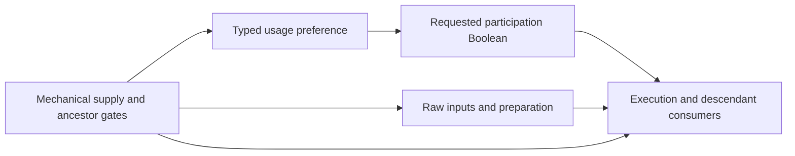

# ADR: requested participation and mechanically supplied skills

**Status:** Accepted 2026-10-06; native consumer implemented and tested;
first Sniper input/rule packet and typed composition integration validated.
Remaining skill families and complete-original coverage remain open.

**Input publication, 2026-10-07:** the
[remaining-occurrence packet](../data/owned/poe2/3887ae68/occurrence-participation-inputs/README.md)
reuses policy 332b for Original05's other eight selected roots. Together with
Sniper, Sand and Firebolt, all twelve now preserve requested group/occurrence
enabled values. All-five import inverses and 52 source controls pass. This adds
no readiness declarations or native formulas; complete selected parameter/rule
inventories and usage accounting still require their own proofs.

**Date:** 2026-10-05.
**Decider:** Project owner.

## Context

Saved generated skills can be enabled or disabled independently of the item or
allocation that supplies them. Their typed preferences already belong to the
skill preset, with exact-source applicability and scenario overrides. Those
storage decisions remain accepted. The missing contract is how native execution
consumes requested participation without making a skill's activation depend on
a program that requires that same activation.

Current [usage compilation](../crates/poe-optimizer-engine/src/owned_plan/compile/usage.rs)
binds a generated target through its actual entering grant. Every readiness
phase retains that grant and its ancestors. Existing readiness only changes
when required skill parameters must exist; moving usage earlier does not remove
the grant dependency. Usage deliberately cannot emit `ActivateGrant` or project
skill parameters.

An ordinary early usage program can already derive a typed Boolean Skill stat
from its policy parameter. Data's `PreparationFacts` role permits that output.
What is absent is a declaration making execution depend on that exact Boolean.
Today, adding it only to damage rules would leave support delivery, applications,
descendant actors/actions, queries and other execution consumers inconsistent.

Authored `SkillUse.enabled` already controls root availability. Tree and Item
roots instead follow selected allocation/equipment and loadout availability.
Effect-only preferences, such as Offering's application switch, have narrower
meaning than disabling the entire skill. PoB's `enableGlobal1/2` are likewise
not generic enabled fields and must not acquire that meaning through this change.

There is a separate reference-preview distinction. In the pinned
`CalcSetup.lua:1888–1895`, MAIN and CALCS choose their main socket group from
different selectors. At lines 1912, 1981 and 2131, that group's selected index
bypasses both group `enabled` and `slotEnabled`; Gem `enabled` still gates
support and active-effect creation (1964 and 1996). If no eligible main effect
exists, lines 2198–2210 construct a default unarmed effect. A numerical source
result therefore does not itself prove requested participation or even the
intended effect identity. Existing disabled-group witness assertions cover
nonselected groups, not this selected-preview case.
Other readers still require group enabled, including the Energy Blade restart
at line 2185 and socketed-support counting at 2254. There is no single
source-wide participation expression to copy.

The recommendation keeps native query selection from enabling an occurrence.
Before importing group/Gem activation, add a source control for a disabled
selected group, a disabled Gem and unavailable equipment, recording exact
result identity and any fallback. Classify the preview behavior under the
[Lua/source cleanup gate](legacy-retirement.md#lua-compatibility-cleanup-gate-requested-2026-10-05);
do not silently copy it into native execution or declare it another Frost
exception. Any requested native preview override needs a separate explicit
contract and discussion.

## Source evidence: selected previews and missing providers (2026-10-06)

The bounded [participation source test](../crates/poe-optimizer-pob/tests/owned_selected_participation_source.rs)
passed in 165.36 seconds. It preserves Original05 unchanged as its baseline and
adds eleven controls over its actual saved sources. Each control has an
independent fresh replay and an independent unhooked runtime, retaining `fresh`,
`rebuilt_once` and `rebuilt_twice` separately. Exact identities and scalar outputs
agree between corresponding stages of independent runs. There is no retry or
settling step, calculation wrapper or calculation hook. Loader provenance joins
saved fields to exact runtime groups, Gems and item/tree providers.

Both JIT reports in `runs/owned-selected-participation-source-01/` are byte
identical: `source-jit-off.json` and `source-jit-on.json` are each **6,768,645 bytes**,
SHA-256 `d2aa60cae2de446dad0c51ffeb65d450cca5b199f3b87d33a6c94afa5f37a6e8`.
The report authenticates source revision
`3887ae68a6a6b8bb7b41d1b61998f1aa184201e4` and the unchanged Original05 XML.
Reproduce with the ignored test
`selected_participation_preserves_exact_source_identity_and_preview_outcomes`
in target `owned_selected_participation_source`, setting
`POE_OPTIMIZER_TEST_SELECTED_PARTICIPATION_SOURCE_OUT` to a fresh output directory.

The following identity outcomes occur in every captured lifecycle stage:

| Control | Original source outcome |
| --- | --- |
| Unchanged Original05 | MAIN selects `SummonSkeletalSnipersPlayer` in group 3; CALCS selects `SummonSkeletalArsonistsPlayer` in group 1. Their saved selectors intentionally differ. |
| Both selectors focus Sniper; its group is disabled | Both still select Sniper. Disabling the selected Gem instead produces `MeleeUnarmedPlayer` without a source group. Disabling the nonselected Arsonist group removes that group's active effect. |
| Both selectors focus item-granted Firebolt from item 28 | Disabling its selected group still selects `FireboltPlayer`; disabling its Gem produces the default unarmed effect. Unequipping the actual provider removes its active effects and both modes instead select the remaining `IceNovaPlayer` group. |
| Both selectors focus tree-granted Sand Djinn from node 13289 | Disabling its selected group still selects `SummonSandDjinnPlayer`. Removing that allocation removes both generated effects and both modes instead select Sniper. The independent manual occurrence of `SummonSandDjinnPlayer` remains active, including when the tree provider is absent. |

Provider removal uses saved equipment/allocation changes, not direct runtime
mutation. Numerical output alone would miss these changed result identities.
This proves the bounded source-preview distinctions; it does not authorize a
native preview override, classify a new source-bug exception, settle requested
participation semantics or establish complete build parity. The proposal remains
accepted for implementation, and native complete-build validation remains **0/5**.

## Recommendation: separate supply from requested participation

Keep mechanical supply and its ordinary grant gates unchanged. Add an explicit,
data-declared participation requirement over the same occurrence graph:

1. The existing usage record supplies a typed Boolean parameter. An ordinary
   early rule derives a declared Boolean stat on the exact Skill occurrence.
   It retains existing provider/ancestor gates and early-input validation.
   It cannot create a provider, write its own entering grant, or retarget a source.
2. An explicit readiness declaration binds a Skill definition to its Boolean
   participation channel. The native compiler instantiates that requirement for
   exact occurrences, using existing identities and computed-value dependencies.
   This is a consumer declaration, not a second input store or callback language.
3. Normal execution requires both mechanical availability and participation.
   False suppresses participation; unknown remains unresolved. An explicit true
   cannot enable a missing, disabled or off-loadout provider.
4. Execution under a Skill's actual provider/actor ancestry inherits the
   participation requirement. A child cannot override a false ancestor. Sibling
   or same-definition occurrences with different providers remain independent.
   Query availability and effect delivery must use the same gate builder.
5. Intrinsic inputs and source preparation can remain computable while a
   mechanically supplied skill is not participating. A preparation mechanic
   that actually depends on participation must declare that read explicitly.
   Do not silently gate every preparation program, and do not let early facts
   become ungated gameplay contributions through another consumer.

The implemented wire spelling is `SkillReadiness.participation: Option<StatDefId>`
within current stages V4 / operations V21. It reuses the existing readiness row,
renamed in place without a compatibility alias. The
data contract is a finite mapping from Skill definitions to exact, declared
Boolean channels. Reject duplicate, foreign, wrong-type, late or cyclic bindings.
Any neutral/default value comes from an explicit data rule and complete input
inventory, never from an absent usage record or a source `nil` spelling.
An omitted participation declaration preserves the old meaning; it does not
prove that a saved enabled field was interpreted.

Preserve authored root availability and existing effect-only usage. The new
requirement may compose with them, but cannot turn an effect/application
preference into a whole-Skill preference. Rebuild affected development artifacts
under the current contract rather than keeping a compatibility mode. Imported
group/Gem enabled fields require their own authenticated combination and exact
target correspondence. Explicit topology supplies Command/actor descendants;
source names and XML groups are not native propagation rules.

## Alternatives and trade-offs

| Option | Benefits | Costs and limits |
| --- | --- | --- |
| **A. Separate participation requirement — adopted** | Reuses preset/scenario usage, typed rules, readiness, computed channels and one graph. Avoids self-dependent grants. Retains inputs needed to prepare and compare inactive choices. | Adds an explicit execution-gate declaration. Requires an audit of descendant/query/delivery gates and explicit participation-dependent preparation. |
| **B. Make requested enabled change mechanical supply** | Disabled skills disappear at the supply boundary, so existing descendant grant gates can suppress them. | Requires a producer that runs before the grant it controls, with new authority/context rules. Changes when raw inputs and support/source preparation are available, and risks circular dependencies or a second preparation model. |
| **C. Store a new raw Skill parameter** | Can reuse generated-input storage and literal parameter producers. | Still needs a participation consumer. Scenario usage cannot currently override those inputs; adding that authority would duplicate conflict/composition semantics and classify usage as intrinsic configuration. |

Option A best preserves the already accepted ownership and readiness separation.
It does not expand supported game mechanics or relax whole-build completeness.
An inactive occurrence cannot hide Partial owner behavior, unknown contributor
reach, missing input authority or other unresolved inventories.

## Implementation and validation gates

1. [x] Owner selects the supply/participation semantics (2026-10-06).
2. [x] Add an explicit version/operation gate and immutable Data validation.
   Rebuild affected artifacts and reject stale identities. The owner does not
   require backward compatibility or parallel old/new execution paths.
3. [x] Reuse ordinary early usage derivation and concrete dependency checks.
   No self-grant writer, second graph or generated Skill input storage is added.
4. [x] Apply the requirement consistently to execution, queries, support delivery,
   applications and actual Skill/Actor/Action ancestry. Check shared source
   preparation with mixed participating/nonparticipating effects explicitly.
5. [ ] Prove Tree and Item grants, manual/authored controls, repeated identical
   definitions with different providers, scenario override and dormant presets.
   Preserve authored disabled roots, effect-only Offering behavior and independent
   siblings. Exercise Command, actor and action descendants.
6. [x] Reject missing/wrong-type participation, competing writers, late/cyclic
   producers and unknown ancestry. False must not manufacture availability,
   suppress coverage diagnostics or produce zero as a substitute for unresolved.
7. [ ] Authenticate saved enabled/group combination separately from global
   switches and Full DPS. Preserve all five original requests and 110 queries,
   exercise A/B/A scratch reuse and Rayon workers, and record the next blocker.
   Native query reordering/subsetting must not change execution or availability.
   Source controls must retain MAIN/CALCS selectors and exact evaluated identities
   across selected/nonselected, group/Gem enabled and equipment-availability cases.

The owner approved the separate supply/participation contract on 2026-10-06.
Public implementation is authorized; numerical parity must still satisfy the
gates above. The five complete native build gate remains 0/5. The parallel global
switch witness addresses source-field evidence only; it cannot authorize
whole-build non-applicability.

## Native consumer checkpoint (2026-10-06)

The common execution gate collects exact Skill occurrences from their provider
prefixes and actual owned-Actor ancestry. It covers ordinary execution, queries,
support recipients/sources and effect applications. A physical Gem container
does not become an alias for one of its supplied effects. Structural and
preparation phases retain their mechanical gates without implicit participation.
Data admits only same-namespace Boolean Skill-only channels and ordinary early
`PreparationFacts` derivations. Missing producers remain concrete unresolved
dependencies. Native final support outputs cannot manufacture the participation
stat. All potential writers retain existing cycle, stage and conflict checks.

Validation passes: one Core wire test, all 33 Data stage tests (seven new), and
nine new Engine tests. Existing preparation (14), source-property (15), and
Offering usage (six) regressions pass; the source-backed compact observation test
was not run here. New Engine cases cover Item, Tree and authored roots, repeated
occurrences, independent siblings, source/recipient applications, mixed source
assembly, disabled/off-loadout supply, incomplete owners, unknown values,
query subsets/order and A/B/A plus Rayon scratch. These are finite contract
fixtures, not new production game coverage. Preset override/dormancy composition
is an existing Core responsibility; its 32 project and 10 preset-intent
regressions also pass. New composed real-build participation
integration remains part of gate 5.

Import's strict `ContainingGroup` usage projection retains group values
independently from occurrence values. It has no fallback and adds no AND formula,
source default or reporting semantics. The next publication must authenticate
the actual group/Gem combination per exact target and preserve narrower
application/global controls. No participation declarations have been installed
in the checked game-data package yet, and complete build evaluation remains 0/5.
All 290 Import normalization tests pass, including independent group/Gem Boolean
combinations, malformed/missing group inputs, strict group numeric transport and
the existing generated count-accounting regressions.

Retained failed runs caught test setup errors: the V21 fixture needed its
explicit ordered-query inventory, early Partial ownership was correctly refused
at Data, and support-output evidence needed the original stored rule identity.
Fixes changed fixture setup, not production authority or completeness checks.

## First real data publication (2026-10-06)

The [Sniper packet](../data/owned/poe2/3887ae68/skill-participation/README.md)
publishes policy `332b`, required group/occurrence Boolean slots `332c/332d`,
and Skill-only Stat `332e`. An ordinary `PreparationFacts` rule derives their
conjunction. Count policy `326a` and physical supply `0011` → `0016` → `0012`
are unchanged. Import uses the existing current multiple-policy contract after
removing the old Boolean/numeric dispatch and retired usage variants.

All five originals retain their previous values, source origins, selections,
Pending issues and 110 queries after removing only the exact new bindings in an
inverse comparison. Original01 gains one binding and Original05 five; the other
three gain none. Eight false/missing/malformed/unknown source controls pass.
The authenticated package is `runs/owned-skill-participation-02/package`;
publication/rebuild and corpus/control validation take 36.24s.

Five native integration tests pass (13.84s) through current typed preset intent
and checked composition. They prove exact scenario override, unselected-preset
isolation, independent count, preparation retention, intrinsic Actor Life effect
gating, required-input rejection, Partial refusal and A/B/A plus Rayon replay.
A disabled physical root does not supply an Actor; a mechanically supplied Actor
can have inactive execution. Local physical bindings use Required applicability;
external-provider dormancy remains the separately validated shared contract.

The readiness delta is joined to the existing complete two-parameter execution
requirement before use. It remains an authoring fragment because the production
release has no complete evaluation bundle. These tests do not claim final Actor
Life-pool parity or complete-original evaluation. Gate 5 is advanced by real
physical integration but broader family/provider coverage remains open. Gate 7
has all-five preservation and Sniper controls, not blanket source equivalence for
other enabled-field consumers. Full native builds remain 0/5.
