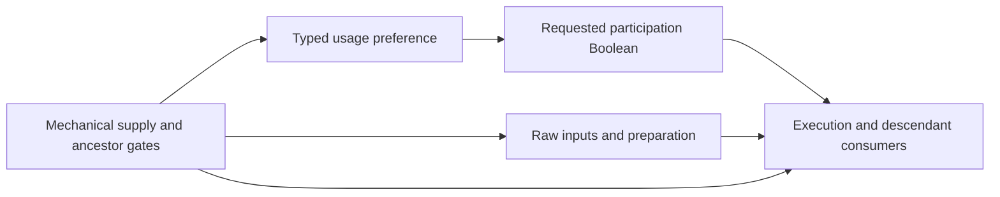

# ADR: requested participation and mechanically supplied skills

**Status:** Proposed; owner decision required before changing the public contract.
**Date:** 2026-10-05.
**Decider:** Project owner.

## Context

Saved generated skills can be enabled or disabled independently of the item or
allocation that supplies them. Their typed preferences already belong to the
skill preset, with exact-source applicability and scenario overrides. Those
storage decisions remain accepted. The missing contract is how native execution
consumes requested participation without making a skill's activation depend on
a program that requires that same activation.

Current [usage compilation](../crates/poe-optimizer-engine/src/owned_plan/compile/usage.rs)
binds a generated target through its actual entering grant. Every readiness
phase retains that grant and its ancestors. Existing readiness only changes
when required skill parameters must exist; moving usage earlier does not remove
the grant dependency. Usage deliberately cannot emit `ActivateGrant` or project
skill parameters.

An ordinary early usage program can already derive a typed Boolean Skill stat
from its policy parameter. Data's `PreparationFacts` role permits that output.
What is absent is a declaration making execution depend on that exact Boolean.
Today, adding it only to damage rules would leave support delivery, applications,
descendant actors/actions, queries and other execution consumers inconsistent.

Authored `SkillUse.enabled` already controls root availability. Tree and Item
roots instead follow selected allocation/equipment and loadout availability.
Effect-only preferences, such as Offering's application switch, have narrower
meaning than disabling the entire skill. PoB's `enableGlobal1/2` are likewise
not generic enabled fields and must not acquire that meaning through this change.

There is a separate reference-preview distinction. In the pinned
`CalcSetup.lua:1888–1895`, MAIN and CALCS choose their main socket group from
different selectors. At lines 1912, 1981 and 2131, that group's selected index
bypasses both group `enabled` and `slotEnabled`; Gem `enabled` still gates
support and active-effect creation (1964 and 1996). If no eligible main effect
exists, lines 2198–2210 construct a default unarmed effect. A numerical source
result therefore does not itself prove requested participation or even the
intended effect identity. Existing disabled-group witness assertions cover
nonselected groups, not this selected-preview case.
Other readers still require group enabled, including the Energy Blade restart
at line 2185 and socketed-support counting at 2254. There is no single
source-wide participation expression to copy.

The recommendation keeps native query selection from enabling an occurrence.
Before importing group/Gem activation, add a source control for a disabled
selected group, a disabled Gem and unavailable equipment, recording exact
result identity and any fallback. Classify the preview behavior under the
[Lua/source cleanup gate](legacy-retirement.md#lua-compatibility-cleanup-gate-requested-2026-10-05);
do not silently copy it into native execution or declare it another Frost
exception. Any requested native preview override needs a separate explicit
contract and discussion.

## Recommendation: separate supply from requested participation

Keep mechanical supply and its ordinary grant gates unchanged. Add a versioned,
data-declared participation requirement over the same occurrence graph:

1. The existing usage record supplies a typed Boolean parameter. An ordinary
   early rule derives a declared Boolean stat on the exact Skill occurrence.
   It retains existing provider/ancestor gates and early-input validation.
   It cannot create a provider, write its own entering grant, or retarget a source.
2. An explicit readiness declaration binds a Skill definition to its Boolean
   participation channel. The native compiler instantiates that requirement for
   exact occurrences, using existing identities and computed-value dependencies.
   This is a consumer declaration, not a second input store or callback language.
3. Normal execution requires both mechanical availability and participation.
   False suppresses participation; unknown remains unresolved. An explicit true
   cannot enable a missing, disabled or off-loadout provider.
4. Execution under a Skill's actual provider/actor ancestry inherits the
   participation requirement. A child cannot override a false ancestor. Sibling
   or same-definition occurrences with different providers remain independent.
   Query availability and effect delivery must use the same gate builder.
5. Intrinsic inputs and source preparation can remain computable while a
   mechanically supplied skill is not participating. A preparation mechanic
   that actually depends on participation must declare that read explicitly.
   Do not silently gate every preparation program, and do not let early facts
   become ungated gameplay contributions through another consumer.

The concrete wire spelling is implementation work after approval. The intended
data contract is a finite mapping from Skill definitions to exact, declared
Boolean channels. Reject duplicate, foreign, wrong-type, late or cyclic bindings.
Any neutral/default value comes from an explicit data rule and complete input
inventory, never from an absent usage record or a source `nil` spelling.
An omitted participation declaration preserves the old meaning; it does not
prove that a saved enabled field was interpreted.

Preserve authored root availability and existing effect-only usage. The new
requirement may compose with them, but cannot reinterpret historical bytes or
turn an effect/application preference into a whole-Skill preference. Imported
group/Gem enabled fields require their own authenticated combination and exact
target correspondence. Explicit topology supplies Command/actor descendants;
source names and XML groups are not native propagation rules.

## Alternatives and trade-offs

| Option | Benefits | Costs and limits |
| --- | --- | --- |
| **A. Separate participation requirement — recommended** | Reuses preset/scenario usage, typed rules, readiness, computed channels and one graph. Avoids self-dependent grants. Retains inputs needed to prepare and compare inactive choices. | Adds a versioned execution-gate declaration. Requires an audit of descendant/query/delivery gates and explicit participation-dependent preparation. |
| **B. Make requested enabled change mechanical supply** | Disabled skills disappear at the supply boundary, so existing descendant grant gates can suppress them. | Requires a producer that runs before the grant it controls, with new authority/context rules. Changes when raw inputs and support/source preparation are available, and risks circular dependencies or a second preparation model. |
| **C. Store a new raw Skill parameter** | Can reuse generated-input storage and literal parameter producers. | Still needs a participation consumer. Scenario usage cannot currently override those inputs; adding that authority would duplicate conflict/composition semantics and classify usage as intrinsic configuration. |

Option A best preserves the already accepted ownership and readiness separation.
It does not expand supported game mechanics or relax whole-build completeness.
An inactive occurrence cannot hide Partial owner behavior, unknown contributor
reach, missing input authority or other unresolved inventories.

## Implementation and validation gates

1. [ ] Owner selects the supply/participation semantics.
2. [ ] Add an explicit version/operation gate and immutable Data validation.
   Preserve old artifacts, default behavior and checked migration identities.
3. [ ] Reuse ordinary early usage derivation and concrete dependency checks.
   No self-grant writer, second graph or generated Skill input storage is added.
4. [ ] Apply the requirement consistently to execution, queries, support delivery,
   applications and actual Skill/Actor/Action ancestry. Check shared source
   preparation with mixed participating/nonparticipating effects explicitly.
5. [ ] Prove Tree and Item grants, manual/authored controls, repeated identical
   definitions with different providers, scenario override and dormant presets.
   Preserve authored disabled roots, effect-only Offering behavior and independent
   siblings. Exercise Command, actor and action descendants.
6. [ ] Reject missing/wrong-type participation, competing writers, late/cyclic
   producers and unknown ancestry. False must not manufacture availability,
   suppress coverage diagnostics or produce zero as a substitute for unresolved.
7. [ ] Authenticate saved enabled/group combination separately from global
   switches and Full DPS. Preserve all five original requests and 110 queries,
   exercise A/B/A scratch reuse and Rayon workers, and record the next blocker.
   Native query reordering/subsetting must not change execution or availability.
   Source controls must retain MAIN/CALCS selectors and exact evaluated identities
   across selected/nonselected, group/Gem enabled and equipment-availability cases.

No public implementation or numerical-parity claim is authorized by this
proposal. The five complete native build gate remains 0/5. The parallel global
switch witness addresses source-field evidence only; it cannot settle this
native participation decision or authorize whole-build non-applicability.
