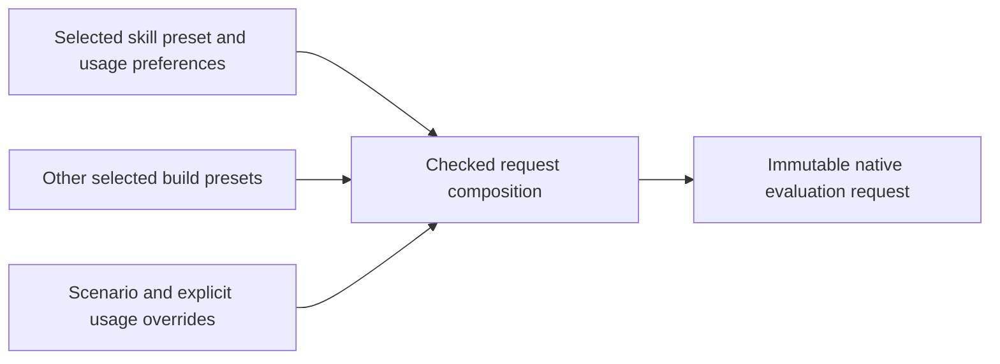

# Skill-preset usage composition

**Status:** Accepted by the owner on 2026-10-02; implementation pending.
**Date:** Proposed 2026-10-01; accepted 2026-10-02.
**Decider:** Project owner, following the request to discuss significant model changes.

## Context

The five original builds still fail draft finalization. The next shared input
boundary is active-Gem occurrence data: count, effect activation and action
settings. The initial catalogue-derived candidate group has 22 selected
occurrences across five builds. This is a source-review domain, not a promise
that all 22 inventories can be completed by one change.

Count is a use-specific setting. PoB's complete loader retains Gem count and a
parent group-count override; its consumers include combined damage reporting and
reservation behavior. It is not physical Gem level, a property of the reusable
Gem definition, or a command to create that many actor records. A source row
without saved minion settings can still have minion mechanics: Pain Offering is
one example. The completed finite source witness distinguishes these dependencies
for the current candidates; broader count/reservation domains remain unsupported.

The current owned model already represents typed usage selections targeted at
an exact Skill, Action or Actor. However:

- `ScenarioInput.usage` is the only persisted usage location.
- Skill presets and scenario presets are independently selected. Draft
  finalization selects supplying skills but resolves the chosen scenario whole.
- Copying all saved skill usages into every scenario would leave references to
  unselected skills. Duplicating scenarios for every skill preset would couple
  independent alternatives and change the import's saved-selection model.
- `SkillUse` has activation and loadout scope, but no per-use input parameters.
- Engine can read a UsagePolicy-owned parameter, but planning currently reports
  every usage selection as `UnsupportedRelation`; no usage program is executed.

These are structural gaps, not missing game constants. A data-only physical-Gem
schema expansion cannot resolve them. The unrelated preparation-readiness
proposal remains unaccepted and is not a dependency of this proposal.
This affects the originals now: Originals02 and05 each retain six skill presets
and one scenario, with 63 and 46 authored skill uses respectively. All current
scenario usage lists are empty/Pending. The checked package contains no authored
UsagePolicy definitions or usage programs to reuse.

## Accepted decision

Store typed usage preferences with the skill preset that supplies their targets.
Compose only the selected preset's preferences with the explicitly selected
scenario into the existing native `UsagePolicySelection` representation.

This should cover both complete project and editable draft models, including
round-trip persistence. It must not be implemented as temporary import sidecar
data or a draft-only field that disappears during project conversion. Add one
checked request-composition operation used by draft finalization and future
CLI/GUI callers; retain the existing build-only composition behavior.

The accepted semantics are:

1. Each preference binds a typed UsagePolicy definition, exact occurrence target
   and typed parameters. Game meanings, units, defaults and numerical programs
   come from injected definitions. Core knows neither PoB field spellings nor
   skill names.
2. Preset preferences may reference only supplying occurrences in that preset
   and their explicit generated topology. Global project existence alone is
   insufficient. Distinct uses of the same physical Gem remain distinct.
3. The selected scenario can override a preference by exact `(policy, target)`.
   An override replaces the complete parameter record; it does not silently merge
   fields or borrow missing values. Duplicate entries within either layer reject.
   Both layers and their bounds are checked before composition.
4. Unresolved selected preferences remain explicit draft obligations. Preferences
   in an unselected preset do not block the selected request. Missing preferences
   do not imply count one, disabled effects or a complete usage inventory.
5. Composition preserves provenance in the editing/import layer and emits one
   resolved native usage record per key. It neither creates actor populations
   nor mutates physical Gem inputs or the user's metric requests.
6. Implement bounded generic native usage-program execution for the supported
   target/context pairs, with exact target resolution and activation rules.
   Unsupported relations and incomplete definition/program coverage remain
   unresolved. Transporting a count is not proof of reservation or total-DPS
   parity; those numerical consumers require their own tested programs.

Only add numerical channels when a demonstrated requested dependency needs them.
The 22 current candidates have count one, no group-count override, and false/nil
combined-DPS inclusion. The witness confirms no MultipleReservation type or active
UmbralWell flag in their actual MAIN/CALCS environments. Changing count alone
preserves their observed direct outputs; opting Twister into FullDPS exposes
count-sensitive reporting with a separate strongest-Ignite contribution. These
finite observations do not justify inventing an otherwise unused count statistic
or claiming that every count consumer is implemented.

Count, global switches and action choices must first receive separate semantic
dispositions. This proposal does not put every source field into one generic
usage record. Effect activation needs an exact effect correspondence; action
selection needs the actual constructed action identity, including stat set.

## Options considered

| Option | Benefits | Costs and limitations |
| --- | --- | --- |
| **A. Skill-preset usage preferences, explicit scenario composition (recommended)** | Preserves independent saved alternatives; reuses the native typed usage representation; supports future GUI and search through one composition boundary. | Adds project/draft persistence and validation; needs explicit conflict semantics and native usage execution. |
| **B. New input parameters on every SkillUse** | Values travel directly with an occurrence and cannot refer to an unselected preset. | Requires a new per-use schema/read contract and a separate scenario-override model; risks conflating fixed skill configuration, reporting preferences and dynamic encounter usage. Could still be appropriate for distinct per-use choices after their semantics are established. |
| **C. Usage only in scenarios, with explicit scenario-to-skill-preset binding** | Keeps the final usage storage shape close to today's model. | Couples independent preset axes; introduces duplicated scenario records or dependent selection constraints; makes alternative build and scenario combinations harder to express. |

Option A changes the composition model explicitly rather than encoding source
choices as physical Gem properties. Its additional validation should occur while
building a request; candidate evaluation continues to consume immutable native
inputs and worker-local scratch without PoB or process spawning.

## Implementation and acceptance gates

1. [x] Owner confirms skill-preset preferences with scenario overrides (2026-10-02).
   Final wire/version migration details
   are implementation work; historical bytes and unresolved semantics need
   explicit compatibility tests.
2. [x] Finish finite source lifecycle evidence on unchanged originals and isolated
   controls in both JIT modes. Preserve MAIN/CALCS selections and distinguish
   count, activation, reservation, reporting and action defaults. The 15 full
   loads per mode and fresh loader controls pass with identical JIT observations;
   this is reference evidence, not native usage or action coverage.
3. [ ] Implement complete/draft persistence, validation and one checked request
   composition path. Test two skill presets sharing a Gem with distinct use
   settings, scenario overrides, foreign targets, duplicates, pending selected
   versus unselected data, round trips and resource limits.
4. [ ] Implement native usage planning/execution with exact occurrence isolation,
   missing/invalid input propagation, partial coverage and scratch reuse checks.
5. [ ] Add an optional, source-bound active-input projection and finite inventory
   proof using those contracts. Existing support/omitted-policy behavior and
   unsupported active domains stay unchanged.
6. [ ] Rerun all five original selected requests and preserve all 110 queries.
   Record exact known values, any newly localized obligations, retired issues and
   the next actual failing boundary. Do not use issue reduction as a substitute
   for complete native evaluation and numerical parity.

Current evidence: `runs/owned-armour-next-blocker-review.md`, the current
`owned_project`, `owned_draft/finalize` and `owned_plan/compile` implementations,
`runs/owned-active-occurrence-contract-review.md`, the exact preset census in
`runs/owned-active-occurrence-preset-census.json`, and the completed active-occurrence
source witness in `runs/owned-active-gem-occurrence-source-01`. The accepted usage
direction authorizes these implementation gates; it does not accept the separate
preparation-readiness or direct SkillUse-input proposals.
